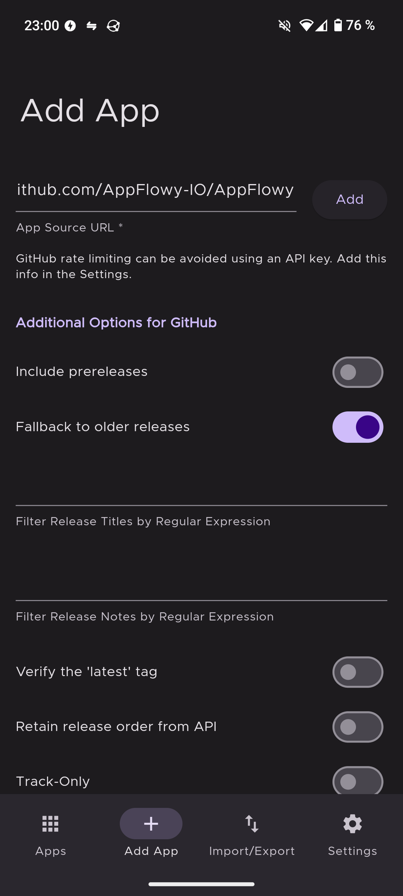
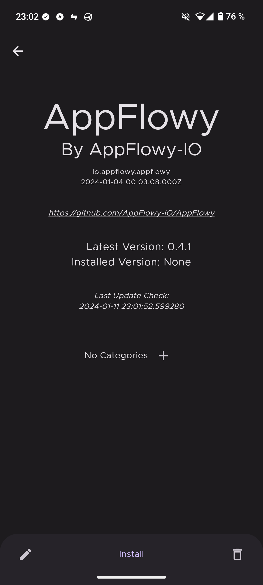
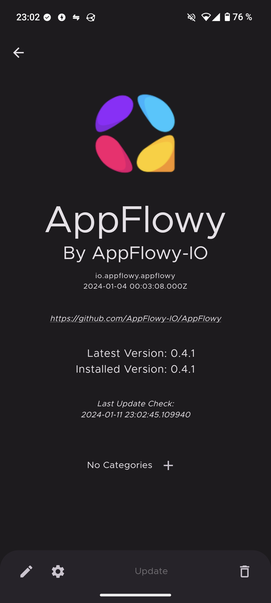

# Obtainium

Easily access the latest AppFlowy releases for Android directly from GitHub using Obtainium.

## Install Obtainium

1. **Download:** Obtain the latest Obtainium APK from the [official GitHub releases page](https://github.com/ImranR98/Obtainium/releases).
2. **Installation:** Install the downloaded APK on your Android device. Subsequent updates for Obtainium can be done within the app itself.

> [!NOTE] 
> Adding multiple apps in Obtainium may lead to hitting the GitHub API limits. To avoid this, you can add a GitHub personal access token in the "Settings" menu.

## Install AppFlowy

Follow these steps to add AppFlowy to Obtainium:

1. **Copy Repository URL:** Get the official AppFlowy repository URL: `https://github.com/AppFlowy-IO/AppFlowy`.
2. **Add in Obtainium:** Open Obtainium, go to "Add App", and paste the URL into "App Source URL". Use the default configuration and tap "Add".

3. **Install AppFlowy:** You will be directed to the App information view. Tap "Install" to initiate the installation of AppFlowy.

Obtainium automatically checks for new releases every 6 hours and notifies you about updates for AppFlowy.

> [!NOTE] 
> Ensure your Android battery saver settings don't interfere with automatic updates. You can also manually refresh the App list or the App information view to check for updates.
