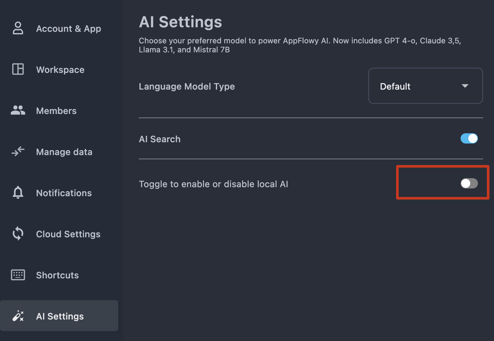
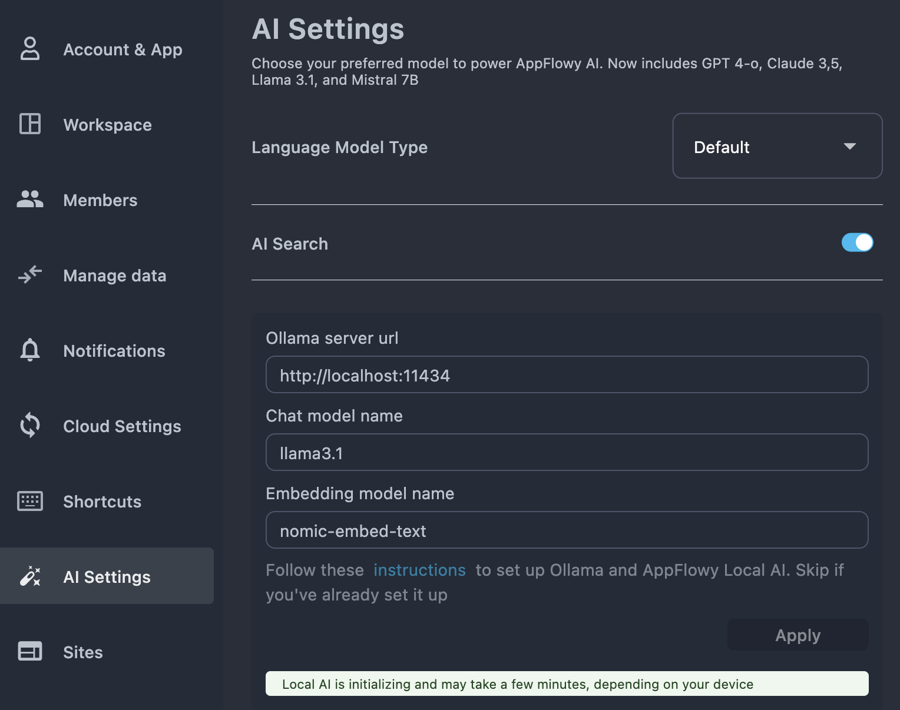
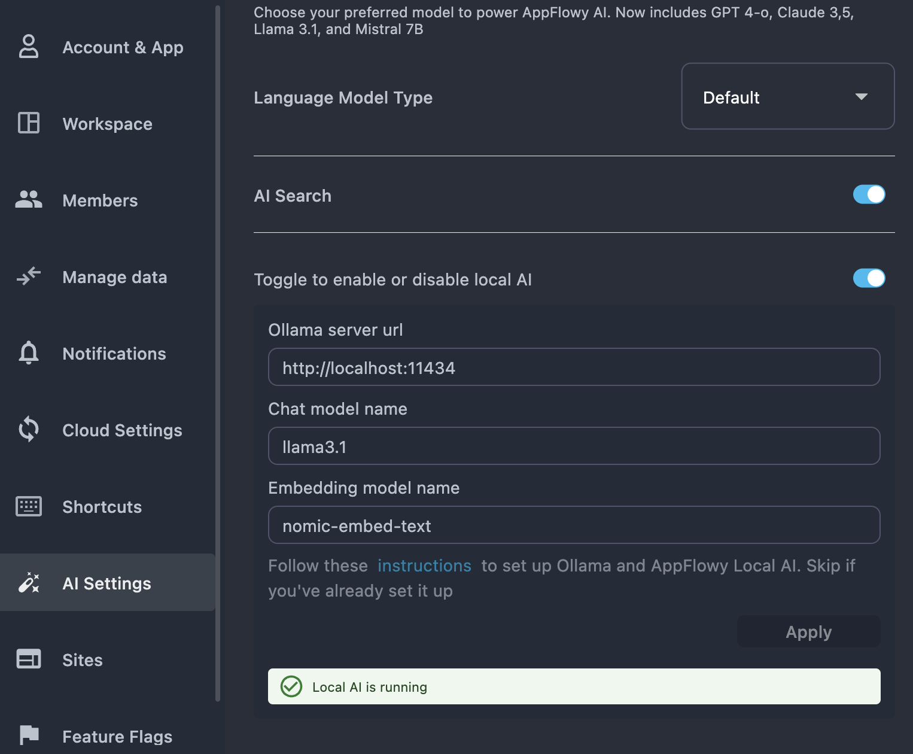
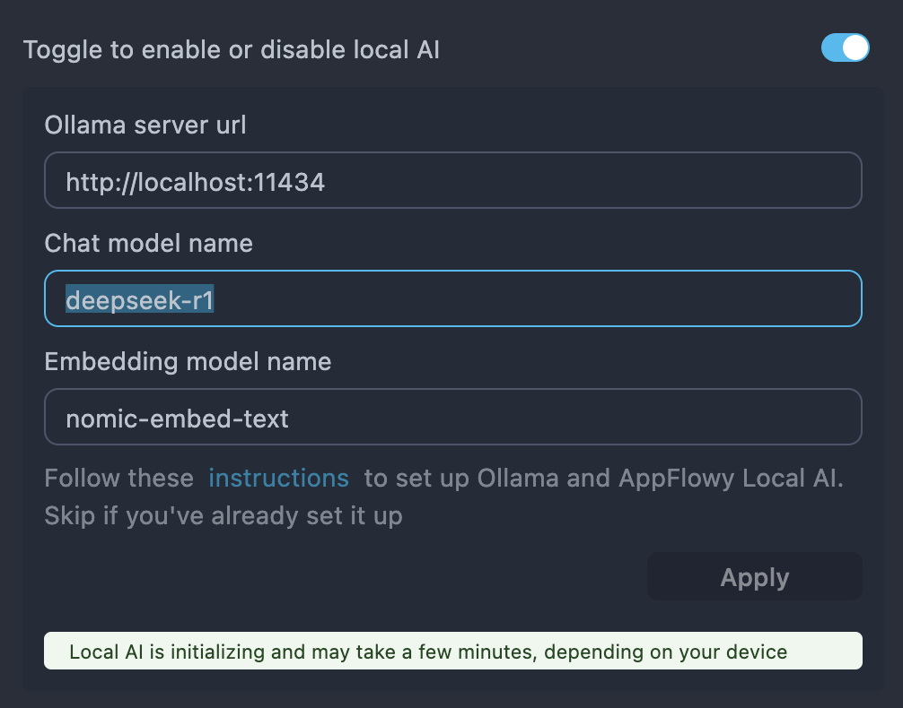
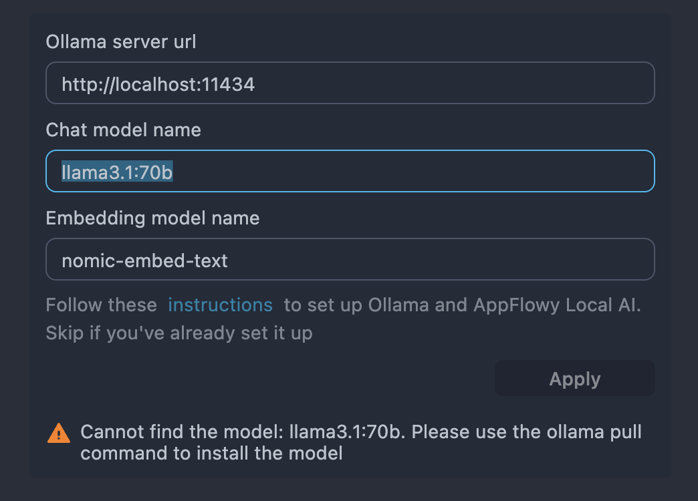

# AppFlowy AI - Ollama

AppFlowy leverages Ollama integration to provide local AI functionality, allowing you to run AI features without relying on cloud services.


⚠️ For optimal performance, ensure your system has the following minimum RAM:

	•	7B models: 8 GB
	•	13B models: 16 GB
	•	33B models: 32 GB

## Setup Process Overview

The setup involves three main components:

1. Installing and configuring Ollama with required models
2. Installing the AppFlowy LAI application
3. Enable AppFlowy LAI on AppFlowy Desktop Application

## Install Ollama

Follow the [official installation guide](https://ollama.com/) to set up Ollama on your system. Choose instructions for your operating system:

* **Linux/macOS**: Use the terminal script provided on the website.
* **Windows**: Download and run the `.exe` installer.

Verify the installation by running:

```bash
ollama --version
```

***

### Download Required Models

By default, we use the following models:

* llama3.1
* nomic-embed-text

Run these commands in your terminal to download the models:

```bash
ollama pull llama3.1  
ollama pull nomic-embed-text
```

**Verify the Download**:

Check installed models with:

```bash
ollama list
```

You should see `llama3.1` and `nomic-embed-text` in the output.

***

### Start the Ollama Server (Optional)

After installing Ollama, the server starts automatically. To view its logs, first stop the server and then start a new terminal window and run:

```bash
ollama serve
```

⚠️ **Keep the Server Running**:

* The terminal window where you run `ollama serve` must remain open.
* For production setups, run Ollama as a background service (e.g., use `systemd` on Linux or `nohup ollama serve &`).


## Install AppFlowy LAI (Local AI)

### macOS

#### Step 1: Download the Application

1. Visit the [AppFlowy-LocalAI releases page](https://github.com/AppFlowy-IO/AppFlowy-LocalAI/releases).
2. Download the **latest** version of AppFlowy LAI.


#### Step 2: Install

1. Unzip the downloaded file.
2. Drag the **AppFlowy LAI** to your `Applications` folder.
3. Launch **AppFlowy LAI** from your Applications directory.\
   Important: Do not move or delete the AppFlowy LAI application if you plan to continue using local AI features.


#### Step 3: Install Application

<figure><figcaption><p>Select the macOS .dmg file from the release assets</p></figcaption></figure>


#### Step 4: Verify Installation (Optional)

1. Open a **new terminal window**.
2. Run this command to confirm the AI plugin is accessible:

```bash
command -v ollama_ai_plugin  
```

✅ **Expected Output**:

```
/usr/local/bin/ollama_ai_plugin  
```

### Windows

#### Step 1: Download the Application

1. Visit the [AppFlowy-LocalAI releases page](https://github.com/AppFlowy-IO/AppFlowy-LocalAI/releases) to find the latest Windows version.
2. Download the latest release suitable for Windows (typically a `.zip` file).

***

#### Step 2: Extract the Application

1. Locate the downloaded zip file (`AppFlowyLAI.zip`) in your Downloads folder.
2. Right-click the file and select **Extract All** to unzip it to your preferred location.

***

#### Step 3: Launch AppFlowy LAI

1. Navigate to the extracted folder (`AppFlowyLAI`).
2. Double-click the executable file (`AppFlowyLAI.exe`) to launch the application.

*Important:* Do not move or delete the `AppFlowyLAI.exe` file or its containing folder if you intend to keep using local AI features.

***

#### Step 3: Verify Installation (Optional)

1. Open PowerShell.
2. Verify the installation path of `ollama_ai_plugin.exe`:

```cmd
Get-Command ollama_ai_plugin | Select-Object -ExpandProperty Definition
```

**Expected output:**

```
C:\path\to\AppFlowyLAI\ollama_ai_plugin.exe
```

Ensure the output matches the location of your extracted `AppFlowyLAI.exe`.


## Enable AppFlowy LAI on AppFlowy Desktop Application

By default, AppFlowy LAI is disabled. To enable it, open the settings page in AppFlowy Desktop and toggle the local AI option.


<figure><figcaption></figcaption></figure>

Once enabled, the application will begin initializing the local AI.

<figure><figcaption></figcaption></figure>


After a few seconds—or minutes, depending on your machine’s performance—you’ll see that the local AI is running.

<figure><figcaption></figcaption></figure>


## Q & A

### 1. How to use other models?

If you want to use additional models, first download (pull) them and then update the configuration in the settings page of AppFlowy.

<figure><figcaption></figcaption></figure>


To use the deepseek-r1 model, first download it with the following command:

```bash
ollama pull deepseek-r1
```

Once the download completes, update the configuration in the AppFlowy settings page by renaming the chat model from llama3.1 to deepseek-r1.


<figure><figcaption></figcaption></figure>


If you attempt to use a model that hasn't been downloaded, AppFlowy will display a "model not found" message. You can download the model and then reopen the setting.


<figure><figcaption></figcaption></figure>


### 2. What features does AppFlowy LAI support?

AppFlowy LAI supports the following features:

* Chat
* AI writer in document 
  * summarize
  * fix grammar
  * continue writing
  * improve writing
  * explain

Upcoming features:

* Chat with PDF
* Chat with image
* Chat with local files


