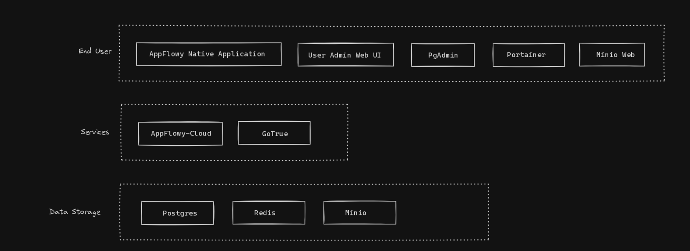

# 🌈 Architecture

# Client Usage

This is where regular AppFlowy Cloud users should spend most of their time in.

## AppFlowy Native Application

- Dependencies: GoTrue, AppFlowy-Cloud
- Client Application specific to various Operating System

## User Admin Web UI

- Dependency: GoTrue, Redis
- Aims to be Account management for both Admin and Non-Admin users.
- Accessible at https://test.appflowy.cloud/web
- Admin capabilities
    - User creation, deletion, password change
    - Generating sign in link for users
- Non-Admin capabilities
    - Password Change
    - User Invitation (via email)

# Observability Tools

Strictly speaking, the following are not essentially for cloud functionality, but recommended to have for various reasons including:

- Resource Usage
- Database performance

Usernames and password are generated during the initialization phase. Kindly refer to environmental variables for login credentials.

## PgAdmin

- Dependency: Postgres
- Postgres database management
- Accessible at [https://test.appflowy.cloud/pgadmin](https://test.appflowy.cloud/web)

## Minio Web UI

- Depdency: None
- File storage management
- Accessible at [https://test.appflowy.cloud/minio](https://test.appflowy.cloud/web)

## Portainer

- Container management
- Accessible at https://test.appflowy.cloud/portainer

# Services

core services that AppFlowy Native Application would need

## AppFlowy-Cloud

- Dependencies: GoTrue, Postgres, Redis, Minio
- Provides core functionalities to AppFlowy Native Application

## GoTrue

- Dependencies: Postgres
- Authentication Server for Native Application, User Admin, and AppFlowy-Cloud
- Source of truth for user creation/deletion/verification

# Data Storage

## Postgres

- Essential data storage for AppFlowy Cloud and Gotrue

## Redis

- Used as cache for AppFlowy Cloud and User Admin Web for session management.