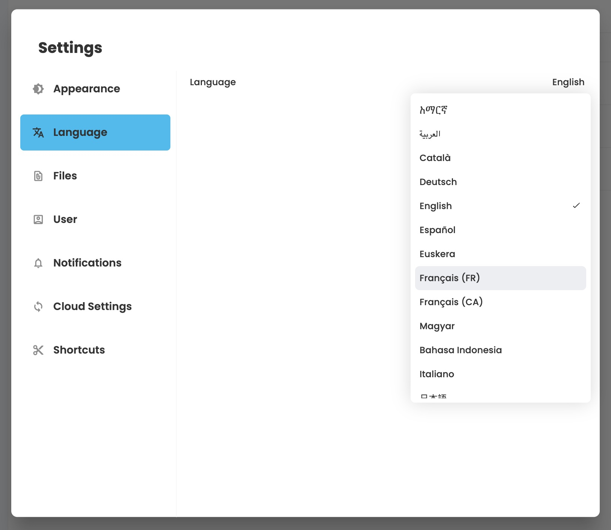

# ☎️ Translate AppFlowy

We'd like AppFlowy to be usable by people from all over the globe. You can help us reach that goal by contributing to our translation efforts. See below on how to fill out missing translations, modify existing translations, or add a language that isn't supported yet.

## Modify an Already-Supported Language

### Using the inlang no-code editor

1. Open the [inlang-editor](https://inlang.com/editor/github.com/AppFlowy-IO/AppFlowy)
2. Edit translations (filter & search can help)
3. From the `frontend` directory, run `sh ./scripts/code_generation/language_files/generate_language_files.sh` on Linux and macOS, or `.\scripts\code_generation\language_files\generate_language_files.cmd` on Windows to generate.
4. Alternatively, run the `AF: Generate Language Task` from VSCode by hitting `F1`, selecting `Tasks: Run Task`, then searching for the task.
5. Verify that the translation has changed appropriately by compiling and running the app.

### Directly in the source code

1. Modify the specific translation file located at: `frontend/resources/translations/<language-code>-<country_code>.json`
2. From the `frontend` directory, run `sh ./scripts/code_generation/language_files/generate_language_files.sh` on Linux and macOS, or `.\scripts\code_generation\language_files\generate_language_files.cmd` on Windows to generate.
3. Alternatively, run the `AF: Generate Language Task` from VSCode by hitting `F1`, selecting `Tasks: Run Task`, then searching for the task.
4. Verify that the translation has changed appropriately by compiling and running the app.

## Add an Unsupported Language

> Adding new languages from within the inlang editor is not supported yet, but you can add the language and then do the translations in inlang. (Adding via inlang is coming soon)

1. Create a JSON file that contains the translation tokens and values. You can simply copy `frontend/resources/translations/en.json` and edit it from there.
2. The name of the file should be `<language_code>-<country_code>.json`, where `language_code` follows the [ISO-639-1 standard](https://en.wikipedia.org/wiki/List\_of\_ISO\_639-1\_codes) and the `country_code` is a valid [ISO3166 alpha2 country code](https://www.iso.org/obp/ui/#search/code/). For example, Spanish in Venezuela would be `es-VE.json`. If the language doesn't change much between countries that use it, you can simply use the language code instead, e.g. `pl.json`.
3. From the `frontend` directory, run `sh ./scripts/code_generation/language_files/generate_language_files.sh` on Linux and macOS, or `.\scripts\code_generation\language_files\generate_language_files.cmd` on Windows to generate.
4. Alternatively, run the `AF: Generate Language Task` from VSCode by hitting `F1`, selecting `Tasks: Run Task`, then searching for the task.
5.  In `frontend/appflowy_flutter/lib/startup/tasks/app_widget.dart`, search for the `InitAppWidgetTask` class and add the new language (e.g. `Locale('en', 'IN')`) to the `supportedLocales` list :\


    ```
    runApp(
      EasyLocalization(
        supportedLocales: const [
          Locale('am', 'ET'),
          Locale('ar', 'SA'),
          Locale('ca', 'ES'),
          Locale('de', 'DE'),
          Locale('en'),
          ...                // <---- Add locale to this list
        ],
        path: 'assets/translations',
        fallbackLocale: const Locale('en'),
        child: app),
    );
    ```
6.  Add the name of the language in that language to the list of language names in `frontend/appflowy_flutter/packages/flowy_infra/lib/language.dart`.\


    <pre class="language-dart"><code class="lang-dart"><strong>String languageFromLocale(Locale locale) {
    </strong>  switch (locale.languageCode) {
        case "en":
          return "English";
        case "zh":
          return "简体中文";
        case "de":
          return "Deutsch";
        case "es":
          return "Español";
        case "fr":
          return "Français";
        ...                   // &#x3C;- add your language here.
        default:
          return locale.languageCode;
      }
    }
    </code></pre>

## How to test your changes

Once you are pleased with your translations, compile AppFlowy, select the language and see your work come to life! If everything is working fine, don't forget to create a PR on Github so that others can also benefit from your effort.

<figure><figcaption><p>Change your language in the settings page of AppFlowy</p></figcaption></figure>

