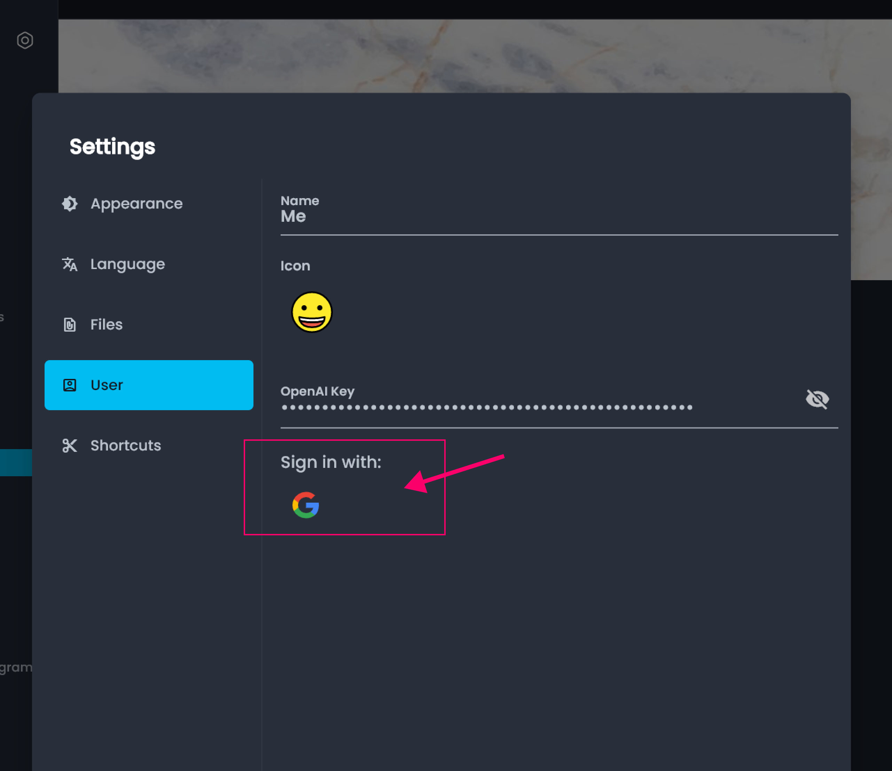

# ☁ AppFlowy Cloud

## Here comes this AppFlowy Cloud that does 3 things for you:

1. Allow you to back up local data and access it from different devices
2. Given that AppFlowy is local-first, you enjoy the flexibility to remain local and sync as required
3. You have the freedom to make one workspace 100% local and another has cloud backup

## **How to use AppFlowy Cloud?**

Go to Settings --> User --> Sign in with Google

<figure><figcaption>
appflowy server sync
</figcaption></figure>
