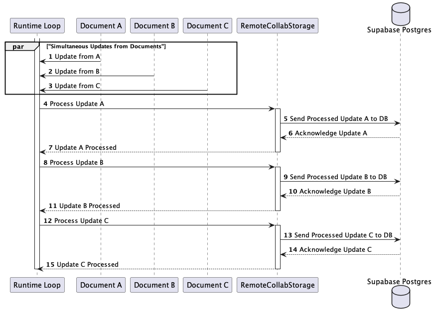

# AppFlowy with Supabase(WIP)
AppFlowy, known for its user-friendly features in local apps, now allows users to upload data to the Cloud. We've chosen Supabase, an open-source alternative to Firebase, to manage user sign-ins and data storage. With a Supabase project, anyone can easily implement a self-hosted AppFlowy.

Let's explore how AppFlowy uses Supabase for these tasks.

1. Authentication
2. Data storage

## Authentication

At first, we wanted to build our own authentication service from scratch. But then we realized there are open-source projects that already provide this service. That's when we discovered the Supabase authentication service. It offers several ways to authenticate users:

- Email & password
- Magic links
- Social providers
- Phone logins

### Dive in the code
Additionally, there's a Flutter package named [supabase_flutter](https://pub.dev/packages/supabase_flutter) which can be seamlessly integrated into AppFlowy. It perfectly meets our requirements. We utilize the `env` file to inject the supabase configuration into the app. Consequently, simply adding `supabase_flutter` and `envied` to the `pubspec.yaml` is all that's needed to kickstart the process.

```yaml
dependencies:
  supabase_flutter: ^1.10.4
  envied: ^0.3.0+3
  
dev_dependencies:
  envied_generator: ^0.3.0+3
```

**Initialize the supabase**

Before using the Supabase instance, we need to initialize it. This is done in the `supabase_task.dart` file.

```dart
 await Supabase.initialize(
   url: Env.supabaseUrl,
   anonKey: Env.supabaseAnonKey,
   debug: kDebugMode,
   localStorage: const SupabaseLocalStorage(),
 );
```

**Perform authentication**

Our authentication logic leverages an abstract class named `AuthService`. This class's Supabase implementation can be found in `SupabaseAuthService`, specifically within the `supabase_auth_service.dart` file.

```dart
 @override
  Future<Either<FlowyError, UserProfilePB>> signUpWithOAuth({
    required String platform,
    AuthTypePB authType = AuthTypePB.Supabase,
    Map<String, String> params = const {},
  }) async {
    final provider = platform.toProvider();
    final completer = supabaseLoginCompleter(
      onSuccess: (userId, userEmail) async {
        return await _setupAuth(
          map: {
            AuthServiceMapKeys.uuid: userId,
            AuthServiceMapKeys.email: userEmail,
            AuthServiceMapKeys.deviceId: await getDeviceId()
          },
        );
      },
    );

    final response = await _auth.signInWithOAuth(
      provider,
      queryParams: queryParamsForProvider(provider),
      redirectTo: supabaseLoginCallback,
    );
    if (!response) {
      completer.complete(left(AuthError.supabaseSignInWithOauthError));
    }
    return completer.future;
  }
```

### Voila!
Ultimately, by clicking the Google login button, users are directed to a web browser to finalize the authentication process. Once authenticated, they are seamlessly redirected back to AppFlowy. Truly, integrating Supabase authentication into AppFlowy is a straightforward endeavor.


## Data storage
Upon integrating Supabase authentication, we discovered it inherently offers a PostgreSQL database. This advantage implies that individual users self-hosting AppFlowy on Supabase won't require separate data storage setups. Each Supabase project is pre-equipped with a dedicated PostgreSQL database, which we leverage to store AppFlowy's data.

### Dive in the code

AppFlowy's backend is built using Rust, necessitating a Rust crate to facilitate interaction with the Postgres database. Fortunately, the community has provided [postgrest-rs](https://github.com/supabase-community/postgrest-rs), a crate tailored to implement Supabase's Postgres database functionalities.

To provide a consistent abstraction for various cloud services, we established a series of traits. These traits are then implemented utilizing the [postgrest-rs](https://github.com/supabase-community/postgrest-rs) crate.

```rust
pub trait UserService { 
  ...
}
pub trait DocumentCloudService {
  ... 
}
pub trait DatabaseCloudService {
  ...
}
pub trait RemoteCollabStorage {
  ...
}
```




We won't delve too deeply here since it's beyond the scope of this article. However, it's worth highlighting the RPC function, which proves invaluable for customizing database actions. We've defined a function named `flush_collab_updates_v3`. This function locks the row with a specified oid, consolidates the updates into one, and subsequently deletes the merged updates.

```rust
pub(crate) async fn flush_collab_with_update(
  object: &CollabObject,
  update_items: Vec<UpdateItem>,
  postgrest: &Arc<Postgres>,
  update: Vec<u8>,
  secret: Option<String>,
) -> Result<(), Error> {
  // 2.Merge the updates into one and then delete the merged updates
  let merge_result = spawn_blocking(move || merge_updates(update_items, update)).await??;
  tracing::trace!("Merged updates count: {}", merge_result.merged_keys.len());

  let workspace_id = object
    .get_workspace_id()
    .ok_or(anyhow::anyhow!("Invalid workspace id"))?;

  let value_size = merge_result.new_update.len() as i32;
  let md5 = md5(&merge_result.new_update);

  let (new_update, encrypt) =
    SupabaseBinaryColumnEncoder::encode(merge_result.new_update, &secret)?;
  let params = InsertParamsBuilder::new()
    .insert("oid", object.object_id.clone())
    .insert("new_value", new_update)
    .insert("encrypt", encrypt)
    .insert("md5", md5)
    .insert("value_size", value_size)
    .insert("partition_key", partition_key(&object.ty))
    .insert("uid", object.uid)
    .insert("workspace_id", workspace_id)
    .insert("removed_keys", merge_result.merged_keys)
    .insert("did", object.get_device_id())
    .build();

  postgrest
    .rpc("flush_collab_updates_v3", params)
    .execute()
    .await?
    .success()
    .await?;
  Ok(())
}

```

### Table design
For a comprehensive guide on configuring the PostgreSQL database, refer to [this documentation](https://github.com/AppFlowy-IO/AppFlowy-Supabase/tree/main/postgres).

Here's what our schema looks like:


