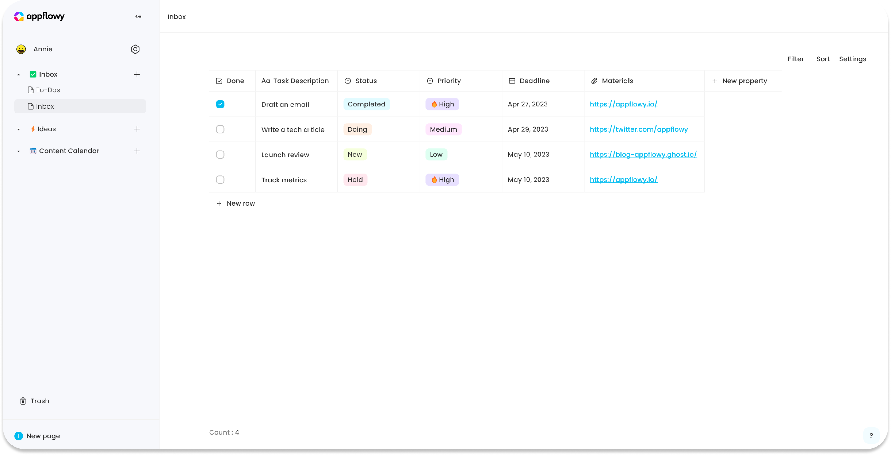

# Table-view Databases

A table-view database is also called a Grid. It looks like a classic table but can do more than just rows and columns.

<figure><figcaption></figcaption></figure>

## Create a database in table view

There are two ways:

1.  Click on the `+` icon next to a page, then select "Grid"

    <figure><figcaption></figcaption></figure>
2. Create one inside a page. Type `/` to open up the menu. Select `Create a new Grid`

<figure><figcaption></figcaption></figure>

## Rows&#x20;

Every row in a database is a page. You can open a row as a page to edit properties or enter values.

* Hover over a row and click the `Open as a Page` button

.png>)

* You will see all the properties organized at the top.
  * Click on the property name to edit it or its type.
  * Click in the property field to edit its content.
  * Learn more about how to [manage properties](../databases/manage-properties.md).
* You can also add a new property to your database by clicking `+ New property`.
* You can perform `Delete` and `Duplicate` on the current row.
  * `Delete`: delete this row
  * `Duplicate:` duplicate this row

### Add Rows

* Click the `+` that appears on hover next to any row. This creates a new row below it.

<figure><figcaption></figcaption></figure>

* Click `+ New` at the bottom of your table to add a new row right there.

<figure><figcaption></figcaption></figure>

### Row Options

Click the :: icon that appears on hover to the left of each row to bring up this menu of options:

* `Delete`: Deletes the row from your list.

## Customize your table

### Edit table properties

#### Add a property

* Click the `+` all the way to the right of your last column.

<figure><figcaption></figcaption></figure>

* Open row as a page and then click `+New Property`

<figure><figcaption></figcaption></figure>

* Learn more about how to [manage properties](../databases/manage-properties.md).

## Filter

View only the rows that fit certain criteria.

* Click `Filter` at the top right of your table.

<figure><figcaption></figcaption></figure>

* Choose which property you want to filter by from the dropdown.

<figure><figcaption></figcaption></figure>

* Choose the condition you want to use, i.e. `is`, `is not`, etc.

<figure><figcaption></figcaption></figure>

* Define the value of the property you want to see, i.e. a specific tag or contains certain words.
* You can add multiple filters.

<figure><figcaption></figcaption></figure>

* Click `Filter` again to hide or show filters

<figure><figcaption></figcaption></figure>

* Remove a filter by clicking on the filter and then the `:` menu

<figure><figcaption></figcaption></figure>

## Sort

When you sort your data by any property in `Ascending` or `Descending` order, all the data from that row will travel together automatically.

<figure><figcaption></figcaption></figure>

* Click `Sort` at the top right of your table.
* Choose the property you want to sort by, then choose `Ascending` or `Descending`. You'll see your table rearrange in real time.
* You can add multiple sorts to a table, with sorting criteria taking precedence based on their order in the list.
* Remove sorts by clicking the X icon in the Sort menu next to them.

<figure><figcaption></figcaption></figure>

## Linked View of Database

You can add an existing view of database to a page. Type `/` to open the slash menu.&#x20;

Select `Referenced Grid`\` to link an existing table-view database.

<figure><figcaption></figcaption></figure>

Property value changes you made to the linked view will sync back to the original database.&#x20;

