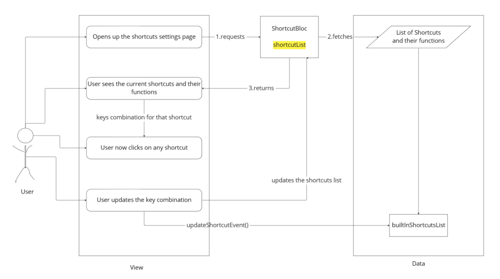

# Shortcuts and Customized Hotkeys for AppFlowy

#### Introduction

* Appflowy is now my favorite knowledge management tool and there are many who share my opinion. Appflowy provides many useful features.&#x20;
* But it currently lacks in one area. Although many useful functionalities can be achieved using AppFlowy, there are many widely accepted shortcuts that appflowy currently does not support.&#x20;
* Shortcuts are key combinations that allow users to quickly achieve some functionality. They improve the users' productivity. Using keyboard shortcuts is much faster than using the mouse.&#x20;
* One of the main edges AppFlowy has over its competitors is the ability to have a customizable user experience. Many applications offer users a way to customize keyboard shortcuts to their desired functionality but currently, there is no such mechanism in AppFlowy.

#### Goal

* We need to implement a bunch of functionalities based on some key combinations or single key presses. These shortcuts can be classified into two types:&#x20;
  1. Predefined Shortcuts
  2. Customizable Shortcuts
* Predefined Shortcuts will be a set of commonly used key combinations that help in simple text editing, cursor movement, element selection, etc. These shortcuts will be inspired by other desktop applications, which will give our users a uniform experience across their desktop apps. Thus through this project, our goal is to support many standard shortcuts.
* Customizable Shortcuts is an advanced functionality that will allow users to customize key combinations to achieve their desired functionality with AppFlowy. This feature truly aligns perfectly with the vision of AppFlowy in providing a customizable user experience. Through this project, our goal is to allow users to customize key combinations.

#### Implementation Design

Let us talk about how the Apps UI might change after we achieve the aforementioned changes.

<figure><figcaption>
Users will see a Shortcuts tab in the settings
</figcaption></figure>

In the settings, a Shortcuts option will appear which shows all the custom shortcuts

<figure><figcaption>
Predefined shortcuts link
</figcaption></figure>

In the Shortcuts tab, users can customize some shortcuts and through a link, they can also see a list of predefined shortcuts(this link will open up in a browser).

<figure><figcaption>
Add Custom Shortcut option
</figcaption></figure>

Clicking any existing key combination will open a popup for assigning a new key combination to that functionality. This popup will contain an input field where users can enter the key, the keys pressed will be caught by the Keyboard Listener service. That key event will be assigned for that shortcut. Finally selecting done will save this key combination to achieve the desired functionality.

### Halfway Evaluation:

* **Week 1** \~ 30th January 2023

<!---->

* [x] Discussed the project plan with my mentor Lucas
* [x] I researched existing shortcuts and how they are implemented in the codebase.
* [x] Added new key bindings to existing shortcuts. (PR: [1786](https://github.com/AppFlowy-IO/AppFlowy/pull/1786))

<!---->

* **Week 2** \~ 6th February 2023

<!---->

* [x] Created shortcuts for toggling checkbox, tested it, and got it merged. (PR: [1817](https://github.com/AppFlowy-IO/AppFlowy/pull/1817))
* [x] I started working on shortcuts for creating sub-todos using the Tab key.
* [x] I started working on improving editing using Ctrl/Meta.

<!---->

* **Week 3** \~ 13th February 2023

<!---->

* [x] Merged shortcuts for creating sub-todos using the Tab key (PR: [1847](https://github.com/AppFlowy-IO/AppFlowy/pull/1847))
* [x] Merged PR that allows editing with Ctrl/Meta (PR: [1845](https://github.com/AppFlowy-IO/AppFlowy/pull/1845))

<!---->

* **Week 4** \~ 20th February 2023

<!---->

* [ ] Implement the Find with Ctrl+F plugin.
* [ ] Implement the Find and Replace with Ctrl+H plugin.
* [x] Created hardcoded UI for Customize Shortcuts Settings page.

<!---->

* **Week 5** \~ 27th February 2023

<!---->

* [x] Designed the BLoC for handling Customize Shortcuts Settings page. (See [here](shortcuts-and-customized-hotkeys-for-appflowy.md#bloc-design-for-customized-shortcuts))
* [x] Researched about KeyboardListener, RawKeyboardListener, etc in flutter, to better capture user actions.
* [x] Discussed doubts about implementing Customize Shortcuts Settings page with Mentor.

#### BLoC Design for Customized Shortcuts

<figure><figcaption>
BLoC Design use case
</figcaption></figure>

#### Next steps and schedule

* **Week 6** \~ 6th March 2023

<!---->

* [ ] Implement a completely functioning Customize Shortcut feature and test it.
* [ ] Gather feedback about Customize shortcut feature and improve upon it.

<!---->

* **Week 7** \~ 13th March 2023

<!---->

* [ ] Finish work for Find and Replace plugins in the editor.
* [ ] Write an article about my mentorship experience.
* [ ] Continue maintaining and improving my work.

