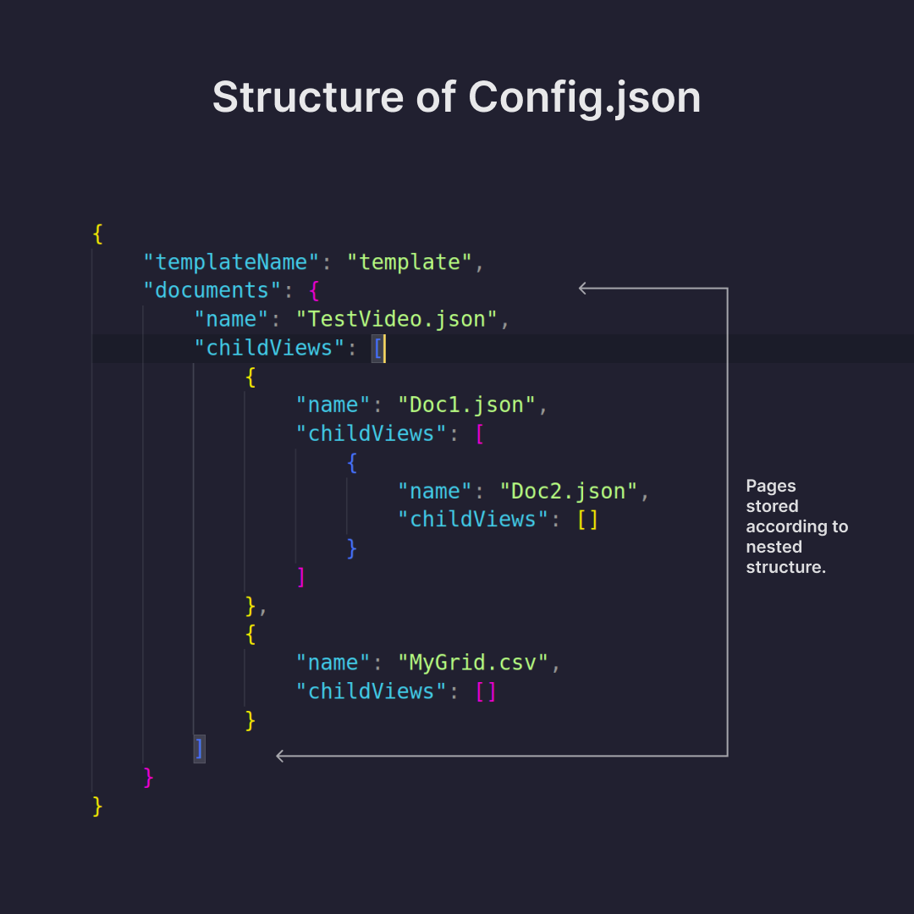
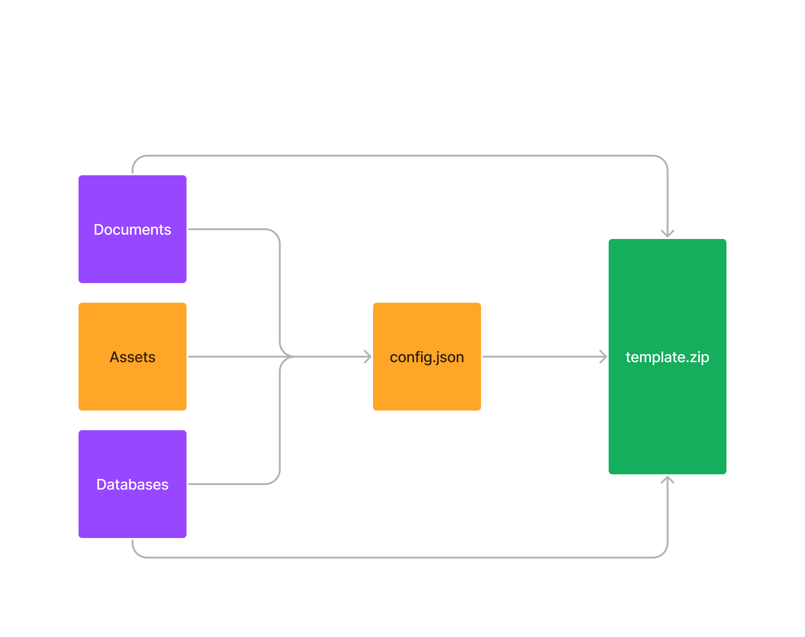
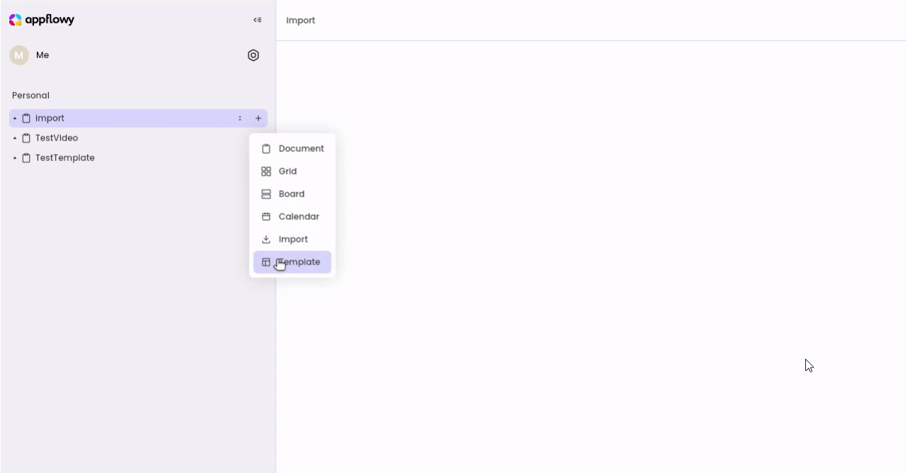
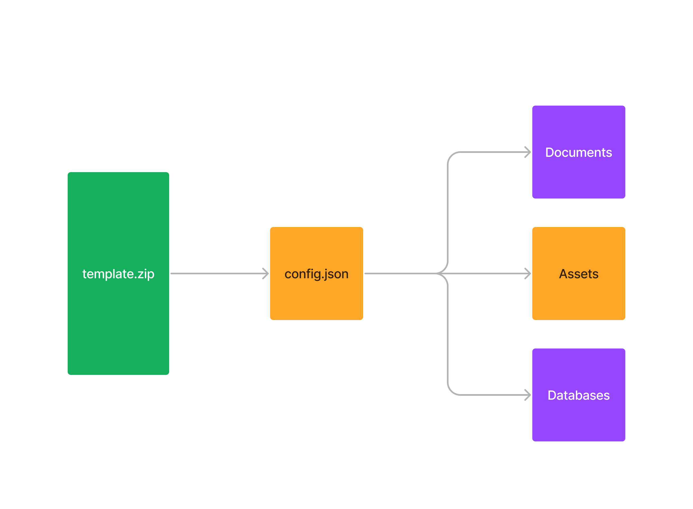

# Templates

## Introduction

AppFlowy is a powerful Open-Source Notion alternative, and we are rapidly improving the application to provide a seamless experience. As of writing this doc, we support nested documents, grids, boards, calendars, and referenced documents/grids. Using these tits and bits you can combine and create your own perfect workspace. While having all these features is excellent, creating your ideal workplace from scratch every time can be cumbersome. &#x20;

## Goal

The goal of this project is to provide a template feature, where users can create templates from a `Zip` File, and can also export a template. Users can use a template created by the community or reuse their own templates. Later, we plan to have a Template Marketplace where users can share their templates with others. However, that would be out of the scope of this project and a different feature altogether.

## Scope

By the completion of this project, the user will be able to:

* [x] Export existing pages as templates in ZIP format.
* [x] Import templates by selecting the ZIP file, which will recreate the original structure with its content.
* [x] Import/Export nested pages and databases.
* [ ] Maintain references between referenced databases and Linked Pages while importing/exporting.
* [ ] Support exporting assets, while exporting a document.

## Implementation Design

To implement the template feature, we came ahead with a simple but efficient solution. Further, we will discuss the implementation of the import and export templates separately.&#x20;

### Export Template:&#x20;

In AppFlowy, we previously provided the following features for exporting:

* Export a document as `.json` or `.md` file.
* Export a database as `.csv` file.

In the export template feature, we wanted to provide the user with the capability of exporting multiple pages and documents as a whole package. Another critical decision was to decide how to save the data regarding the structure of the pages, which could be then used as a reference to import the pages in the same structure.

To store the document structure and configuration, we decided to generate a `config.json` file during exporting that would contain all the details about the template. During, importing a template the same config file would be used to understand the structure of the template.

<figure><figcaption>
Example of <code>config.json</code>
</figcaption></figure>

* To generate the config file we created a `ConfigService` which does all the heavy lifting i.e. generating `config.json` using the current `ViewPB`.&#x20;
* Once, the config file is generated we then use `TemplateService` to simply export all the pages, databases, and the config file.

> By default the exported files are stored in `documents/template/` folder.

The export process is completed at this point and the exports can be Zipped into a single `.zip` file which is then ready to be imported!

<figure><figcaption>
Flow of export template
</figcaption></figure>

### Import Template:

Importing documents and databases was previously supported in AppFlowy, however, under this feature, we would support importing a complete structure of documents and databases. Previously we created a `config.json` file while exporting, we would now use it for importing the template.

* Click on the add button and select the template option as shown.

<figure><figcaption>
Select the template option
</figcaption></figure>

* Now the file picker will be opened and you can now select the `tempate.zip` generated in the export section. Once you select the template ZIP it will be added to your editor.

<figure><figcaption>
Flow of importing a template
</figcaption></figure>

## Schedule

This project is expected to be completed halfway by Mid-September, the features to be expected by then are:

* [ ] Generate `config.json` from the view structure, which should support nested structure as well.
* [ ] Support exporting templates and importing them as ZIP.

The final version of this project will be completed by September, and the features to be expected are:

* [ ] Support exporting assets used in the pages that are being exported.
* [ ] Maintain references between databases, while importing/exporting.
* [ ] Some Demo Templates are pre-loaded into the application for first-time users.

