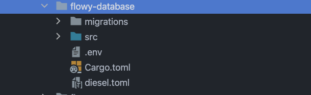

# Database

AppFlowy use [SQLite](https://www.sqlite.org/index.html) as database and [Diesel](https://diesel.rs/) as [ORM](https://en.wikipedia.org/wiki/Object%E2%80%93relational_mapping).

## The flowy-database
The crate, flowy-database, contains the logic for creating the SQLite [schema](https://www.sqlite.org/schematab.html) and providing a shared kv storage.
It is located in `frontend/rust-lib/flowy-database`.



The following section will guide you through how to create or update a schema. Before starting, I recommend checking out
the [Diesel Getting Started](https://diesel.rs/guides/getting-started) if you don't know about diesel before. Make sure
you install the diesel CLI tool. You can install it by running:

> cargo install diesel_cli --no-default-features --features SQLite


### Create schema
Create a new schema.
```shell

/// Go to the working directory
cd frontend/rust-lib/flowy-database/

/// Generate a new migration named user
diesel migration generate user
```

**Output**
* Creating migrations/2022-08-07-140433_user/up.sql
* Creating migrations/2022-08-07-140433_user/down.sql

Create a table named **user_table**. Open the **up.sql**
```SQL
CREATE TABLE user_table (
    id TEXT NOT NULL PRIMARY KEY,
    name TEXT NOT NULL DEFAULT '',
    token TEXT NOT NULL DEFAULT '',
    email TEXT NOT NULL DEFAULT ''
);
```
When doing revert operation, the **down.sql** will be applied. We drop the **user_table** here.
```SQL
DROP TABLE user_table;
```

Run the migration
```SQL
diesel migration run
```

Migrations allow us to evolve the database schema over time. Each migration can be applied (up.sql) or reverted (down.sql).
Applying and immediately reverting a migration should leave your database schema unchanged. It’s a good idea to make sure
that down.sql is correct. You can quickly confirm that your down.sql rolls back your migration correctly by redoing the migration:

```SQL
diesel migration redo
```

**Output**:
* Rolling back migration 2022-08-07-140433_user
* Running migration 2022-08-07-140433_user

Ok, here we go. Everything is fine. After running the migration, the schema is automatically added to the `schema.rs`
```rust
// flowy-database/src/schema.rs
table! {
    user_table (id) {
        id -> Text,
        name -> Text,
        token -> Text,
        email -> Text,
    }
}
```

**Writing Rust**

```rust
#[derive(Clone, Default, Queryable, Identifiable, Insertable)]
#[table_name = "user_table"]
pub struct UserTable {
    pub(crate) id: String,
    pub(crate) name: String,
    pub(crate) token: String,
    pub(crate) email: String,
}
```


### Update schema
Update an existing schema.
```shell
cd frontend/rust-lib/flowy-database/
diesel migration generate user-add-icon
```

**Output**
* Creating migrations/2022-08-07-140433_user-add-icon/up.sql
* Creating migrations/2022-08-07-140433_user-add-icon/down.sql


**up.sql**
```SQL
ALTER TABLE user_table ADD COLUMN icon_url TEXT NOT NULL DEFAULT '';
```

**down.sql**
```SQL
ALTER TABLE user_table DROP COLUMN icon_url;
```

```SQL
diesel migration run
diesel migration redo
```

After running the migration, the icon_url is added to the user_table schema automatically.
```rust
// flowy-database/src/schema.rs
table! {
    user_table (id) {
        id -> Text,
        name -> Text,
        token -> Text,
        email -> Text,
        icon_url -> Text,
    }
}
```

## Write Rust
Let's write some Rust to read the database data. We're not going to explain how to use the `diesel` macros here, you can
check [this](https://diesel.rs/guides/all-about-inserts.html) out for that.

We create a struct named `UserTable` to read the record of the `user_table`. The name of the properties should be the same
as the user_table. We can use `UserTable` to insert a new record or read the existing record from the database.

```rust
#[derive(Clone, Default, Queryable, Identifiable, Insertable)]
#[table_name = "user_table"]
pub struct UserTable {
    pub(crate) id: String,
    pub(crate) name: String,
    pub(crate) token: String,
    pub(crate) email: String,
    pub(crate) icon_url: String,
}
```

Diesel provides lots of handy functions for reading and updating a record.

**Read**
```rust
// conn: the connection to the database
let user: UserTable = dsl::user_table
    .filter(user_table::id.eq(&user_id))
    .first::<UserTable>(conn)?;
```

**Insert**

Check out [this](https://diesel.rs/guides/all-about-inserts.html) for more information about inserting a record.
```rust
// user: instance of the UserTable 
let _ = diesel::insert_into(user_table::table)
            .values(user)
            .execute(conn)?;
```

**Update**

 We use`AsChangeset` macro that diesel provides to implement the AsChangeset trait. Check out [this](https://diesel.rs/guides/all-about-updates.html) 
 for more information about updating a record.
```rust
#[derive(AsChangeset, Identifiable, Default, Debug)]
#[table_name = "user_table"]
pub struct UserTableChangeset {
    pub id: String,
    pub name: Option<String>,
    pub email: Option<String>,
    pub icon_url: Option<String>
}

```
Apply the changeset to the database
```rust
// changeset: instance of the UserTableChangeset 
diesel::update(user_table::table).set(&changeset);
```

## Architecture
We use dependency injection to forbid the other crates directly dependencies on the **flowy-database** crate. Each crate
defines their database [traits](https://doc.rust-lang.org/book/ch10-02-traits.html) to meet their need.

> Traits are a name given to a group of functions that a data structure can implement. I think using traits to isolate
> dependencies is a very good practice. 

The `flowy-user` dependencies on the `flowy-database` crate directly. It initializes the database connection when the Application
launch or when the user switches account. The `flowy-grid` defines the `GridDatabase` trait and the `flowy-folder` defines the 
`WorkspaceDatabase` trait, these two traits are implemented in the `flowy-sdk` crate.

> `flowy-sdk` is a crate that aggregates all the crates and resolves each crate's dependencies.
> `flowy-database` is a crate that handles all the grid operations
>
> `flowy-folder` is a crate that handles all the folder operations. The folder represents the concepts that include the 
> workspace, app, and view.


