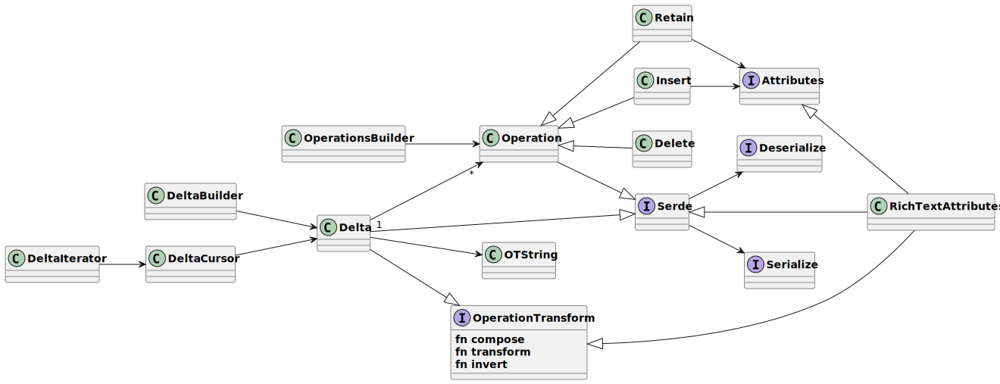

# Delta

A `Delta` contains a list of operations, which describe the changes to a document. There are three kinds of operations,
insert, delete, and retain. The implementation of Delta is located in the `lib-ot`(shared-lib/lib-ot) crate.The format
of `Delta` is JSON based, and is human readable, it can describe any rich text document, includes all text and
formatting information.

The picture shown below is a UML diagram that describes the relations between these classes. We're going to explain them
on by one.



## DeltaIterator
```rust
let mut delta = RichTextDelta::default();
delta.add(Operation::insert("123"));
delta.add(Operation::insert("4"));
assert_eq!(
    DeltaIterator::from_interval(&delta, Interval::new(0, 2)).ops(),
    vec![Operation::insert("12")]
);

assert_eq!(
    DeltaIterator::from_interval(&delta, Interval::new(1, 3)).ops(),
    vec![Operation::insert("23")]
);
```

### DeltaCursor
```rust
let mut delta = RichTextDelta::default();   
delta.add(Operation::insert("123"));    
delta.add(Operation::insert("4"));

let mut cursor = DeltaCursor::new(&delta, Interval::new(0, 3));
assert_eq!(cursor.next_iv(), Interval::new(0,3));
assert_eq!(cursor.next_with_len(Some(2)).unwrap(), Operation::insert("12"));
assert_eq!(cursor.get_next_op().unwrap(), Operation::insert("3"));
assert_eq!(cursor.get_next_op(), None);
```
### DeltaBuilder

```rust
let delta = TextDeltaBuilder::new()
    .insert("AppFlowy")
    .build();
assert_eq!(delta.content().unwrap(), "AppFlowy");

let mut attribute = RichTextAttribute::Bold(true);
let delta = RichTextDeltaBuilder::new().retain_with_attributes(7, attribute.into()).build();    
assert_eq!(delta.json_str(), r#"[{"retain":7,"attributes":{"bold":true}}]"#);
```

## Operation
Operation contains three types, **Insert**, **Delete**, and **Retain**. 

### Insert
Insert operations have an insert key defined. A String value represents inserting text. an optional attributes key can 
be defined with an Object to describe additional formatting information. Formats can be changed by the retain operation.

### Delete
Delete operations have a Number delete key defined representing the number of characters to delete.


### Retain
Retain operations have a Number retain key defined representing the number of characters to keep An optional attributes
key can be defined with an Object to describe formatting changes to the character range. A value of null in the
attributes Object represents removal of that key.


## OTString
The length of strings behaves differently in different languages. For example: [Dart] string's
length is calculated with UTF-16 code units. The method [utf16_len] returns the length of a
String in UTF-16 code units.

```rust
let utf16_len = OTString::from("👋").utf16_len();
assert_eq!(utf16_len, 2);
let bytes_len = String::from("👋").len();
assert_eq!(bytes_len, 4);
```

**OTUtf16CodePointIterator**
```rust
let s: OTString = "👋😁👋".into();    ///
let mut iter = s.utf16_code_point_iter();
assert_eq!(iter.next().unwrap(), "👋".to_string());
assert_eq!(iter.next().unwrap(), "😁".to_string());
assert_eq!(iter.next().unwrap(), "👋".to_string());
assert_eq!(iter.next(), None);

let mut iter = s.utf16_code_point_iter();
assert_eq!(iter.next().unwrap(), "👋".to_string());
assert_eq!(iter.next().unwrap(), "1".to_string());
assert_eq!(iter.next().unwrap(), "2".to_string());
assert_eq!(iter.skip(OTString::from("ab一二").utf16_len()).next().unwrap(), "👋".to_string());
```


## Attributes
Each operation can carry attributes. For example, the [RichTextAttributes] has a list of key/value attributes.
Such as { bold: true, italic: true }.  

Because [Operation] is generic over the T, so you must specify the T. For example, the [TextDelta]
uses [PhantomAttributes] as the T. [PhantomAttributes] does nothing, just a phantom.


### RichTextAttributes
```rust
pub type RichTextDelta = Delta<RichTextAttributes>;
pub type RichTextDeltaBuilder = DeltaBuilder<RichTextAttributes>;
```


### PhantomAttributes

```rust
pub type TextDelta = Delta<PhantomAttributes>;
pub type TextDeltaBuilder = DeltaBuilder<PhantomAttributes>;
```

## OperationTransform
https://en.wikipedia.org/wiki/Operational_transformation


```rust

pub trait OperationTransform {
    /// Merges the operation with `other` into one operation while preserving
    /// the changes of both.    
    ///
    /// # Arguments
    ///
    /// * `other`: The delta gonna to merge.
    ///
    /// # Examples
    ///
    /// ```
    ///  use lib_ot::core::{OperationTransform, TextDeltaBuilder};
    ///  let document = TextDeltaBuilder::new().build();
    ///  let delta = TextDeltaBuilder::new().insert("abc").build();
    ///  let new_document = document.compose(&delta).unwrap();
    ///  assert_eq!(new_document.content().unwrap(), "abc".to_owned());
    /// ```
    fn compose(&self, other: &Self) -> Result<Self, OTError>
        where
            Self: Sized;

    /// Transforms two operations a and b that happened concurrently and
    /// produces two operations a' and b'.
    ///  (a', b') = a.transform(b)
    ///  a.compose(b') = b.compose(a')    
    ///
    fn transform(&self, other: &Self) -> Result<(Self, Self), OTError>
        where
            Self: Sized;

    /// Returns the invert delta from the other. It can be used to do the undo operation.
    ///
    /// # Arguments
    ///
    /// * `other`:  Generate the undo delta for [Other]. [Other] can compose the undo delta to return
    /// to the previous state.
    ///
    /// # Examples
    ///
    /// ```
    /// use lib_ot::core::{OperationTransform, TextDeltaBuilder};
    /// let original_document = TextDeltaBuilder::new().build();
    /// let delta = TextDeltaBuilder::new().insert("abc").build();
    ///
    /// let undo_delta = delta.invert(&original_document);
    /// let new_document = original_document.compose(&delta).unwrap();
    /// let document = new_document.compose(&undo_delta).unwrap();
    ///
    /// assert_eq!(original_document, document);
    ///
    /// ```
    fn invert(&self, other: &Self) -> Self;
}
```

## Serde
