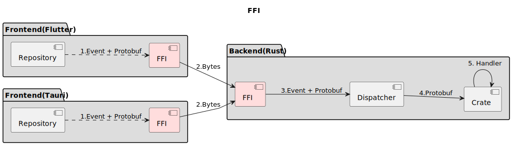

# Events

AppFlowy's backend defines all the events and generates the event's [foreign function interface](https://en.wikipedia.org/wiki/Foreign\_function\_interface) that supports **Dart** and **TS** event call.

Events are emitted in the frontend and are processed in the backend. Each event has its own handler in the backend.This mechanism uses a Protobuf-RPC like protocol under the hood to serialize requests and responses, all arguments and return data must be serializable to **Protobuf**.

This article introduces how AppFlowy uses protobuf buffer to exchange the data between the frontend and backend. The pattern as shown below:

&#x20;

Different frontend uses the corresponding FFI interface to communicate with the backend. For example:

* Dart

```dart
class UserEventSignIn {
     SignInPayloadPB request;
     UserEventSignIn(this.request);

    Future<Either<UserProfilePB, FlowyError>> send() {
    final request = FFIRequest.create()
          ..event = UserEvent.SignIn.toString()
          ..payload = requestToBytes(this.request);

    return Dispatch.asyncRequest(request)
        .then((bytesResult) => bytesResult.fold(
           (okBytes) => left(UserProfilePB.fromBuffer(okBytes)),
           (errBytes) => right(FlowyError.fromBuffer(errBytes)),
        ));
    }
}
```

* TS

```tsx

export async function UserEventSignIn(payload: pb.SignInPayloadPB): Promise<Result<pb.UserProfilePB, pb.FlowyError>> {
    let args = {
        request: {
            ty: pb.UserEvent[pb.UserEvent.SignIn],
            payload: Array.from(payload.serializeBinary()),
        },
    };

    let result: { code: number; payload: Uint8Array } = await invoke("invoke_request", args);
    if (result.code == 0) {
        let object = pb.UserProfilePB.deserializeBinary(result.payload);
        return Ok(object);
    } else {
        let error = pb.FlowyError.deserializeBinary(result.payload);
        return Err(error);
    }
}
```

So, just calling the corresponding function and then let the backend handle it. The result will be returned asynchronously.

## Code Generate Process

Let's introduce the generating process step by step.


### Step One - Definitions

We define the `Event` and the `Protobuf data struct` in Rust, for example, the `DocumentEvent` defined in event\_map.rs and `ExportDataPB` defined in entities.rs.

```rust
// event_map.rs
#[derive(Clone, Copy, PartialEq, Eq, Debug, Display, Hash, ProtoBuf_Enum, Flowy_Event)]
#[event_err = "FlowyError"]
pub enum DocumentEvent {
    #[event(input = "OpenDocumentContextPB", output = "DocumentSnapshotPB")]
    GetDocument = 0,

    #[event(input = "EditPayloadPB")]
    ApplyEdit = 1,

    #[event(input = "ExportPayloadPB", output = "ExportDataPB")]
    ExportDocument = 2,
}
```

The annotation, `#[event(input = Input struct, output = Output struct)]` is used to generate the event FFI function.

* `Input struct` mean the function receive the input parameter's type.
* `Output struct` mean the function's return value's type

I think you noticed that there is a`PB` keyword appended to every struct. We use the `PB` keyword to identify this struct is in protobuf format.

```rust
// rust-lib/flowy-document/src/entities.rs
#[derive(Default, ProtoBuf)]
pub struct ExportDataPB {
    // The annotation, index = 1, match the syntax that defines proto file.
    #[pb(index = 1)] 
    pub data: String,

    #[pb(index = 2)]
    pub export_type: ExportType,
}
```

The procedural macro, `ProtoBuf`, is used to mark this struct is going to generate the protobuf struct.

> We use the [syn](https://docs.rs/syn/latest/syn/) to collect the [AST](https://en.wikipedia.org/wiki/Abstract\_syntax\_tree) information that will be used to generate the `proto file`. If you interest in how to collect the information in details, you should check out the [Procedural Macros](https://doc.rust-lang.org/reference/procedural-macros.html).

### Step Two - Configurations

We use [toml](https://en.wikipedia.org/wiki/TOML) to control which files should be included when doing the code generation. It supports specify a single file or a folder.

```toml
proto_input = ["src/event_map.rs", "src/entities.rs"]
event_files = ["src/event_map.rs"]
```

**proto\_input**

The proto\_input receives path or file. The `code gen` process will parse the proto\_input in order to generate the struct/enum.

**event\_files**

The event\_files receives file that define the event. The `code gen` process will parse the file in order to generate the corresponding language event class. The event class name consists of the Enum name and the Enum value defined in event\_map.rs.

### Step Three - Build configuration

[Build Scripts](https://doc.rust-lang.org/cargo/reference/build-scripts.html) is the perfect way to do the code generation. Let's check out some pseudocode. We use [features flag](https://doc.rust-lang.org/cargo/reference/features.html) to control generate process. If the **dart** feature is on then the **Dart** event FFI functions will be generated.

```
// build.rs

fn main() {
    let crate_name = env!("CARGO_PKG_NAME");
    flowy_codegen::protobuf_file::gen(crate_name);

    #[cfg(feature = "dart")]
    flowy_codegen::dart_event::gen(crate_name);

    #[cfg(feature = "ts")]
    flowy_codegen::ts_event::gen(crate_name);
}
```

### Step Four - Code Gen on Build

The `code gen` process is embedded in the AppFlowy build process. But you can run the build process manually. Just go to the corresponding crate directory(For example, frontend/flowy-text-block), and run:

`cargo build --features=dart`

or if you want to check the verbose output.

`cargo build -vv --features=dart`

The build scripts will be run before the crate gets compiled. Thanks to the cargo toolchain, we use `cargo:rerun-if-changed=PATH` to enable the build.rs will only run if the files were changed.

> [cargo:rerun-if-changed=PATH](https://doc.rust-lang.org/cargo/reference/build-scripts.html#rerun-if-changed)
>
> The rerun-if-changed instruction tells Cargo to re-run the build script if the file at the given path has changed. Currently, Cargo only uses the filesystem last-modified timestamp to determine if the file has changed. It compares against an internal cached timestamp of when the build script last ran.

After running the build.rs, it generates files in Dart/TS and Rust protobuf files using the same proto files.

Dart (with dart feature on):

* `dart_event.dart`

The file is located in `packages/appflowy_backend/lib/dispatch/dart_event/flowy-document`.

TS (with ts feature on):

* `event.ts`

The file is located in `appflowy_tauri/src/services/backend/events`.

## Message passing

Let's see how the message passing from the frontend to the backend. Let use dart for demonstration (It's the same in TS).

1. Repository constructs the `DocumentEventExportDocument` class, and call `send()` function.
2. Frontend's FFI serializes the event and the `ExportPayloadPB` to bytes.
3. The bytes were sent to Backend.
4. Backend's FFI deserializes the bytes into the corresponding `event` and `ExportPayloadPB`.
5. The dispatcher sends the `ExportPayloadPB` to the crate that registers as the event handler.
6.  `ExportPayloadPB` will try to parse into `ExportParams`. It will return an error if there are illegal fields in it.

    For example: the `view_id` field in the `ExportPayloadPB` should not be empty.
7. Crate's `export_handler` function gets called with the event and data.
8. At the end, `export_handler` will return 'ExportDataPB', which will be post to the frontend.


