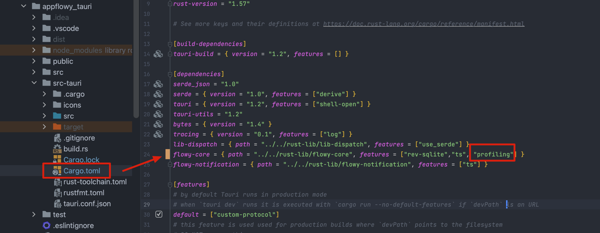
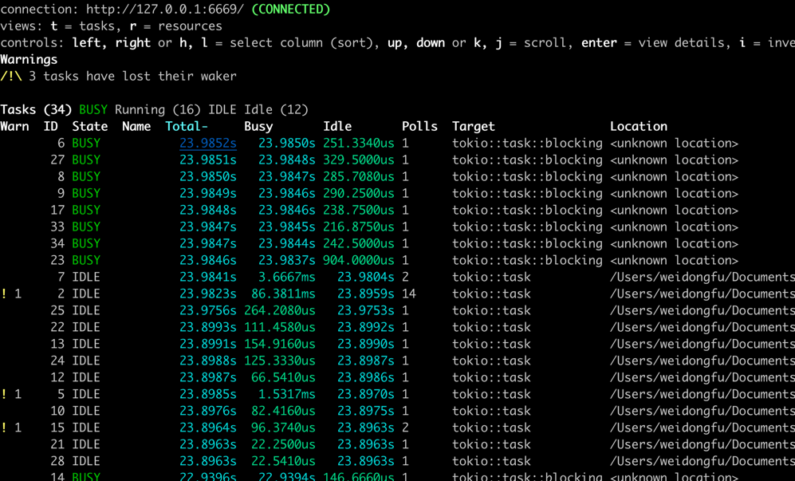

# Profiling

AppFlowy uses [tokio-console](https://github.com/tokio-rs/console) to debug the Rust backend.
It would be very useful when having the high CPU usage issues.

## Prerequisites
Install the tokio-console by running the following command

```shell
cargo install --locked tokio-console
```

and run locally

```shell
tokio-console
```

## Enable profiling
The `flowy-core` crate has a feature called `profiling`. Just enable this feature
in the cargo.toml. 

### Profiling with Tauri


The profiling data will be displayed in terminal after the application run.



### Profiling with Flutter

WIP