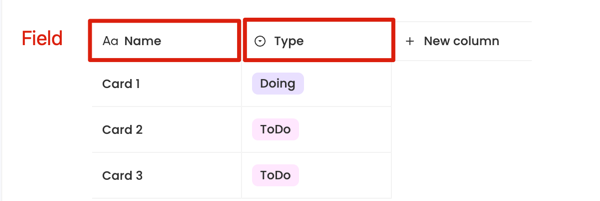
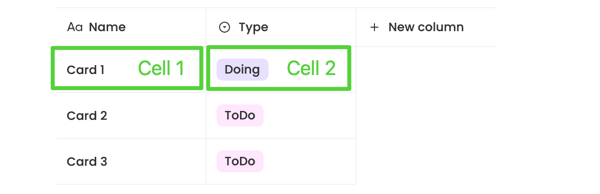

# Database View

## Introduction

This document explains how the Grid, Board, and Calendar shares the same data structs defined in the backend. It can be a development guide when you want to contribute to the Grid, Board or Calendar feature. This document will be continuously updated, and all suggestions are appreciated.

## View Definitions

Below, you will find some quick definitions to help you read through the document.

|          |                                                                                                      |
| -------- | ---------------------------------------------------------------------------------------------------- |
| Database | AppFlowy self-defined database that manages the relation between columns, rows and cells.            |
| Grid     | A Grid type is a simple representation of items placed in columns and rows.                          |
| Board    | A Board is an project management tool designed to help visualize work, limit work-in-progress.       |
| Calendar | A Calendar allows you to display data associated with dates and times in day, week or month formats. |

## Relations

Currently, AppFlowy has three types of views that share the same database. A single database can have multiple views and these views can be converted to each other.

## Events and notifications

The database views use [events and notifications](https://appflowy.gitbook.io/docs/essential-documentation/contribute-to-appflowy/architecture/frontend/inter-process-communication) to exchange the data between the frontend and backend. When triggering an event, there may be notifications sent to the frontend asynchronously. The database events are defined [here](https://appflowy.gitbook.io/docs/essential-documentation/contribute-to-appflowy/architecture/frontend/database-view/events).

## Database Definitions

Below you will find some quick definitions about the database.

|              |                                                                                           |
| ------------ | ----------------------------------------------------------------------------------------- |
| Database     | A Database struct that contains a list of fields and rows                                 |
| Field        | A Field represents a column of the database. Different fields have different `FieldType`s |
| FieldType    | A `FieldType` represents the type of column.                                              |
| TypeOption   | A `TypeOption` represents the configuration of the `Field`.                               |
| Row          | A `Row` represents a group of related cells.                                              |
| Cell         | A `Cell` contains the data of the corresponding `FieldType`                               |
| TypeCellData | Same as `Cell` but carry the `FieldType` when the `Cell` create                           |

### Database

A database is a collection of rows and columns, as shown in the picture below. It allows for the creation of more rows and columns. Each row contains a list of cells and each cell corresponds to a specific column. The number of cells is equal to the number of columns in a row. Each column, aka a `Field`, contains the configuration of how to format the cell.

### Field

A Field represents a column in the database. It has a property called `field_ty`, which is an enum defined in FieldType. The `FieldType` defines the kind of data contained in a column. Such as date, number, text, multi-select, etc. This data is stored in the `typeOptions` property, which is a Map. The key is the `FieldType`, and the value is the `TypeOption`.

The current field type of the column is determined by the `field_ty` property. As shown in the picture below. There are two Fields in the database.

### FieldType

A `FieldType` represents the type of the `Field`. Currently, AppFlowy supports `text`, `numbers`, `date`, `select`, `multi-select`, `checkbox`, `URL` and `checklist` as shown in the picture below.

### TypeOption

A `TypeOption` represents the configuration of the `Field`. Certain `TypeOption`s have user-defined options such as color, date format, number format, or a list of values for a multi-select list.

On the other hand, the `TypeOption` of a number `Field` contains the name and a list of format styles:

### Row

A `Row` contains a list of related cells, and each cell corresponds to a specific column. This means that the number of cells in a row is equal to the number of the `Fields` that are in the database.

### Cell

A `Cell` contains the data of the corresponding `FieldType`.

Most of the time, the cell data is not human-readable and requires the `Field`'s `TypeOption` to format the data. The following image describes how the cell data gets formatted step-by-step.

1. Get the corresponding `Database` with `database_id.`
2. Get the corresponding `Field` with `field_id.`
3. Get the corresponding `TypeOption` base on the current value of the `Field`'s `field_ty` property. Assuming the `field_ty` is `FieldType::Date`.
4. Get the corresponding `Row` with `row_id.`
5. Get the corresponding `Cell` with `field_id.`
6. Using the `DateTypeOption` to format the raw cell data.
7. Returns the formatted cell data.

The formatted cell data will be different depending on the `DateFormat` and `TimeFormat` of the `DateTypeOption`.

| DateFormat     | TimeFormat     | Raw cell data |                     |
| -------------- | -------------- | ------------- | ------------------- |
| month/day/year | TwelveHour     | 1675083591    | 01/30/2023 01:00 PM |
|                | TwentyFourHour | 1675083591    | 01/30/2023 13:00    |
|                |                |               |                     |
| year-month-day | TwelveHour     | 1675083591    | 2023-01-30 01:00 PM |
|                | TwentyFourHour | 1675083591    | 2023-01-30 13:00    |
