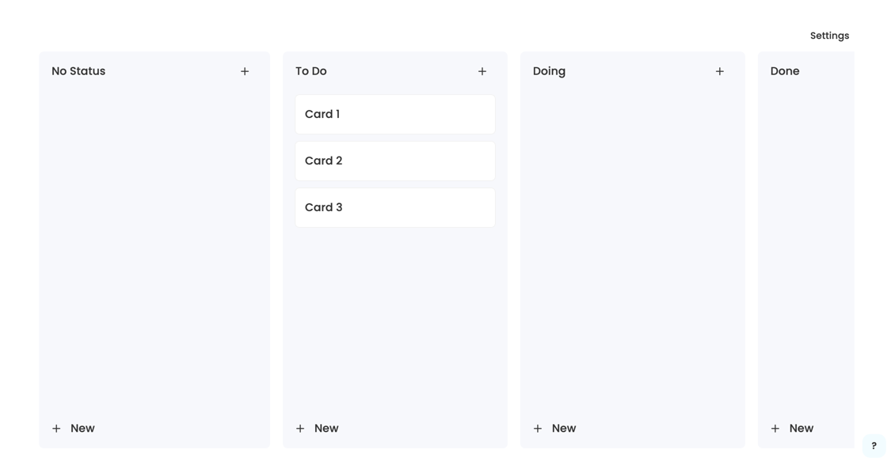
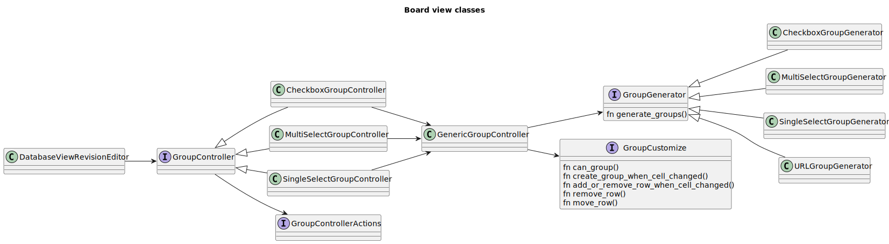

# Kanban Board

A Board is an project management tool designed to help visualize work, limit work-in-progress.
As the image shown below. 

## Definitions
Below you will find some quick definitions to help you read through the document.

|                |                                                                                   |
|----------------|-----------------------------------------------------------------------------------|
| Board          | contains multiple groups and each group represents as an independent state        |
| Group          | contains list of cards and each card represents as a record in database           |
| Card           | contains list of properties and each property belongs to a specific `FieldType`   |
| Grouping field | using the grouping rules provided by the `Field` to organize all rows             |
| Grouping cell  | the `FieldType` of the cell in row equal to the `FieldType` of the grouping field |
| Grouping data  | each group has its grouping data that represents as the group id                  |

## Board 
A board using the [database](../README.md) as its data storage. 

## Group
The UML of the classes used in grouping shown in the following picture.

### Generation
The groups are generated by the selected `grouping field`. Currently, AppFlowy supports these 
grouping fields. These groups are generated by its own rules shown below.

| FieldType    |                                                                     |
|--------------|---------------------------------------------------------------------|
| SingleSelect | The number of groups equal to the number of options                 |
| Multi-Select | The number of groups equal to the number of options                 |
| URL          | The number of groups equal to the number of different URLs in Cells |
| Checkbox     | Only two groups                                                     |

The first group of the board will be the `No Status` group. It contains the cards that the `grouping
cell` doesn't contain the `grouping data` specified by the `grouping field`.

### Modifications
The number of rows in group will be changed by these conditions
1. Move the card directly to another group. 
2. Edit the properties of the card

Actually, both of them can represent as `create`/`delete`/`update` of the `card`. 

## Card 

### Create
Create a card is equal to create a row with the `grouping cell` data in the database. For example, creating a 
card in a group whose `grouping field` type is `SingleSelect`. Then the data of the `grouping cell` will be
that option specified by that group.

### Delete
Delete a card is equal to delete the corresponding row in the database

### Update
1. Moving a row from A group to B group will set the data of the `grouping cell` from A's `grouping data` to
B's `grouping data`.
2. Update the data of the `grouping cell` to one of these groups is equal to moving this row to that group

