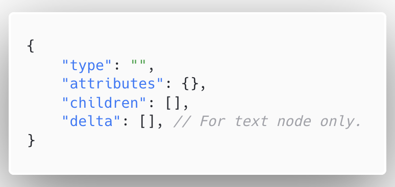
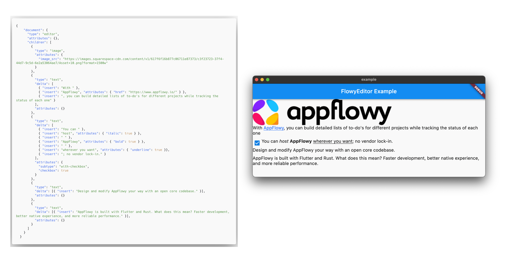
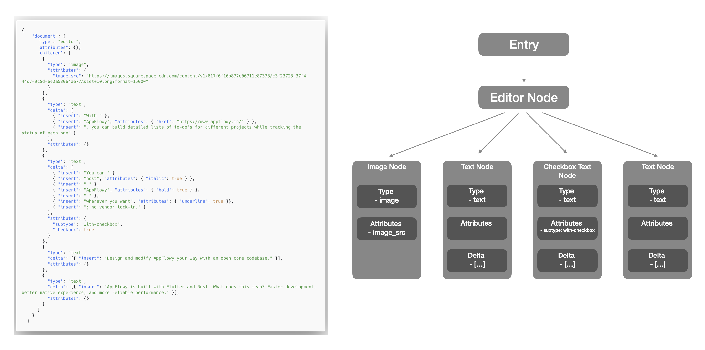
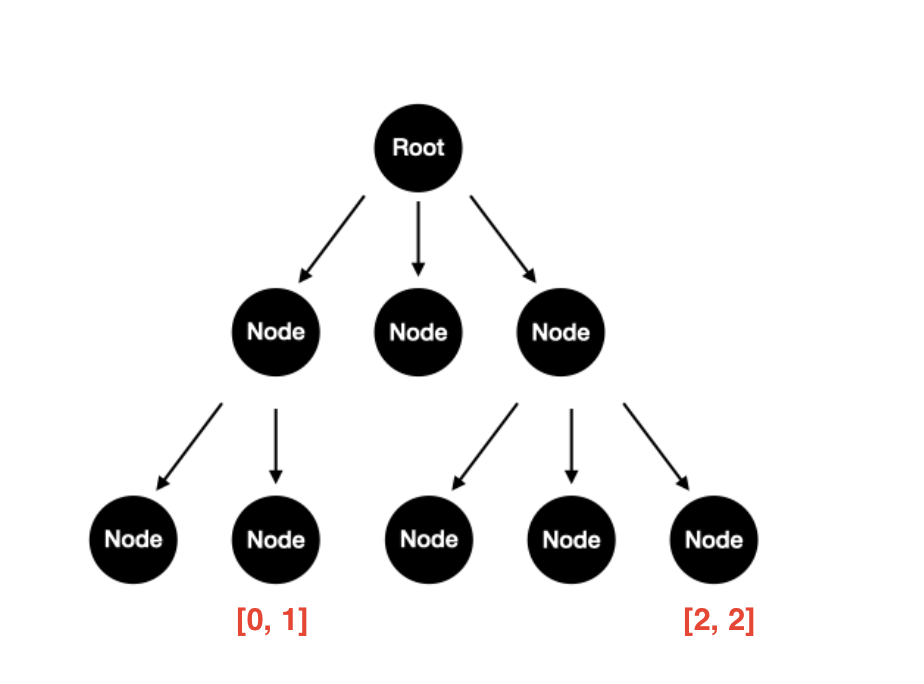

# Editor

## Introduction

This document explains how the editor works on the Dart side. Also, it can be a development guide when you want to be an editor contributor. This document will be continuously updated, and any suggestions would be helpful.


The editor is still under development, and there may be minor adjustments to the architecture. If you are interested, you can check out the feat/flowy_editor branch. Any technical suggestions are a help to us.


## Data Structure
In the selection of data structure, the editor focuses on

* Extendable - which can be simply extended with a new type for rendering and updating.
* Pluggable - which can assist in the implementation of plugins.
* Collaborative - which supports multiple simultaneous editors.

Inspired by slate.js and quill.js, the editor uses a tree structure (we called it `state_tree`) to describe the nodes in the document, and for the text node, uses the `delta` to describe it.

The benefits of the combination of `state_tree` and `delta` are

* More friendly to plugins and conflict handling, and different rendering ways can be customized for different nodes.
* Using `delta` to describe the text nodes reduce the complexity in the `state_tree`, otherwise the editor needs to split text of different style into different nodes. Also, this is compatible with historical document data.

To summarize, we used `JSON` as the data structure for local, and `state_tree` as the in-memory data structure.

### JSON
The editor uses a specific JSON data format to describe nodes.

* type - A string representing the identifier of the current node.
* attributes - A map representing the meta information of the current node.
* children - A array representing the child nodes of the current node.
* delta - A array representing the text operations, for text node only.

Each part of a document can be converted by the above format, for example

An outermost layer is an object whose type is `editor`, which is used as the entry for the editor to parse data. And children are the details of the document.

### Node
The `state_tree` is an in-memory mapping of the JSON file, consisting of nodes and its property name is consistent with the JSON keys. So each node must contain fields for **type, attributes, and children**.

#### Type
Type is an identifier describing the current node. The editor dispatches nodes to different rendering components according to the types. Note that nodes whose type is equal to ‘text’ are used as internal reserved fields.

#### Attributes
Attributes is an information data describing the current node. We reserve the subtype field to describe the derived type of the current node, and other fields can be extended at will.

#### Children
Children are the child nodes that describe the current node. We assume that each node can nest the other nodes.

#### StateTree
The editor encapsulates operations on Node, such as insert, delete and modify in StateTree. It holds the root node and is responsible for converting between JSON to and from it.

#### Path
Path is an array of integers to locate a node in the state tree. For example, [0, 1] represents the second child of the first child of the root node.

#### Reversed field
**Type**
* text

***Attributes**
* subtype

## Renderer(WIP)

## Text Editing and Selection（WIP）

## Operation（WIP）
