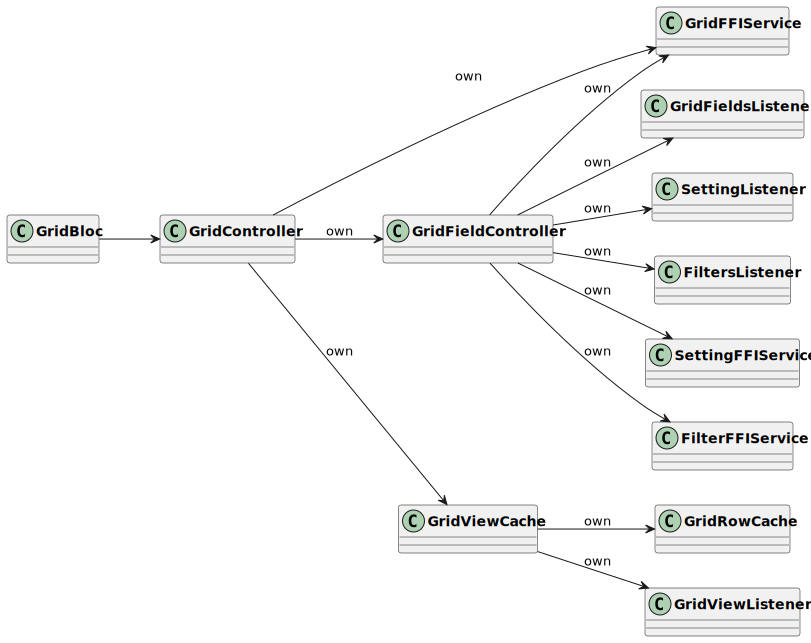

# 🧮 Grid

## Introduction

This document explains how the grid works on the Dart side. Also, it can be a development guide when you want to be a grid contributor. This document will be continuously updated, and any suggestions would be helpful.

### Definitions

Below you will find some quick definitions to help you read through the document.

| Block         | A grid can have many rows. Rows are therefore grouped into Blocks in order to make things more efficient.                                                 |
| ------------- | --------------------------------------------------------------------------------------------------------------------------------------------------------- |
| Cache classes | Aim to reduce the time cost of getting data from the backend.                                                                                             |
| Cell          | A Cell is one individual cell in a grid. You can see more in the [Cell](grid.md#cell) section.                                                            |
| Column        | A column is a theoretical representation of data, however, there is no Column class.                                                                      |
| Field         | A Field represents the configuration of a column. You can see more in the [Field](grid.md#field) section.                                                 |
| Grid          | A Grid type is a simple representation of items placed in columns and rows. It is not a spreadsheet. You can see more in the [Grid](grid.md#grid) section |
| Header        | @@@                                                                                                                                                       |
| Row           | A Row represents a group of related data                                                                                                                  |

## Grid

At its core, a Grid type is a simple representation of items placed in columns and rows. It is not a spreadsheet.

Another name for a column is Field. A column's configuration is defined in the [Field](grid.md#field) class. It is important to note though that although a grid has the concept of columns, there are no actual Column classes.

A user can add a Row, and then define the data in each of the cells created for the Grid's Fields in that row.

A Grid has a list of Blocks, each Block has a list of Rows.


Classes with a PB suffix are generated in protobuf format. You could check the [protobuf.md](../backend/protobuf.md "mention") document out if you are interested in how the protobuf classes are generated.


## Cache

When you open a grid, a `GridBloc` will be initialized. There are four cache classes, as shown in the diagram above.

1. `GridFieldCache`
   * Listens to the `Field`'s changes.
   * Updates the `Field` according to the `GridFieldChangesetPB`.
2.  `GridBlockCache`

    A Grid contains many `Block`s, each `Block` has a `GridRowCache`.

    * Listens to the `Block`'s changeset.
    * Updates the `GridRowCache` according to the `GridBlockChangesetPB`. The changeset contains the ids of inserted/deleted/updated `Rows`.
3. `GridRowCache`
   * Caches the `Block`'s `Row`s in memory.
   * A `Row` contains many `Cells, each` Cell`will be cached in the`GridCellCache\`.
   * Allows to insert/delete/update `Row`s.
4. `GridCellCache`
   * Caches each `Cell` by `GridCellCacheKey` in memory.
   * Allows to remove/insert `Cell`s.

## Block

A `Grid` can hold many thousands of `Row`s. In order to streamline the fetching of data, these `Row`s are split up and contained in `Block`s.

A `Grid` can contain many `Block`s, each `Block` has a `GridRowCache`. For the moment, we only support having one `Block` in the Grid. This will cause a limitation on the number of rows that a user can create, however, this limitation will be lifted in the future.

## Field

### Field

A `Field` represents a column's configuration. It will contain the column's name, id, width, type (as defined in [FieldType](grid.md#fieldtype)), etc.

A `Field` is not a column of data, it does not contain a list of `Cell`s.

### FieldType

A `Field` has a `FieldType`. The `FieldType` defines the kind of data contained in a column. For example, a column may contain dates, numbers, text, multi-select list, etc.

Certain field types have user-defined options such as color, date format, number format, or a list of values for a multi-select list. These options are defined within a specialization of the `FieldTypeOption` class.

Each field has its `TypeOptionBuilder` in the backend that is used to parse the bytes into corresponding FieldTypeOption.

### **FieldEditor**

**FieldEditor**

A `FieldEditor` is a widget that is used to edit the field's shared properties. Such as the name of the field, etc. It uses the `FieldTypeOptionEditor` to customize the UI for each field.

**FieldEditorBloc**

`FieldEditorBloc` uses a `TypeOptionDataController` to listen for changes to a `Field` or perform a rename operation. It will notify the widget to rebuild if its state has changed.

**TypeOptionDataController**

Defines how to update a `Field`'s properties. Such as the name, the field, and the type option data.

**IFieldTypeOptionLoad**

Defines how to load a `Field`'s type option data. For example, when we create a new `Field`, we use `NewTypeOptionLoader`. We use `FieldTypeOptionLoader` to load the existing `Field`'s type option data.

**FieldTypeOptionEditor**

`FieldTypeOptionEditor` is a widget that provides a custom UI for each `Field`. You can provide a custom UI by extending the `TypeOptionWidgetBuilder` As the image below shows, we have many `TypeOptionWidgetBuilder` implementations.

The widget returned by `TypeOptionWidgetBuilder` use `TypeOptionWidgetContext` as its data model. For example, `DateTypeOptionWidget` uses `DateTypeOptionContext` that extends the `TypeOptionWidgetContext`.

`TypeOptionWidgetContext` uses `TypeOptionDataParser` to parse the generic data, List, to specific data type. As the image below shows, each `TypeOptionContext` must have a corresponding `TypeOptionDataParser`.

## Row

A `Row` represents a group of related `Cells`.

**RowService**

`RowService` handles up the logic to interact with the backend. It allows creating, duplicating, deleting, and moving the row operations.

**GridRowCache**

Caching the rows in memory to reduce the cost of getting data from the backend. (as defined in the [Cache](grid.md#cache))

**GridCellBuilder**

* A `Row` has a list of `Cell`s. It uses the `GridCellBuilder` to build the custom `Cell` according to the field type. Each cell should extend the `GridCellWidget` interface.

## Cell

A `Cell` is one individual cell in a grid. The number of `Cell`s in a `Row` is equal to the number of `Field`s in the `Grid`. We define the `GridCellWidget` that defines the shared behaviors. Such as `CellAccessory`, `CellEditable`, and `CellShortcuts`.

Let's look at the select `GridSingleSelectCell` and find out how it works. When a user clicks a cell, the `SelectOptionCellEditor` will show up.

* `SelectOptionCellEditor` is a widget that defines the UI when editing the cell.
* `SelectOptionCellEditorBloc` binds the UI and the data, the `SelectOptionCellEditor` will be rebuilt if the bloc state changes.
* `SelectOptionService` handles up the logic for deleting, updating the select option with the backend.
* `GridSelectOptionCellController` use `IGridCellController` to implement the cell's operations.

**IGridCellController**

* Allows getting Read/Write cell data.
* Listens to the cell date change.
* Allows getting the corresponding field type option data that is parsed by the `TypeOptionDataParser`.
* Listens to the field event and loads the cell data if needed. For example, the numbered cell should reload when the number format is changed.

**IGridCellDataParser**

Allow getting the cell data and then parsing into a specific type.

**IGridCellDataParser**

The implementation of `IGridCellDataParser` will parse the `List<int>` into specific cell data. For example, the `SelectOptionCellDataParser` will parse the List into `SelectOptionCellDataPB`.

**IGridCellDataPersistence**

We can use CellDataPersistence that implements the `IGridCellDataPersistence` to perform normal save operation.

Also, implement the `IGridCellDataPersistence`to provide custom data saving operation. Just like the `DateCellDataPersistence` does.

**CellService**

Handling the logic for reading and writing the cell data with the backend.
