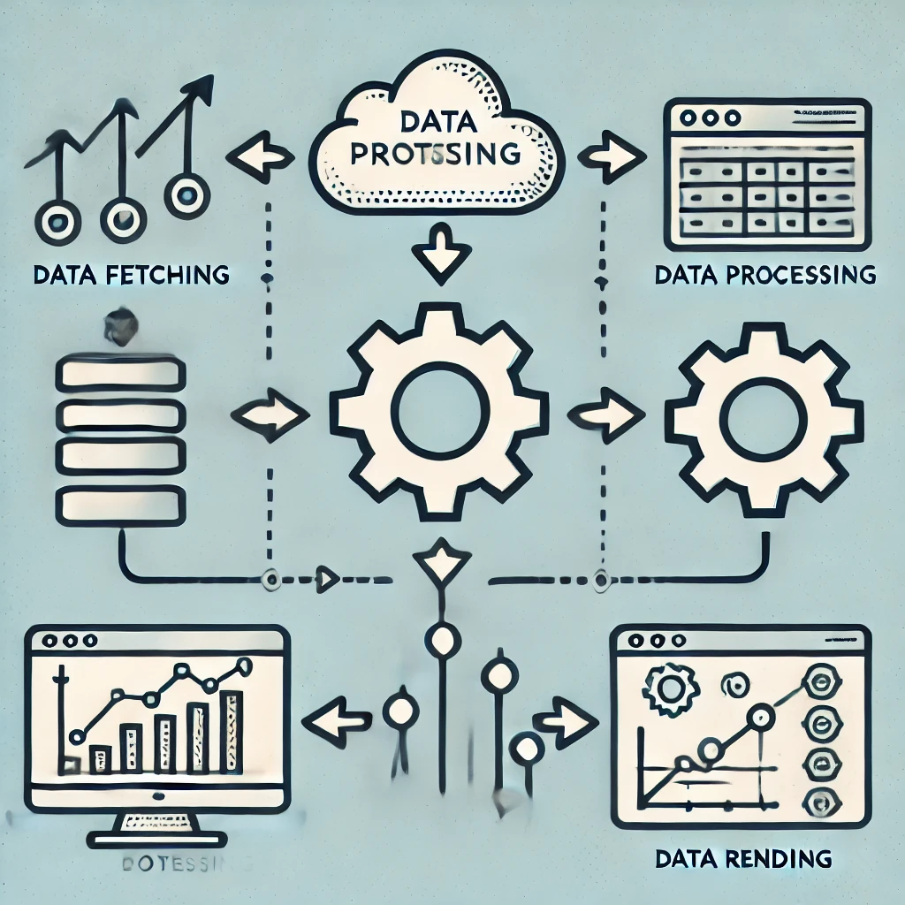
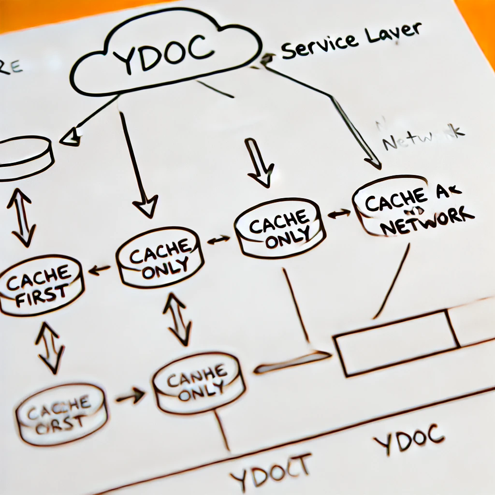

# Web

## 🌐 Project Background

**AppFlowy Web** is a key project designed to 🚀 fully support and extend the capabilities of the AppFlowy client. By providing an efficient, flexible, and user-friendly web platform, AppFlowy Web makes it easier for a broad audience to access the functions and services of AppFlowy. The core objectives of AppFlowy Web include:

- **📢 Publishing Features**: Users can quickly publish and share their content through the web interface, whether it be personal notes, team projects, or publicly displayed materials. Everything can be online with simple operations.

- **🔌 Browser Plugins**: Customized for commonly used browsers, AppFlowy Web integrates seamlessly with the tools users employ daily, enhancing work efficiency and user experience.

- **🚪 Quick Login and Registration Portals**: AppFlowy Web features a streamlined login and registration process, making it easy for new users to join while ensuring platform security and confidentiality of user data.

- **📂 Online Mailbox and Document Management**: The platform provides robust online document management capabilities. Users can access and edit their documents on any device and manage emails through an integrated mailbox, making communication and file management more efficient.

## 🌟 Design Philosophy

In this project, we implement a three-tier architecture: **Data Fetching Layer**, **Data Processing Layer**, and **Data Rendering Layer**. This structured approach is designed to enhance our development efficiency and simplify problem-solving by focusing on key principles:

1. **Simplicity is Efficiency** 🚀: We prioritize straightforward solutions to support rapid development and facilitate easier understanding, which helps in maintaining a low error rate and reducing complexity.

2. **Reducing Heavy Dependencies** 🔗: Our architecture promotes high cohesion and low coupling through a modular design where each layer handles specific functions independently. This structure minimizes inter-layer dependencies, enhancing flexibility and maintainability.

3. **Functional Programming Principles** 🔄: By applying functional programming techniques, we emphasize immutable data structures and pure functions. This approach not only simplifies data handling and state management but also makes the code more predictable and easier to test.

4. **Simplifying Complex Problems** 🧩: We break down complex issues into smaller, manageable parts by clearly defining layer responsibilities. This method ensures that developers are not bogged down by the intricacies of the code, fostering a more enjoyable and effective problem-solving environment.

Our goal with this architecture is to create a development environment that not only meets the current technical demands but also remains manageable and enjoyable for our team. By adhering to these principles, we aim to produce a robust system with fewer bugs and higher overall productivity.

## 🏗️ Project Structure

* [🗺️ CodeMap](essential-documentation/contribute-to-appflowy/architecture/frontend/web/codemap.md)

## 🛠️ Technology Stack

- **React.js**: A JavaScript library for building user interfaces, React.js is the foundation of AppFlowy Web's frontend development. It provides a robust framework for creating interactive and dynamic web applications.

- **Yjs**: A framework for building collaborative editing applications, Yjs enables real-time collaboration features in AppFlowy Web. It allows multiple users to work on the same document simultaneously, making it ideal for team projects and shared documents.

- **Node.js**: A JavaScript runtime environment, Node.js is used to run the backend services of AppFlowy Web. It provides a scalable and efficient platform for handling server-side logic and data processing.

## 📦 Module Composition

AppFlowy Web is architected around three key modules, ensuring efficient data handling and flexible frontend rendering:

1. **Data Fetching**: Responsible for obtaining data from backend APIs or other external data sources. This layer focuses on the initial reception of data, including user inputs and external API calls.

2. **Data Processing**: Handles necessary data manipulation and state management before rendering. This layer leverages Yjs to manage data states, ensuring synchronization and real-time updates in multi-user scenarios.

3. **Data Rendering**: Builds and renders the final user interface. Utilizing React, this module constructs responsive UIs that dynamically update based on user interactions and data changes.

These modules work together to facilitate a smooth data flow from acquisition to presentation, optimizing user experience and system responsiveness.

### 🔄 Data Fetching

In AppFlowy Web, the Data Fetching module employs a WebAssembly (WASM) library provided by AppFlowy, instead of traditional HTTP methods. This choice is based on practical reasons:

1. **Code Reusability**: Using the same WASM library as the desktop client allows for a consistent and reusable codebase across platforms. This uniformity aids in maintaining and updating the software more efficiently.

2. **Technical Exploration**: Choosing WASM is part of an effort to learn and integrate newer technologies within the project. This provides the development team with experience in newer web development practices.

The adoption of WASM, despite its potential to increase bundle sizes, reflects an interest in exploring how emerging technologies can be fitted into and benefit the project.

### 🔄 Data Processing

The Data Processing module in AppFlowy Web links the data fetching and rendering stages, focusing on preparing data for use:

1. **Service Layer Connection**: Connects to the fetching module and implements caching strategies to speed up data availability for rendering. The service provides access to the original data (YDoc) for the rendering layer.
   

2. **Data Manipulation Methods**: Raw data obtained from the service is not immediately suitable for rendering and requires processing:

    - **Publish Provider**: Manages publishing-related data operations, providing interfaces and hooks for data access.

    - **Document Transfer**: Handles the conversion between Slate data and Yjs data, manages update listeners, and performs granular updates necessary for document synchronization.

    - **Database Operations**: Monitors YDoc updates to facilitate data querying, sorting, grouping, and fetching specific rows and columns. This layer controls component updates based on the data fetched from various interfaces.

This module ensures data is correctly processed and ready for rendering, supporting the application's operational flow.

### 🎨 Data Rendering

The Data Rendering module in AppFlowy Web is primarily responsible for rendering components within the application. This module utilizes the React framework to manage and update the user interface based on data changes:

1. **Integration with Data Processing**: Although data handling is often separated for maintenance purposes, data processing and rendering are inherently linked. This separation helps in maintaining clarity and manageability in the codebase but recognizes that some level of data processing is necessary directly at the rendering stage.

2. **React Framework**: Components are rendered using React, which relies on data-driven updates through props and state management. React's context mechanism is also employed to pass down data and provide accessibility across different components without prop-drilling.

This approach ensures that the application remains responsive and efficient, updating only the necessary parts of the user interface when data changes occur.
