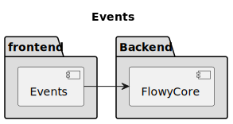
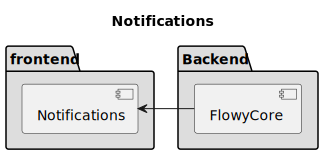

# Inter-Process Communication

AppFlowy uses a particular style of Inter-Process Communication called [Asynchronous Message Passing](https://en.wikipedia.org/wiki/Message_passing#Asynchronous_message_passing),
where processes exchange requests and responses are serialized using the **Protobuf** representation.

Message passing is a safer technique than shared memory or direct function
access because the recipient is free to reject or discard requests as it
sees fit. For example, if the Flowy Core determines a request is invalid,
it simply discards the requests and never executes the corresponding function.
This article is going to explain how the event process works.

## Events
AppFlowy's backend defines all the events and generates the event's [foreign function interface](https://en.wikipedia.org/wiki/Foreign_function_interface).
Currently, AppFlowy supports **Dart** and **TS** event call.

Events are emitted in the frontend and are processed in the backend. Each
event has its own handler in the backend

## Notifications
Notifications one-way messages that are best suited to communicate lifecycle events
and state changes. Notifications are triggered in the backend and received in the frontend.

