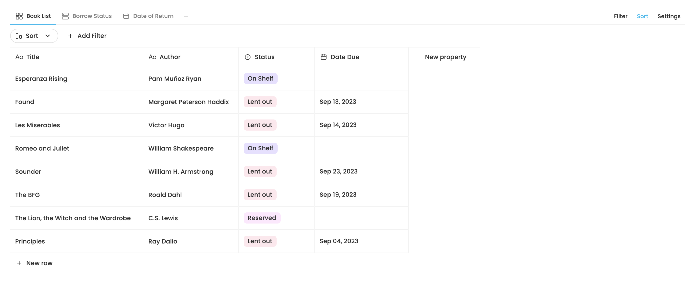
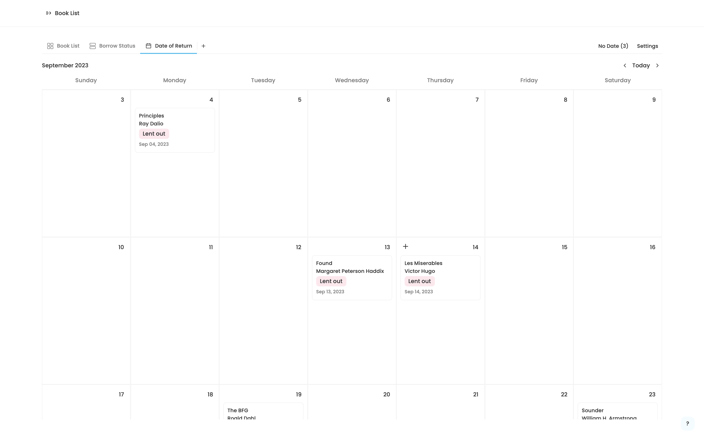

# Creating a Calendar View for the AppFlowy Database

by Richard, as part of the AppFlowy Mentorship Program

### Introduction

AppFlowy is powered by a robust database that stores large amounts of structured data. It is designed to help you input, store and organize this data in an intuitive way. Users can select a specific field type for a column that is most suited for the data in that field such as date, select options and checklist. Each row can also have a rich-text editing area to add even more information. And lastly, there are extra tools to pick out special interests in the data such as sorting and filtering.

### The case for database views

The AppFlowy database can be thought of as simply a collection of rows and columns (or fields). For example, consider a database for books in a library. The database needs to keep track of all the information on the books that it offers to the visitors. This includes the title, author, publisher, date of publication, ISBN, borrow status, current borrower, date borrowed and latest date of return, etc. The user can use the field type most suited for each kind of information (single select for borrow status, date and time for date borrowed, for example)

<figure><figcaption><p>The grid views lays out data in rows and columns</p></figcaption></figure>

However, we wish to provide users with a way to visualize the data in the database in different ways to give more useful insight. We do this by allowing users to select which view layout to view the database. Prior to this project, we support grid and kanban board.

To give users the most flexibility, we separated data that should be customizable in each individual database view from the data that should be shared between all the database views. We will see the structure of a database view in the following section, but in a basic sense only the field and row information (corresponding to the books and attributes of those books in the examples) is shared between all the views.

A database can also have multiple database views at the same time. The user can switch between them using the tab bar above the database. Continuing from our example, a kanban board view that uses a “Status” field to group the rows could be added to a nice overview of the books that are in the library, which ones are being borrowed, which ones are reserved, etc.

<figure><figcaption><p>The kanban board groups similar rows together</p></figcaption></figure>

To go a step further, we can also add a calendar view so that users will be able to know when a book should be returned at a glance. Through a calendar, users can grasp upcoming (or past) scheduled events at a glance. Users will be able easily identify the duration of an event, if and when events overlap, or how much time exists between two events. This feature would be especially useful for task scheduling and event planning. In this post, we'll explore how we created a new calendar view for the AppFlowy database.

### A closer look at a database view

```rust
pub struct DatabaseView {
    pub id: String,
    pub database_id: String,
    pub name: String,
    pub layout: DatabaseLayout,
    pub layout_settings: LayoutSettings,
    pub filters: Vec<FilterMap>,
    pub group_settings: Vec<GroupSettingMap>,
    pub sorts: Vec<SortMap>,
    pub row_orders: Vec<RowOrder>,
    pub field_orders: Vec<FieldOrder>,
    pub created_at: i64,
    pub modified_at: i64,
}
```

Most of these fields are pretty straightforward. For example, `filters` and `sorts` correspond to existing sort and filter configurations, while `group_settings` corresponds to how rows may be grouped in a kanban board, and `field_orders` and `row_orders` define how the rows and fields are ordered respectively.

We'll now look at a new configuration introduced for the calendar specifically that helps users to customize it: `layout_settings`.

### Layout Settings

Whether it is a custom in their current region or personal preference, users would like to customize their calendar layouts to better suit their needs. The layout settings is responsible for storing these layout-specific settings.

* The calendar layout type: while only month layout is supported currently, we are also hoping to have a week layout as well as a day layout in the future.
* First day of the week: in some parts of the world, Monday is the first day of the week while in others, Sunday is the first day of the week
* Show weekends: some people such as students or people working on weekdays only can choose to hide the weekends to save space
* Show week numbers: this is pretty self-explanatory
* `field_id` this is the id of the date field being used to layout the events in the calendar. We’ll talk about this later.

To store the data and support [Conflict-free Replicated Data Type (CRDT)](https://crdt.tech/) throughout the entire application, we use the `yrs` crate in our AppFlowy-Collab crate. Naturally, we use the data structures that lead to the most efficient data processing possible. The database stores and processes data through a wrapper around a hash map of the `lib0` crate's `Any` type, which can store any type of value and has efficient serialization for storage. We call this `AnyMap` and we use it to store cell data, field type options, sort and filter configurations, etc. We also use other common shared types as well, including `ArrayRef` and `MapRef`.

<pre class="language-rust" data-overflow="wrap"><code class="lang-rust">pub struct LayoutSettings(HashMap&#x3C;DatabaseLayout, LayoutSetting>);

pub type LayoutSetting = AnyMap;

pub struct CalendarLayoutSetting {
    pub layout_ty: CalendarLayout,
    pub first_day_of_week: i32,
    pub show_weekends: bool,
    pub show_week_numbers: bool,
    pub field_id: String,
}

impl From&#x3C;LayoutSetting> for CalendarLayoutSetting {
    fn from(setting: LayoutSetting) -> Self {
        let layout_ty = setting
            .get_i64_value("layout_ty")
            .map(CalendarLayout::from)
            .unwrap_or_default();
        let first_day_of_week = setting
            .get_i64_value("first_day_of_week")
            .unwrap_or(DEFAULT_FIRST_DAY_OF_WEEK as i64) as i32;
        let show_weekends = setting
            .get_bool_value("show_weekends")
            .unwrap_or_default();
	let show_week_numbers = setting
            .get_bool_value("show_week_numbers")
            .unwrap_or_default();
        let field_id = setting.get_str_value("field_id").unwrap_or_default();
        Self {
<strong>            layout_ty,
</strong>            first_day_of_week,
            show_weekends,
            show_week_numbers,
            field_id,
        }
    }
}
	
impl From&#x3C;CalendarLayoutSetting> for LayoutSetting {
<strong>    fn from(setting: CalendarLayoutSetting) -> Self {
</strong>        LayoutSettingBuilder::new()
            .insert_i64_value("layout_ty", setting.layout_ty.value())
            .insert_i64_value("first_day_of_week", setting.first_day_of_week as i64)
            .insert_bool_value("show_week_numbers", setting.show_week_numbers)
            .insert_bool_value("show_weekends", setting.show_weekends)
            .insert_str_value("field_id", setting.field_id)
            .build()
    }
}
</code></pre>

### Events and Notifications

AppFlowy uses a system of events and notifications using Protobuf to communicate between the frontend and backend. (You can learn more about events and notifications in the [AppFlowy Documentation](https://docs.appflowy.io/docs/essential-documentation/contribute-to-appflowy/architecture/frontend/inter-process-communication)) And while most of these used in grids and kanban boards are also usable in the calendar, we created some additional ones to pass event data more efficiently.

The first is of course events and notifications for layout settings, and we defined `DatabaseEvent::GetLayoutSetting` and `DatabaseEvent::SetLayoutSetting`, pretty straight forward. Next, we need to fetch the calendar events from the database. Let’s first define a calendar event as the following:

```rust
pub struct CalendarEventPB {
    #[pb(index = 1)]
    pub row_meta: RowMetaPB,

    #[pb(index = 2)]
    pub date_field_id: String,

    #[pb(index = 3)]
    pub title: String,

    #[pb(index = 4)]
    pub timestamp: i64,

    #[pb(index = 5)]
    pub is_scheduled: bool,
}
```

In grid and kanban board, we can load the rows in a straightforward manner. In the calendar, however, we decided to also fetch timestamp of the event based on the date field specified in the layout settings. Doing this makes it much easier to write the frontend code, since the event information and the timestamp are now together. If we didn’t do this, we would have to get all of the rows in the database, and then fetch the timestamp for each individual.

Currently, there are four defined events: `GetAllCalendarEvents`, `GetNoDateCalendarEvents`, `GetCalendarEvent` and `MoveCalendarEvent`. While the first 3 are simply getters that return one or more `CalendarEventPB`s, `MoveCalendarEvent` is a special event that we use to re-schedule the event using drag and drop.

After implementing the event handlers for each event, and we’re now ready to move to the frontend.

### Building the Frontend

#### Bloc

In AppFlowy databases, state management is typically handled using `bloc`. Thanks to the separation of logic from the Flutter widgets that it provides, we are able to solely focus on the processing of data. We then use the `flutter_bloc` package to create, manage and consume them in the widget tree.

Let’s first look at the blocs used in other database views and see what we can re-use. There are a number of controllers and services in place to communicate with the backend. They are often initialized with the bloc managing the state of the database being presented to the user, but some others may be created as needed (such as a cell controller being created for a specific cell's editor bloc). During initialization, listeners for notifications from the backend are also created.

* `DatabaseController` is a controller that encapsulates some specific controllers and services to provide specific functions. This is the main controller when a database is opened.
* `DatabaseViewBackendService` can be used to make settings to the current database view (more on this later).
* `FieldController` is used to edit the options of a field and manage filtering and sorting tasks on a field.
* `DatabaseGroupListener` is used in database views that can group rows together based on a specific field, listening to group setting changes in the backend. This is currently only used in Kanban Board.
* `DatabaseLayoutSettingListener` listens to layout setting changes. This is currently only used in Calendar.
* Various cell controllers used to listen to and allow making changes to cell data.
* `FilterBackendService` and `SortBackendService` that allow the user to create, modify and remove filtering and sorting configurations.

Since there are lots of overlap between different listeners, we’ll only look at the `DatabaseLayoutSettingListener` here.

```dart
class DatabaseLayoutSettingListener {
    final String viewId;
    PublishNotifier<LayoutSettingsValue<DatabaseLayoutSettingPB>>?
        _settingNotifier = PublishNotifier();
    DatabaseNotificationListener? _listener;
    DatabaseLayoutSettingListener(this.viewId);

    void start({
        required void Function(LayoutSettingsValue<DatabaseLayoutSettingPB>)
            onLayoutChanged,
    }) {
        _settingNotifier?.addPublishListener(onLayoutChanged);
        _listener = DatabaseNotificationListener(
        objectId: viewId,
        handler: _handler,
        );
    }

    void _handler(
        DatabaseNotification ty,
        Either<Uint8List, FlowyError> result,
    ) {
        switch (ty) {
        case DatabaseNotification.DidUpdateLayoutSettings:
            result.fold(
                (payload) => _settingNotifier?.value =
                    left(DatabaseLayoutSettingPB.fromBuffer(payload)),
                (error) => _settingNotifier?.value = right(error),
            );
            break;
        default:
            break;
        }
    }
}
```

Upon starting, the listener listens for notifications coming from the backend. When a `DidUpdateLayoutSettings` notification arrives, the `_settingNotifier` is changed to the new value. This then triggers a series callback functions to be called, ultimately ending up at the `didReceiveCalendarSettings` event handler in the calendar bloc.

```dart
didReceiveCalendarSettings: (CalendarLayoutSettingPB settings) {
    // If the field id changed, reload all events
    state.settings.fold(() => null, (oldSetting) {
        if (oldSetting.fieldId != settings.fieldId) {
            _loadAllEvents();
        }
    });
    emit(state.copyWith(settings: Some(settings)));
}
```

As evident from the code snippet, we only need to load all the events (through the `GetAllCalendarEvents` that we have looked at earlier) if there is a change in the date field being used in the layout. This saves us from having to reload all the events when we only change the first day of week from Monday to Sunday, for example.

#### Third-Party Calendar Component

With all the business logic set up and ready to go, the actual implementation of the calendar UI is pretty easy. We use the [calendar\_view](https://pub.dev/packages/calendar\_view) package to implement it, which provides a pretty healthy level of customization and usability features.

This is our current design:

<figure><figcaption><p>This calendar displays the rows from our books example using the return dates</p></figcaption></figure>

* A custom header area that shows the current month and year and allow users to navigate between months, change view settings and see the a list of unscheduled events in a drop-down menu.
* Event cards that not only show the title of the event, but also the other properties associated with it, such as select options.
  * Users can click on the event card to open it as a page, where they can edit the event’s associated properties or hide, duplicate or delete the event.
  * Users can also drag and drop the event cards to reschedule them.
* Users can switch to the previous or next month, and while in another month, jump to the current one.

We also have plans to continuously update the UI to make it more beautiful, intuitive and user-friendly.

### Questionnaire

Thanks for reading this article. If you have some time, please kindly take our 1-minute survey (TODO: link) to give us feedback and let us know what interests you the most. If you have a suggestion or question for the calendar view or any part of AppFlowy, you can create an issue on Github and we’ll get back to you as soon as possible. Also feel free to follow us @appflowy on Twitter or join our Discord server to follow our latest development! (TODO: insert links)
