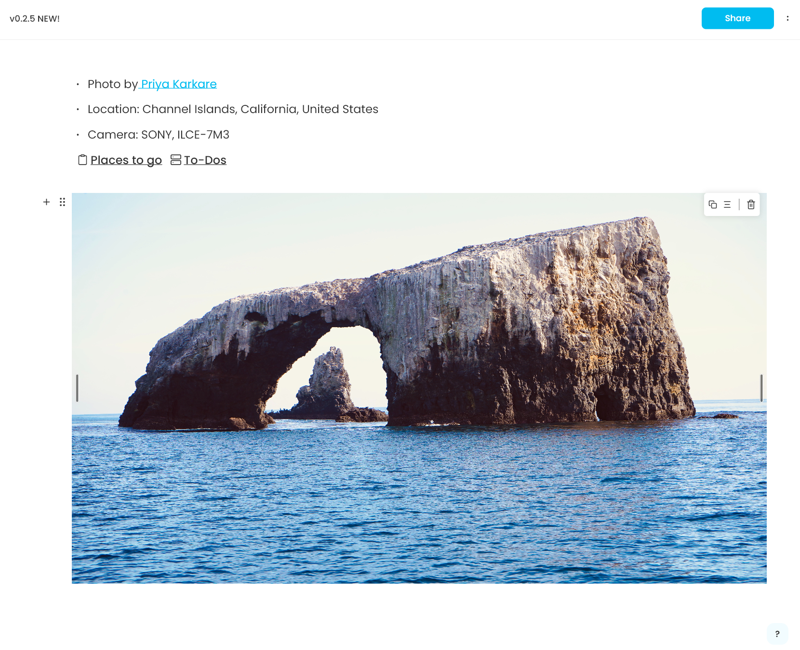

# Don’t Try to Load Code Dynamically in Your Flutter App, It’s Terrible

**Background**

AppFlowy, is an open-source project, emphasizes user customization by offering an editor that allows developers to inject custom code the AppFlowy application. At AppFlowy, we call this injected code a plugin. The primary interface that allows plugin injection is the AppFlowy Editor, the core feature that allows users to edit rich text for their notes. If you are a developer that is curious about how you may be able to support a marketplace where users can get extensions for your application, this article is for you. Let’s get started!

We’ll start by exploring an example that showcases how a developer inject their plugins into the AppFlowy Editor. Please read the comments before continuing.

```dart
// this code is currently AOT compiled the app
return AppFlowyEditor(
  editorState: editorState,
  shortcutEvents: const [],
  // this is an API that a developer can use to inject their plugin
  customBuilders: {
		// What we want is to we want to provide this at runtime...
    'local_image': LocalImageNodeWidgetBuilder(),
  },
);
```

In this specific example, the developer leveraged the interface from the editor to render local images in the editor. The following picture demonstrates what the added functionality may look like (note that this is a local image and this feature was made available in the 0.2.5 release).

<figure><figcaption></figcaption></figure>

**Summary**

By utilizing the `AppFlowyEditor` API, the developer was able to seamlessly integrate a Network image into the editor. If the developer wants this plugin to be used by an end user, they can either:

1. Submit a pull request to AppFlowy and have this plugin integrated into our version of the application.
2. Create their own version of AppFlowy with this plugin and publish it for end user consumption.

**Problem**

Suppose that the added plugin caused the editor to render its content slower. Or, suppose that the added plugin caused the release size to increase significantly. The team would need to consider whether the added plugin was a net benefit to our user base, whether the plugin’s opportunity cost warranted shipping the feature in the next release. **Some users may require the `NetworkImageNodeWidgetBuilder` while others do not. To make everyone happy we may need to create one version of the application with the plugin and one without the plugin**. Now, we are faced with scalability challenges for anyone developing plugins because:

* The plugin developer needs to maintain their own version of AppFlowy with the plugin.
* Or, the team needs to accept this plugin in our version. If not, we need to maintain another version with this plugin.

Hence, non-developers may need to download multiple versions of AppFlowy if developer X has built AppFlowy with plugin Y and developer A has built AppFlowy with plugin B.

Hence, the number of AppFlowy versions grows exponentially. To illustrate, when there are "$n$" distinct plugins, there are a total of $2^n$ versions of AppFlowy. With just 1 plugin, we have one version with the plugin and one version without. With just 5 plugins we would end up with 32 distinct versions of AppFlowy. This lack of scalability indicates the need for a more efficient solution.

**Objective**

The objective now becomes streamlining the release process by consolidating it the application into a single release that allows users to download plugins on demand. In doing so, we aim to enable the execution of 3rd party plugins within our application, treating it as an integrated component. The user should be able to download and enable 3rd party developer plugins with the click of a button from within the application, not by downloading a different version.

**Solutions**

In our pursuit of achieving the desired functionality, we explored many potential approaches. The following sections describe the potential solutions that could enable the integration of 3rd party plugins within our application. By evaluating these options, we aimed to identify the most suitable approach that aligned with our objectives and technical bandwidth.

**Approach #1: Over-the-Air Frameworks**

Over-the-Air (OTA) update frameworks facilitate wireless software updates by delivering code, that wasn’t previously in the software, from a server. Furthermore, OTA updates allow new features to be delivered without 3rd party services, like the App Store.

Typically, these updates are transmitted as deltas, which are unpacked and applied by the framework on the client side. Effective management of the update process necessitates a server to handle code push operations. The following code block illustrates how AppFlowy might use an OTA update framework to implement dynamic plugins.

```dart
@override
void initState() {
	super.initState();
  // grab a list of plugins, maybe as a url, to query a server for the plugin code
	plugins = database["plugins"].map((row) => row.plugin_name)); 
}

return AppFlowyEditor(
	  editorState: editorState,
	  shortcutEvents: const [],
		customBuilders: {
      // here we append the default plugins
			...defaultPlugins,
      // suppose that we query the server for the code an load the plugins here asynchronously
			...plugins.map((name) => { name, OTAWidget(url: '<https://www.example.com/$version/$name>')})
		}
);
```

In the example, workspace plugin preferences are stored, and on startup the app uses those preferences to request the plugins over the air.

Benefits:

* Low cost implementation in existing codebase.
* Plugins aren’t persisted on a user’s machine.
* Plugins are always up to date.

Consequences:

* Requires hosting an OTA update server.
* Requires a robust versioning and backward compatibility policy.
* Flutter OTA frameworks have poor support.
  * Some are unavailable for desktop or web.
  * Some require the use of specific or older versions of Flutter.
* **Apps that use OTA updates can be banned by the App Store or Google Play Store because they circumvent the approval process.**

**Introducing New Complexities**

Implementing an OTA framework to enable customized release builds, but would entail addressing the following requirements:

1. Handling user requests for adding plugins to applications.
2. Determining which deltas should be applied to each user’s application.
3. Deploying updates exclusively to the designated application without affecting others.

Maintaining a deployment framework would impose considerable technical cost to the team considering:

1. Scalability challenges: If AppFlowy has millions of users, the servers will need to scale with the number of requests that are received.
2. Security & Reliability challenges: Attackers may submit millions of requests to our plugin server infrastructure as a denial of service attack and may cause an outage. Many users will not have access to their plugins during this time.
3. Maintainability challenges: Frameworks that allow code push are not widely supported by the Flutter community at this point, and the team would need to allocate sufficient resources to ensuring that these frameworks are robust enough to handle millions of users.

Due to the potential challenges that the team may face, I decided against pursuing an approach that involved OTA updates and pursued other options. Just to note, the frameworks that I’m about to mention do their job well, they just didn’t fit our use case! Please do your best to support the following teams that are working on OTA updates in all of their endeavors.

Notable mentions: [Shorebird.dev](https://shorebird.dev/) and [Flutter Fair](https://pub.dev/packages/fair)

**Approach #2: Isolates and Dynamic Libraries**

It is also possible to load plugins using dart’s `DynamicLibrary` or by using `Isolates`. However, dynamically loaded libraries in dart depend on reflection to analyze code via `dart:mirrors`. The following code block shows rough pseudocode demonstrating how the AppFlowy application may load a 3rd party plugin using isolates.

```dart
import 'dart:mirrors';

void main() {
  // Define the new Dart code as a string
  // this string can be loaded over the air
  String newCode = """
    void main() {
      print("Hello, world!");
    }
  """;

  // Use the `compileSource` function to compile the new code
  LibraryMirror library = currentMirrorSystem().isolate.rootLibrary;
  CompilationUnit compilationUnit = parseCompilationUnit(newCode);
  library.define(new CompilationUnitMember(library, compilationUnit));

  // Use the `invoke` function to execute the new code
  MethodMirror mainMethod = library.declarations[new Symbol('main')];
  InstanceMirror result = currentMirrorSystem().invoke(mainMethod, []);
}
```

Unfortunately the **`dart:mirrors`** library is not available for use in Flutter apps, [due to its size and complexity](https://github.com/flutter/flutter/issues/1150). If I recall correctly, this was a decision made by the Flutter team to improve the performance of released applications. While there are workarounds, the workarounds would be solely supported by the AppFlowy team and would incur significant cost. Therefore, loading code with isolates and dynamic libraries was not considered as candidate for loading 3rd party plugins in AppFlowy. Use this approach if your application can run using Dart without Flutter!

**`flutter_eval` and `dart_eval`**

`flutter_eval` and `dart_eval` are both tools used for evaluating and executing Dart code at runtime. `dart_eval` is a bytecode compiler and runtime for Dart which makes it a viable candidate for loading 3rd party plugins in AppFlowy. Let’s walk through an example of how we might use the two frameworks to create a dynamically loaded 3rd party plugin that inserts a double divider when the user types `==` in the editor. Here’s the code for the shortcut event that we want to load into the editor.

```dart
ShortcutEvent insertDoubleDivider = ShortcutEvent(
  key: 'insert_double_divider',
  command: 'Equal',
  handler: (editorState, event) {
    int? selection = editorState.service.selectionService.currentSelection;
    if (selection == null) {
      return KeyEventResult.ignored;
    }

    final TextNode textNode = textNodes.whereType<TextNode>().first;
    String text = textNode.toPlainText();
    if (text.contains('==')) {
			// insert double divider
      return KeyEventResult.handled;
    }
    return KeyEventResult.ignored;
  },
);
```

It’s worth mentioning now, that the code above when it is loaded into the application, has no meaning since it hasn’t been semantically analyzed. To the application, it’s just a string. To obtain it’s semantic information, the plugin need be analyzed by the `dart_eval` framework while the app is running.

<figure><figcaption></figcaption></figure>

That’s fine… but `dart_eval` can only analyze this string based on what it currently knows about **dart**. This is a proper separation of concerns and does not imply anything wrong with the package itself. But since the `ShortcutEvent` object is something that _we_ implemented, `dart_eval` needs to know what a `ShortcutEvent` is. And for `dart_eval` to understand what a `ShortcutEvent`, we need to extend the `dart_eval` package by creating a interop library. The interop library will provide `dart_eval` with all of the information that it needs to analyze the 3rd party code’s use of our `ShortcutEvent`.

**Building the Interop Library**

Our next task is to allow instances of `ShortcutEvent` the plugin code to be analyzed correctly. For that, our interop library needs to know everything about `ShortcutEvent`.

For example,

* What are its constructors?
* What are its constructor's parameters?
* What are the methods?
* What are the parameters of the methods?
* The list goes on for every method, getter, setter, and field in the class. After we implement our interop class, we have about **250+ lines of code**.

```dart
import 'package:dart_eval/dart_eval.dart';
import 'package:dart_eval/dart_eval_bridge.dart';
import 'package:dart_eval/stdlib/core.dart';
import 'package:flowy_plugin/flowy_plugin.dart';
import 'package:flutter_eval/services.dart';

import 'editor_state.bridge.dart';

class $ShortcutEvent implements $Instance {
  static const $type =
      BridgeTypeRef(BridgeTypeSpec('package:flowy_plugin/src/appflowy_editor/shortcut_event.dart', 'ShortcutEvent'));

  static const $declaration = BridgeClassDef(
    BridgeClassType($type, isAbstract: false),
    constructors: {
      '': BridgeConstructorDef(
        BridgeFunctionDef(
          returns: BridgeTypeAnnotation($type),
          namedParams: [
            BridgeParameter(
              'key',
              BridgeTypeAnnotation(
                BridgeTypeRef.type(
                  RuntimeTypes.stringType,
                ),
              ),
              false,
            ),
            BridgeParameter(
              'character',
              BridgeTypeAnnotation(
                BridgeTypeRef.type(
                  RuntimeTypes.stringType,
                ),
                nullable: true,
              ),
              true,
            ),
            BridgeParameter(
              'command',
              BridgeTypeAnnotation(
                BridgeTypeRef.type(
                  RuntimeTypes.stringType,
                ),
                nullable: true,
              ),
              true,
            ),
            BridgeParameter(
              'handler',
              BridgeTypeAnnotation(
                BridgeTypeRef.type(
                  RuntimeTypes.functionType,
                ),
              ),
              false,
            ),
            BridgeParameter(
              'windowsCommand',
              BridgeTypeAnnotation(
                BridgeTypeRef.type(
                  RuntimeTypes.stringType,
                ),
                nullable: true,
              ),
              true,
            ),
            BridgeParameter(
              'macOSCommand',
              BridgeTypeAnnotation(
                BridgeTypeRef.type(
                  RuntimeTypes.stringType,
                ),
                nullable: true,
              ),
              true,
            ),
            BridgeParameter(
              'linuxCommand',
              BridgeTypeAnnotation(
                BridgeTypeRef.type(
                  RuntimeTypes.stringType,
                ),
                nullable: true,
              ),
              true,
            ),
          ],
        ),
      ),
    },
    methods: {
      'updateCommand': BridgeMethodDef(
        BridgeFunctionDef(
          returns: BridgeTypeAnnotation(
            BridgeTypeRef.type(RuntimeTypes.voidType),
          ),
          namedParams: [
            BridgeParameter(
              'command',
              BridgeTypeAnnotation(
                BridgeTypeRef.type(RuntimeTypes.stringType),
                nullable: true,
              ),
              true,
            ),
            BridgeParameter(
              'windowsCommand',
              BridgeTypeAnnotation(
                BridgeTypeRef.type(RuntimeTypes.stringType),
                nullable: true,
              ),
              true,
            ),
            BridgeParameter(
              'macOSCommand',
              BridgeTypeAnnotation(
                BridgeTypeRef.type(RuntimeTypes.stringType),
                nullable: true,
              ),
              true,
            ),
            BridgeParameter(
              'linuxCommand',
              BridgeTypeAnnotation(
                BridgeTypeRef.type(RuntimeTypes.stringType),
                nullable: true,
              ),
              true,
            ),
          ],
        ),
      ),
      'copyWith': BridgeMethodDef(
        BridgeFunctionDef(
          returns: BridgeTypeAnnotation(
            $ShortcutEvent.$type,
          ),
          namedParams: [
            BridgeParameter(
              'key',
              BridgeTypeAnnotation(
                BridgeTypeRef.type(RuntimeTypes.stringType),
                nullable: true,
              ),
              true,
            ),
            BridgeParameter(
              'command',
              BridgeTypeAnnotation(
                BridgeTypeRef.type(RuntimeTypes.stringType),
                nullable: true,
              ),
              true,
            ),
            BridgeParameter(
              'handler',
              BridgeTypeAnnotation(
                BridgeTypeRef.type(RuntimeTypes.functionType),
                nullable: true,
              ),
              true,
            ),
          ],
        ),
      ),
      'toString': BridgeMethodDef(
        BridgeFunctionDef(
          returns: BridgeTypeAnnotation(
            BridgeTypeRef.type(RuntimeTypes.stringType),
          ),
        ),
      ),
      '==': BridgeMethodDef(
        BridgeFunctionDef(
          returns: BridgeTypeAnnotation(
            BridgeTypeRef.type(RuntimeTypes.boolType),
          ),
          params: [
            BridgeParameter(
              'other',
              BridgeTypeAnnotation(
                BridgeTypeRef.type(RuntimeTypes.objectType),
              ),
              false,
            )
          ],
        ),
      ),
    },
    getters: {
      'hashCode': BridgeMethodDef(
        BridgeFunctionDef(
          returns: BridgeTypeAnnotation(
            BridgeTypeRef.type(RuntimeTypes.intType),
          ),
        ),
      ),
    },
    setters: {},
    fields: {},
    wrap: true,
  );

  $ShortcutEvent.wrap(this.$value);

  @override
  final ShortcutEvent $value;

  @override
  ShortcutEvent get $reified => $value;

  // TODO(a-wallen): this is copied from applowy_editor/editor_state with the same declaration
  static $Value? $new(Runtime runtime, $Value? target, List<$Value?> args) {
    return $ShortcutEvent.wrap(ShortcutEvent(
      key: args[0]!.$value as String,
      character: args[1]?.$value as String?,
      command: args[2]?.$value as String?,
      handler: (editorState, event) => (args[3] as EvalCallable).call(runtime, null, [
        $EditorState.wrap(editorState as dynamic),
        event == null ? const $null() : $RawKeyEvent.wrap(event)
      ])?.$value,
      windowsCommand: args[4]?.$value as String?,
      macOSCommand: args[5]?.$value as String?,
      linuxCommand: args[6]?.$value as String?,
    ));
  }

  @override
  $Value? $getProperty(Runtime runtime, String identifier) {
    switch (identifier) {
      case 'command':
        return $String($value.command!);
      case 'character':
        return $String($value.character!);
      case 'handler':
      case 'keybindings':
      default:
        throw UnimplementedError('Property not found or cannot get $identifier on ShortcutEvent');
    }
  }

  @override
  int $getRuntimeType(Runtime runtime) => runtime.lookupType($type.spec!);

  @override
  void $setProperty(Runtime runtime, String identifier, $Value value) {
    throw UnimplementedError('Property not found or cannot set $identifier on ShortcutEvent');
  }
}
```

T_he point is, that’s tedious. We should probably avoid implementing it by hand._

To make matters worse, those lines of code that we just wrote for our interop library only help us analyze the _first_ line of code from the double divider plugin… we got a long way to go.

For example, consider this statement in our double divider plugin.

```dart
 final TextNode textNode = textNodes.whereType<TextNode>().first;
```

It turns out that the interop for `whereType<TextNode>()` wasn’t implemented in `dart_eval` for `Iterable`. That’s `dart_eval`'s responsibility, rightly so. So, we should probably implement it in `dart_eval`. So, let’s clone `dart_eval` locally, make the change, and pray that our change is accepted into that open-source repository and now that we depend on our updates to `dart_eval` locally we can’t depend on the public version of `dart_eval` anymore; therefore, we need to clone it and add it as a path dependency in `flowy_eval`. So now our fork of `dart_eval` becomes our responsibility to maintain.

Oh, I also forgot to mention, this line from our plugin, is more of the same!

```dart
return KeyEventResult.handled;
```

`KeyEventResult` is from the Flutter framework. It’s not in `dart_eval` it’s in the interop library called `flutter_eval`, and it hasn’t been implemented in `flutter_eval` yet. So we also clone that and add the change. Same story as `dart_eval` now, we need to maintain our fork on our own.

**The Plugin Developer Experience**

*   At this point, I took a step back to also consider the plugin developer’s experience. Click the dropdown to show the double divider code once again. We’ve come a long way.

    ```dart
    import 'package:flutter/material.dart';
    import 'package:appflowy_editor/appflowy_editor.dart';
    // etc. other imports here that would make the red squiggles go away

    ShortcutEvent insertDoubleDivider = ShortcutEvent(
      key: 'insert_double_divider',
      command: 'Equal',
      handler: (editorState, event) {
        int? selection = editorState.service.selectionService.currentSelection;
        if (selection == null) {
          return KeyEventResult.ignored;
        }

        final TextNode textNode = textNodes.whereType<TextNode>().first;
        String text = textNode.toPlainText();
        if (text.contains('==')) {
    			// insert double divider
          return KeyEventResult.handled;
        }
        return KeyEventResult.ignored;
      },
    );
    ```

The “gotcha” here is that the plugin developer would import `material`, `appflowy_editor`, `dart:collection`, and assume that there are no plugin compilation errors, because… well… Intellisense says so. However, Intellisense evaluates code from the dart language server, not the `dart_eval` framework.

_**TL;DR - If the necessary interop to evaluate the plugin is missing, it will show up as a runtime error, not a compile time error. It is normally A VERY opaque runtime error.**_

To solve this, I created a barrel file in my interop library that would only **show** the classes with interop that was implemented for AppFlowy. This is still prone to PEBKAC errors on the team’s end.&#x20;

*   This is what that file looks like.

    ```dart
    /// Available classes from Appflowy Editor and Flowy Infra that can be used
    /// to create a plugin for Appflowy.
    library flowy_plugin;

    export 'package:appflowy_editor/appflowy_editor.dart'
        show
            ActionMenuArena,
            ActionMenuArenaMember,
            ActionMenuItem,
            ActionMenuItemWidget,
            BulletedListTextNodeWidget,
            ActionMenuOverlay,
            SelectionGestureDetector,
            SelectionGestureDetectorState,
            ContextMenuItem,
            ContextMenu,
            Keybinding,
            ActionMenuState,
            ActionMenuWidget,
            AppFlowyKeyboard,
            AppFlowyKeyboardService,
            AppFlowyRenderPlugin,
            AppFlowyRenderPluginService,
            AppFlowySelectionService,
            AppFlowySelectionService,
            ApplyOptions,
            BuiltInTextWidget,
            BulletedListPluginStyle,
            BulletedListTextNodeWidget,
            BulletedListTextNodeWidgetBuilder,
            CheckboxNodeWidget,
            CheckboxNodeWidgetBuilder,
            CheckboxPluginStyle,
            ColorOption,
            ColorPicker,
            CursorWidget,
            CursorWidget,
            DeleteOperation,
            Delta,
            Delta,
            Document,
            Document,
            EditorEntryWidgetBuilder,
            EditorNodeWidget,
            EditorState,
            EditorStyle,
            FlowyRichText,
            FlowyService,
            FlowyService,
            FlowyToolbar,
            HeadingPluginStyle,
            HeadingTextNodeWidget,
            HeadingTextNodeWidgetBuilder,
            HistoryItem,
            ImageNodeBuilder,
            ImageNodeWidget,
            ImageNodeWidgetState,
            ImageUploadMenu,
            InsertOperation,
            LinkMenu,
            Node,
            NodeIterator,
            NodeWidgetBuilder,
            NodeWidgetBuilder,
            NodeWidgetContext,
            NodeWidgetContext,
            NumberListPluginStyle,
            NumberListTextNodeWidget,
            NumberListTextNodeWidgetBuilder,
            Operation,
            Position,
            Position,
            QuotedTextNodeWidget,
            QuotedTextNodeWidgetBuilder,
            QuotedTextPluginStyle,
            RichTextNodeWidget,
            RichTExtNodeWidgetBuilder,
            Selection,
            SelectionMenuItem,
            SelectionMenuItem,
            SelectionMenuItem,
            SelectionMenuItem,
            SelectionMenuItemWidget,
            SelectionMenuService,
            SelectionMenuWidget,
            SelectionWidget,
            ShortcutEvent,
            TextDelete,
            TextInsert,
            TextNode,
            TextOperation,
            TextRetain,
            ToolbarItem,
            ToolbarItem,
            ToolbarItemWidget,
            ToolbarWidget,
            Transaction,
            Transaction,
            UndoManager,
            UpdateOperation,
            UpdateTextOperation;
    export 'package:flowy_infra/theme.dart' show AppTheme;
    export 'package:flowy_infra/colorscheme/colorscheme.dart' show FlowyColorScheme;
    export 'src/flowy_plugin.dart' show FlowyPlugin;
    export 'src/plugin_service.dart' show FlowyPluginService;
    ```

**Now, that wasn’t too bad…**

We implemented about 2 bridge classes for `flowy_eval`, modified one from `dart_eval` and added one to `flutter_eval` for our divider shortcut to work. In total, it was 1,000 lines of code. I was still optimistic at this point!

**Back to the story**

At this point, I figured that the boilerplate wasn’t too bad, I would try my best to write everything by hand to get a demo going. Here’s what I accomplished.

* Dynamically loaded themes for our editor.
* Dynamically loaded selection menu items for our editor.
*   I was going at a good pace until I reached the custom builders for the `appflowy_editor`. This is an example for the node widget builder for the editor.

    ```dart
    import 'package:flutter/material.dart';
    import 'package:flowy_plugin/flowy_plugin.dart';

    import 'dart:ui' as ui;

    const DoubleDividerType = 'horizontal_double_rule';

    class DoubleDividerWidgetBuilder extends NodeWidgetBuilder<Node> {
      @override
      Widget build(NodeWidgetContext<Node> context) {
        return DoubleDividerWidget(
          key: context.node.key,
          node: context.node,
          editorState: context.editorState,
        );
      }

      @override
      bool Function(Node) get nodeValidator => (node) {
        return true;
      };
    }

    class DoubleDividerWidget extends StatefulWidget {
      const DoubleDividerWidget({
        Key? key,
        required this.node,
        required this.editorState,
      }) : super(key: key);

      final Node node;
      final EditorState editorState;

      @override
      State<DoubleDividerWidget> createState() => DoubleDividerWidgetState();
    }

    class DoubleDividerWidgetState extends State<DoubleDividerWidget> {
      @override
      Widget build(BuildContext context) {
        return Container(
          // padding: const EdgeInsets.symmetric(vertical: 5),
          // width: MediaQuery.of(context).size.width,
          height: 25,
          child: CustomPaint(
            painter: DoubleDividerPainter(),
          ),
        );
      }
    }

    class DoubleDividerPainter extends CustomPainter {
      @override
      void paint(Canvas canvas, Size size) {
        var paint = Paint();
        paint.color = Colors.black;
        paint.style = PaintingStyle.stroke;
        paint.strokeWidth = 1.5;

        var path = ui.Path();
        path.moveTo(0, size.height-10);
        path.lineTo(size.width, size.height-10);
        path.moveTo(0, size.height-5);
        path.lineTo(size.width, size.height -5);
        canvas.drawPath(path, paint);
      }

      @override
      bool shouldRepaint(CustomPainter oldDelegate) {
        return true;
      }
    }
    ```

This class alone required that I build about 10 different classes, scattered throughout `flowy_eval`, `flutter_eval`, and `dart_eval`. Not only that, but I started to think about the user experience.

* What if a plugin developer wanted to use code from another package. If that were the case, they would have to create a bridge themselves. I thought that this steep barrier to entry may discourage others from capitalizing on our efforts.

**Generate the Interop Then**

Well that’s what I did (at least tried). I created a simple generator to generate the all of the interop library for any plugin, **and** the interop for any packages that the plugin depended on. The goal was for the plugin itself to be a package. Here’s what the generator would do.

1. Read the `pubspec.yaml` dependencies, and generate the interop for the dependencies.
2. Generate any required interop for the plugin.
3. Load all the interop in the correct order before evaluating the plugin.

In order to do this, I used the following packages:

* `package_info_plus` - to read all of the dependencies from the source.
* `analyzer` - to analyze all of the package source files that are public.
* `source_gen` - to generate the code using `build_runner` which is already a dependency of AppFlowy.

To be honest, this is not how any of these packages were meant to be used. For example, `build_runner` is supposed to have a 1:1 relationship between it’s inputs and outputs. Our input here is the `pubspec.yaml` file, and it generates thousands of files.

Nonetheless, my experiment **almost** went according to plan, until I crashed my computer generating the _**MASSIVE**_ interop library for the double divider. I can’t say exactly how much code needed to be generated (because my computer crashes every time I run the program), but it’s too big, for my computer at least.

**Recap**

* We need to create an interop library to evaluate a plugin at runtime.
* We can manually implement the bridge, but it’s tedious and very expensive.
* We can automatically implement the bridge, but the bridge will be huge and expensive in memory.

**Resolution**

So, with all of the challenges that the team would face if we supported dynamically evaluating dart code from a plugin, we decided to pivot to a much simpler solution that did not require supporting a framework.

[**Dynamic Themes**](https://github.com/AppFlowy-IO/AppFlowy/pull/2670)

The AppFlowy editor offers support for user-specified themes. The editor theme is created from a class called `FlowyColorScheme` which simply lists a few properties that the application can use to resolve the color of a widget. Since the theme is a class in the editor, we can provide it’s values using a JSON file. The JSON file can be loaded at runtime, de-serialized, and used to instantiate a `FlowyColorScheme` class.

To accomplish this, we utilized packages like [freezed](https://pub.dev/packages/freezed) and [json\_serializable](https://pub.dev/packages/json\_serializable), which allowed us to effortlessly load a theme instance with values from a JSON file. By doing so, we were able to dynamically update the application's appearance based on the loaded theme. It took a couple of weeks to fine-tune the functionality and user interface, but the effort required to maintain this infrastructure is significantly lower compared to implementing another framework. This cost-effective solution became the outcome of the investigation and was much simpler to implement and maintain. That being said, aren’t done with our journey to load plugins dynamically, but we found that this was an appropriate solution for the meantime.

Thank you for reading this article, if you enjoyed please leave thumbs-up and support AppFlowy by downloading our latest release. We look forward to your feedback and are excited for what the future of our application holds.
