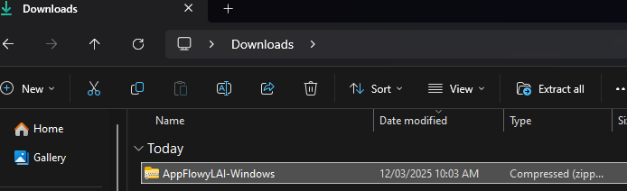

# 🐧 Building on Lin

**Note:**

* The following steps are verified on
  * [x] lubuntu 20.04 - X86\_64
  * [ ] ubuntu 20.04 - aarch64
  * [ ] redhat - X86\_64
  * [x] Arch Linux - X86\_64
  * [ ] Deepin - X86\_64
  * [ ] Raspberry Pi OS - aarch64
* You may need to disable hardware 3D acceleration if you are running AppFlowy in a VM. Otherwise, certain GL failures will prevent the app from launching.

**Note**

* If you encounter any issues, have a look at [Troubleshooting](https://github.com/AppFlowy-IO/appflowy/wiki/Troubleshooting) first. If your issue is not included in the page, please create an [issue](https://github.com/AppFlowy-IO/appflowy/issues/new/choose) or ask on [Discord](https://discord.gg/9Q2xaN37tV).

## Step 1: Install your build environment

***

There's no point continuing if this doesn't work for you, so lets start here before you even download the code. Feel free to ask questions on our Discord so that we may refine this document and make the process as easy as possible for you.

* Install system prerequisites



```bash
sudo apt-get install curl build-essential libsqlite3-dev libssl-dev clang cmake ninja-build pkg-config libgtk-3-dev unzip
```



```bash
yay -S curl base-devel sqlite openssl clang cmake ninja pkg-config gtk3 unzip
```



* If you need to work on protobufs only (usually not the case)



```bash
sudo apt-get install protobuf-compiler
```



```bash
# optional, for generating protobuf in step 8 only
#(Caution: protobuf does not work on Arch at the moment.)
#yay -S protobuf-compiler
```



* Install rust on Linux

```bash
curl --proto '=https' --tlsv1.2 -sSf https://sh.rustup.rs | sh
source $HOME/.cargo/env
rustup toolchain install nightly
rustup default nightly
```

* Install flutter according to [https://docs.flutter.dev/get-started/install/linux](https://docs.flutter.dev/get-started/install/linux)

```bash
git clone https://github.com/flutter/flutter.git
cd flutter
echo "export PATH=\$PATH:"`pwd`"/bin" >> ~/.profile
export PATH="$PATH:`pwd`/bin"
```

* Make sure to enable the flutter stable channel

```bash
flutter channel stable
```

* Enable linux desktop

```bash
flutter config --enable-linux-desktop
```

* Fix any problems reported by flutter doctor

```bash
flutter doctor
```

## Step 2: Get the source code

Clone the source code from our Github project.


However, you should fork the code instead if you wish to submit patches. You'll find information on that in [Submitting your first Pull Request](../submitting-your-first-pull-request.md)


```shell
git clone https://github.com/AppFlowy-IO/appflowy.git
```

## Step 3: Build AppFlowy (Flutter GUI application)

* Change to the frontend directory

```bash
cd appflowy/frontend
```

* Install cargo make

```bash
cargo install --force cargo-make
```

* Install duckscript

```bash
cargo install --force duckscript_cli
```

* Check prerequisites

```shell
cargo make flowy_dev
```

*   \[Optional] Generate protobuf for dart (if you wish to modify the shared-lib's entities)

    * Caution : Not working on Arch Linux yet Make sure to install protobuf-compiler at first. See step 1

    ```shell
    cargo make -p development-linux-x86 pb
    ```
* \[Optional] Build flowy-sdk-dev (dart-ffi)



```bash
cargo make --profile development-linux-x86 flowy-sdk-dev
```



```bash
cargo make --profile production-linux-x86 flowy-sdk-release
```



* Build AppFlowy



```
cargo make -p development-linux-x86 appflowy-linux-dev
```



You'll find the binary in app\_flowy/product/linux/AppFlowy/

```bash
cargo make -p production-linux-x86 appflowy-linux
```



## Step 4: Run the application

```bash
cd app_flowy/product/0.0.2/linux/Debug/AppFlowy
```

```shell
./app_flowy
```

* If using a virtual machine
  * Run Linux GUI application through x11 on windows (use MobaXterm) for instance:

`export DISPLAY=localhost:10`

## Step 5: Edit and run the application

\[VS Code]

1. Open the app\_flowy folder located at xx/appflowy/frontend/app\_flowy with VS Code.
2. Go to the Run and Debug tab and then click the run button.



## Building in release mode

1. Go to the appflowy/frontend/ directory.
2. Run the following command to create the binary.

```bash
cargo make --profile production-linux-x86 appflowy
```

The scripts are located in the appflowy/frontend/Makefile.toml file.

The resulting binary file is located in `appflowy/frontend/app_flowy/product/x.x.x/linux/Release/AppFlowy/`.
