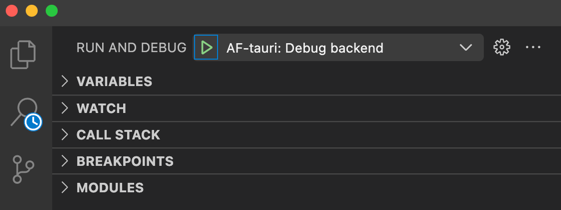
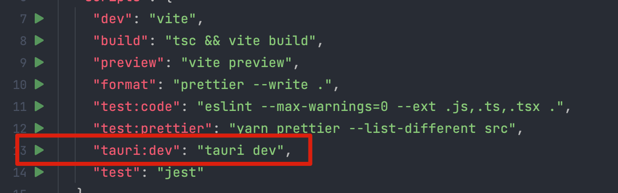

# 📡 Tauri  Setup

## Clone AppFlowy

Clone [AppFlowy](https://github.com/AppFlowy-IO/AppFlowy)
```shell
git clone git@github.com:AppFlowy-IO/AppFlowy.git
```

## Install prerequisites
1. Follow the instructions [here](https://tauri.app/v1/guides/getting-started/prerequisites) to install Tauri
2. Install cargo-make
```shell
# AppFlowy use cargo-make to run the scripts
cargo install cargo-make
````
3. Install AppFlowy dev tools
```shell
# install development tools
cd AppFlowy/frontend
cargo make appflowy-tauri-deps-tools

cd appflowy_tauri
npm install
```

## IDE setup 
### VSCode
You can run from VSCode:
Open the **[frontend](https://github.com/AppFlowy-IO/AppFlowy/tree/main/frontend)** folder located at `AppFlowy/frontend` with VSCode.



This option enable debugging the [core process](https://tauri.app/v1/references/architecture/process-model#the-core-process) directly. 
Or you can run manually:
```shell
cd frontend
cargo make tauri_dev
```

### WebStorm
Open the **appflowy_tauri** folder located at `AppFlowy/frontend/appflowy_tauri` and then run the `tauri:dev`.




## Clean
Remove the build artifacts first when facing compiler errors. 
```shell
cd frontend
cargo make tauri_clean
```
