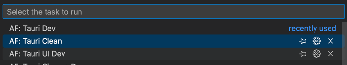

# 📡 Tauri  Setup

## Step 1：
Follow the instructions [here](https://tauri.app/v1/guides/getting-started/prerequisites) to install Tauri and then 
clone [AppFlowy](https://github.com/AppFlowy-IO/AppFlowy)

## Step 2：
Open terminal to install the prerequisites

```shell
# AppFlowy use cargo-make to run the scripts
cargo install cargo-make

# install development tools
cd AppFlowy/frontend
cargo make appflowy-tauri-deps-tools

cd appflowy_tauri
npm install
```

## Step 3：

Run from VSCode:
Open the **[frontend](https://github.com/AppFlowy-IO/AppFlowy/tree/main/frontend)** folder located at AppFlowy/fronted with VSCode.

This option enable debugging the [core process](https://tauri.app/v1/references/architecture/process-model#the-core-process) directly.

Or you can run manually:
```shell
cd frontend
cargo make tauri_dev
```

Remove build artifacts and any generated codes by running **Tauri Clean** from VSCode task 
.
Or you can run manually:
```shell
cd frontend
cargo make tauri_clean
```
