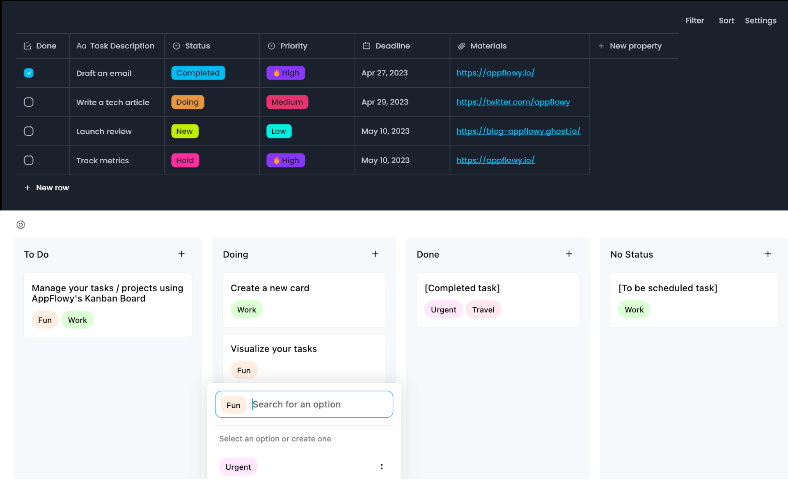
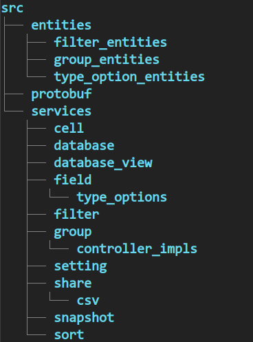

# How to add a new property type to Appflowy database
One of the things you can do in Appflowy is work with structured data (it's called Appflowy databases) and view them in different layouts, such as Table, Board, Calendar.

In this article, I will take a look at how the back-end part of Appflowy databases works overall and share a more detailed guide on how to create a new property type.

## Flowy-database

Flowy-database is a rust crate mainly responsible for the abstractions behind Appflowy databases, CRUD actions on data, storing, filtering and etc. Let's take a look at the code structure and dive in (the picture is only the directories you can take a more detailed look [here](https://github.com/AppFlowy-IO/AppFlowy/tree/e0ad364fa3e9da183698739e0661beef22b1728d/frontend/rust-lib/flowy-database2/src)).

### [Entities](https://github.com/AppFlowy-IO/AppFlowy/tree/e0ad364fa3e9da183698739e0661beef22b1728d/frontend/rust-lib/flowy-database2/src/entities)

Basic abstractions that Flowy-database uses to model the data and work with them behind the scene. I will describe some of them a bit.

#### [Cell](https://github.com/AppFlowy-IO/AppFlowy/blob/main/frontend/rust-lib/flowy-database2/src/entities/cell_entities.rs)

Most basic abstraction that encapsulates the raw data and determines its row and column.

#### [Row](https://github.com/AppFlowy-IO/AppFlowy/blob/main/frontend/rust-lib/flowy-database2/src/entities/row_entities.rs)

Multiple cells packaged together. In table view, it's the table row and in board view each card represents a row.

#### [Field](https://github.com/AppFlowy-IO/AppFlowy/blob/main/frontend/rust-lib/flowy-database2/src/entities/field_entities.rs)

Think of it as sort of table columns. Closely related to Property, It creates a link between different cells and determines their type. Each field has a type (not unique) for example Number, Text, Email, Date, etc.
Will say more about fields on "How to add new property type" section.

#### [Sort](https://github.com/AppFlowy-IO/AppFlowy/blob/main/frontend/rust-lib/flowy-database2/src/entities/sort_entities.rs)

For sorting rows based on a specific field and condition, which will be based on one of the row's cells. This is mostly useful in Table layout.

#### [Filter](https://github.com/AppFlowy-IO/AppFlowy/tree/e0ad364fa3e9da183698739e0661beef22b1728d/frontend/rust-lib/flowy-database2/src/entities/filter_entities)

To filter out and show only some rows based on a condition you can use filters. Filter has a general part ([`FilterPB`](https://github.com/AppFlowy-IO/AppFlowy/blob/main/frontend/rust-lib/flowy-database2/src/entities/filter_entities/util.rs)), for example which field is this filter for and a custom part which is different based on mostly the field type. So for the Number field type, we can have [filter](https://github.com/AppFlowy-IO/AppFlowy/blob/main/frontend/rust-lib/flowy-database2/src/entities/filter_entities/number_filter.rs) which specifies the cell related to the Number field should be greater than the user-specified number. And for a Checkbox field type, we can have a filter that the cell should be checked.

##### Where to start with adding new filter condition

If you want to add new filter condition for your desired field type in Appflowy. First you have to find the specific field type filter entity or create it if doesn't exist. Second, add your filter condition name in the field type conditions enum. Third in [services->field->type_option->field_type](https://github.com/AppFlowy-IO/AppFlowy/tree/e0ad364fa3e9da183698739e0661beef22b1728d/frontend/rust-lib/flowy-database2/src/services/field/type_options), you have to determine how applying that filter condition should take effect. See the [`apply_filter`](https://github.com/AppFlowy-IO/AppFlowy/blob/e0ad364fa3e9da183698739e0661beef22b1728d/frontend/rust-lib/flowy-database2/src/services/field/type_options/type_option.rs#L116) method for each type option.

#### Group

This is for grouping multiple rows by a common field. This is used mostly in Board layout. For example, grouping your tasks (rows) by their priority which priority here is a field with single select type.

##### Where to start with adding a new group by

For enabling group by a specific field you should add its controller in [services->group->controller_impls](https://github.com/AppFlowy-IO/AppFlowy/tree/e0ad364fa3e9da183698739e0661beef22b1728d/frontend/rust-lib/flowy-database2/src/services/group/controller_impls). The controller has to implement [`GroupCustomize`](https://github.com/AppFlowy-IO/AppFlowy/blob/e0ad364fa3e9da183698739e0661beef22b1728d/frontend/rust-lib/flowy-database2/src/services/group/action.rs#L16) trait.

### Events

There are two types of events in Flowy-database internal and external. Here I'm going to describe external events. This is the way Appflowy front-ends and back-end talk to each other. In the [event_map file](https://github.com/AppFlowy-IO/AppFlowy/blob/e0ad364fa3e9da183698739e0661beef22b1728d/frontend/rust-lib/flowy-database2/src/event_map.rs), you can see the handler that each event will trigger. The handler will also usually fetch `DatabaseEditor` service and use it to do the job.

### Services

Services are where the core of the logic exists and it's the way to manipulate data. You can create, delete, update data (rows, cells, properties, ...) via services.

You can see more documentation on Appflowy databases [here](https://appflowy.gitbook.io/docs/essential-documentation/databases).

## How to add new property type

Now with some knowledge that how Flowy-database is structured, we can take a look at a practical example. Let's first see what is property and then go further.

### Property

You can create as many properties as you want for your database in Appflowy. Property is showed differently regarding the view of your database, In table view (layout) it's  column of your table (each column is a separate property).

As I said properties are tightly related to Field entity abstraction. So on creating new property, you create a new `Field` in Flowy-database. Each `Field` data structure has `name` and `field_type`.  The name is what you see as the property name and the type is something you select from available field types (e.g Number, Text, Checkbox, Select, etc).

If you want to introduce a new property type you have to add a new field type ([`FieldType`](https://github.com/AppFlowy-IO/AppFlowy/blob/e0ad364fa3e9da183698739e0661beef22b1728d/frontend/rust-lib/flowy-database2/src/entities/field_entities.rs#L479)) in Flowy-database. Here comes the "type option" data structure.

#### Type Option

`field_type` on `Field` is an enum type named `FieldType` it doesn't hold any data. Each `FieldType` is mapped to a specific type option which has to implement the [`TypeOption`](https://github.com/AppFlowy-IO/AppFlowy/blob/e0ad364fa3e9da183698739e0661beef22b1728d/frontend/rust-lib/flowy-database2/src/services/field/type_options/type_option.rs#L24) trait. This is done in type option service. So for example for a Checkbox field type, we have [`CheckboxTypeOption`](https://github.com/AppFlowy-IO/AppFlowy/blob/e0ad364fa3e9da183698739e0661beef22b1728d/frontend/rust-lib/flowy-database2/src/services/field/type_options/checkbox_type_option/checkbox_type_option.rs#L19) which includes a simple `is_selected` property with bool type.

Note that every field type should get linked to a type option but it's not necessarily a one-to-one relation, it can be many-to-one. As you will see multiple field types can link to the same type option.

#### Filter

If you want to enable filtering for your field type you also have to add a filter entity for it (in [entities->filter_entities](https://github.com/AppFlowy-IO/AppFlowy/tree/e0ad364fa3e9da183698739e0661beef22b1728d/frontend/rust-lib/flowy-database2/src/entities/filter_entities)). See the samples in source code.

Now let's create a new property step by step.

### Let's create new property "Created At" and "Updated At"

I'm writing this closely after [my merge request](https://github.com/AppFlowy-IO/AppFlowy/pull/2572) on adding CreatedAt and UpdatedAt property type has got merged. So when you are reading this Appflowy has these two types as a property type. But here I will assume they are not implemented yet, and we will go through implementing them step by step, I won't go through detail every specifics but I will elaborate the parts which I think are essential.

Note that Appflowy code is changing constantly so the specific names and codes that I mention here may change in time and you may see differences when you are reading this, but the overall process of adding new property type will probably be more stable.

#### What do we want?

For CreatedAt we want a property type which gets set on creating new row. So it will record the time when the row is created.

UpdatedAt is similar in some ways. With this property type we want to record last time the row has been modified. So it should get set each time the row is modified.

#### Adding the new field type

For every property type it is a must to create new field type on `FieldType` enum. So we have to add two new field type CreatedAt and UpdatedAt. Now that I'm writing this beside these two that we are adding, there are 8 field types in Flowy-database. Among them Date field type which is close to our desired field types CreatedAt and UpdatedAt.

#### Deciding to introduce new type option or not

After adding two new field types we should decide about type option. As I said before we have Date field type which has [date type option](https://github.com/AppFlowy-IO/AppFlowy/blob/e0ad364fa3e9da183698739e0661beef22b1728d/frontend/rust-lib/flowy-database2/src/services/field/type_options/date_type_option/date_type_option.rs#L23). If you think through you may agree with me that CreatedAt and UpdatedAt are the same as Date regarding the data they contain.

There is a timestamp which records the date (it's not in date type option but in [date cell data](https://github.com/AppFlowy-IO/AppFlowy/blob/e0ad364fa3e9da183698739e0661beef22b1728d/frontend/rust-lib/flowy-database2/src/services/field/type_options/date_type_option/date_type_option_entities.rs#L49)), time format, date format and timezone for customizing the display. All four are also applicable to CreatedAt and UpdatedAt. The difference is the way the data gets set which is not related to the type option.

So we will use date type option for our new field types. With some tweaks this is possible (adding `field_type` on the date type option), you can see them in the merge request.

#### Connecting field types to type option

We decided to use date type option for our new field types. Still we should connect date type option to these new field types. This is done in:
1. type option service in [`type_option_data_from_pb_or_default`](https://github.com/AppFlowy-IO/AppFlowy/blob/e0ad364fa3e9da183698739e0661beef22b1728d/frontend/rust-lib/flowy-database2/src/services/field/type_options/type_option.rs#L137) function to create date type option from raw data and in `type_option_to_pb` function which date type option to raw data.
2. Again the type option service in [`default_type_option_data_from_type`](https://github.com/AppFlowy-IO/AppFlowy/blob/e0ad364fa3e9da183698739e0661beef22b1728d/frontend/rust-lib/flowy-database2/src/services/field/type_options/type_option.rs#L219) function for creating date type option with default values.
3. In `get_type_option_cell_data_handler` and `get_type_option_transform_handler` function for getting `TypeOptionCellDataHandler` and `TypeOptionTransformHandler`.
Also for filters it's done in implementing from `Filter` to `FilterPB`.

#### Hooking into events and modifying services

Now that we are done with field type, type option we should implement what makes CreatedAt and UpdatedAt distinguish from Date field type, and that is how they get filled.

We want to set each cell with CreatedAt and UpdatedAt field type when a new row is created and keep updating the cell with UpdatedAt field type whenever the row gets modified.

There is a [`CreateRow`](https://github.com/AppFlowy-IO/AppFlowy/blob/e0ad364fa3e9da183698739e0661beef22b1728d/frontend/rust-lib/flowy-database2/src/event_map.rs#L35) database event which is connected to `create_row_handler` there we see that cells are created by [`CellBuilder::with_cells`](https://github.com/AppFlowy-IO/AppFlowy/blob/e0ad364fa3e9da183698739e0661beef22b1728d/frontend/rust-lib/flowy-database2/src/services/cell/cell_operation.rs#L308) method. In the first part row cells are filled based on data received. The data is parsed based on cell field type. Here we can decide to enable setting cells with UpdatedAt and CreatedAt field type manually or not (for example allowing user to change cell with CreatedAt field type).

After the first part, we should change the method so it checks if the row has cells with UpdatedAt or CreatedAt field types and set them to the current timestamp. So every time a row is created these cells will get filled automatically. This is enough for CreatedAt field type. But for UpdatedAt we need to do more.

The cells with UpdatedAt field type should get updated whenever any other cell of the row is modified. If we look at the event map there is an [`UpdateCell`](https://github.com/AppFlowy-IO/AppFlowy/blob/e0ad364fa3e9da183698739e0661beef22b1728d/frontend/rust-lib/flowy-database2/src/event_map.rs#L44) database event connected to `update_cell_handler`, This is the lead we should follow. We can see `update_cell_handler` calls `update_cell_with_changeset` method of `DatabaseEditor` which also at the end calls `update_cell`. What we want to implement here is to update UpdatedAt cells and set them to the current timestamp after the requested cell is updated.

#### Enabling the new property types in front-end

This is it.
1. We added the new field type
2. Made connections from new field types to the date type option
3. We modified the necessary services to change the cells with our new field type as we desire.

Now for seeing our new property type in action. We have to build Flowy-database again. Choose one of Appflowy front-ends and make some changes (which are mostly just mentioning the field type enum). And at last build the front-end.

## Contribute to Appflowy by implementing new property types

You can start contributing to Appflowy by implementing new property types. Look at what we currently have. Create an issue for your desired missing property type and start implementing it after it's accepted.
