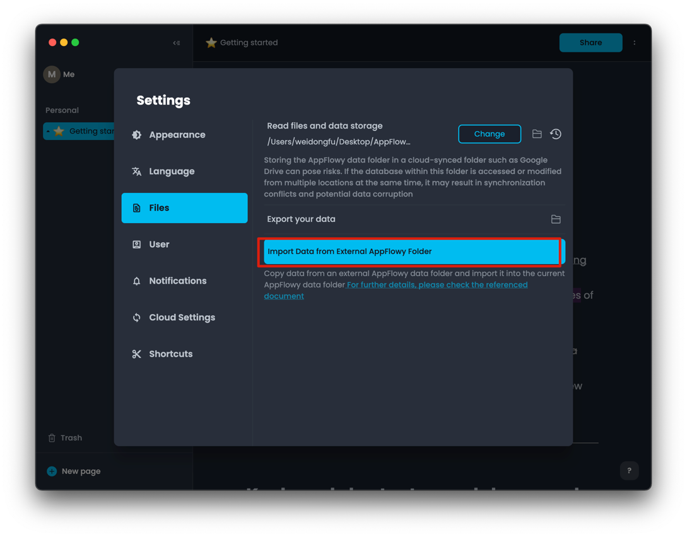
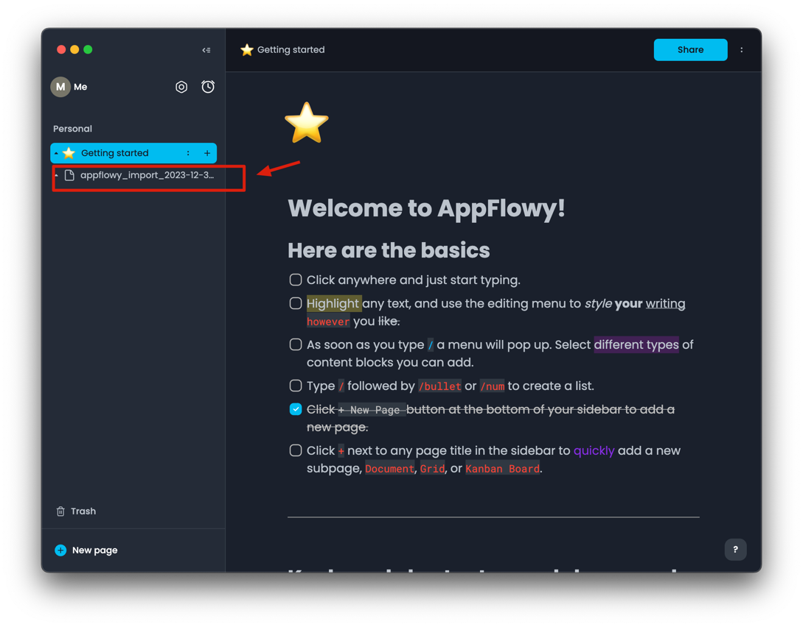
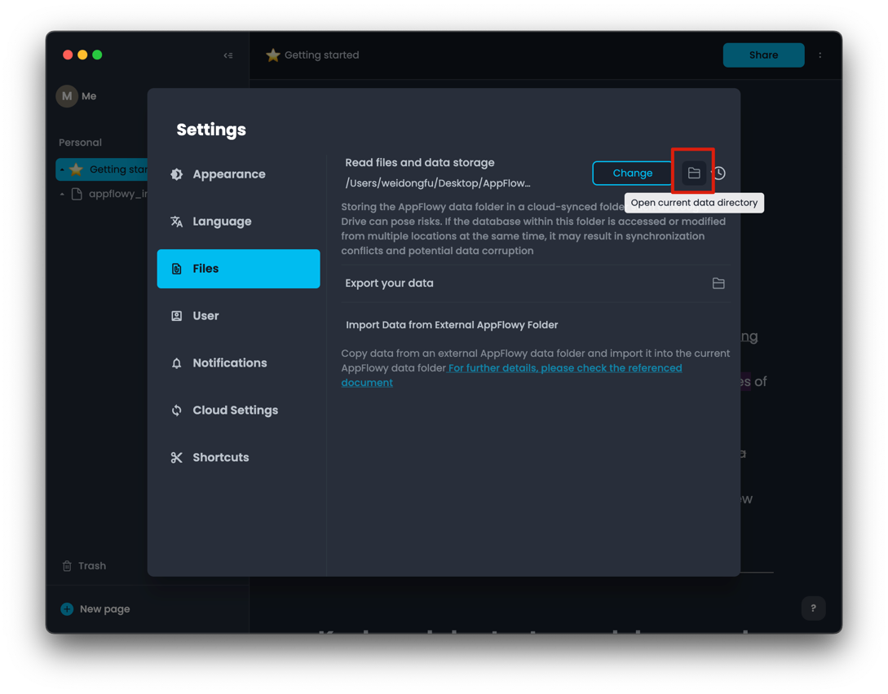
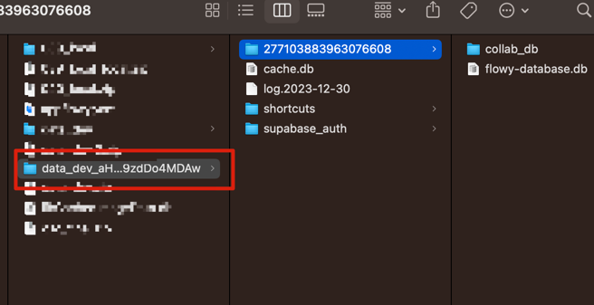
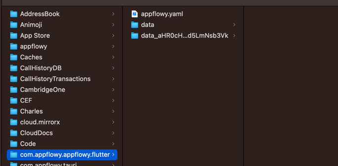
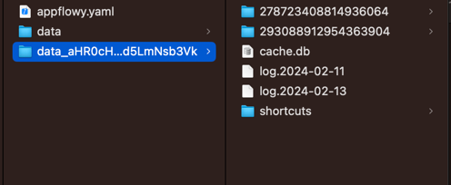
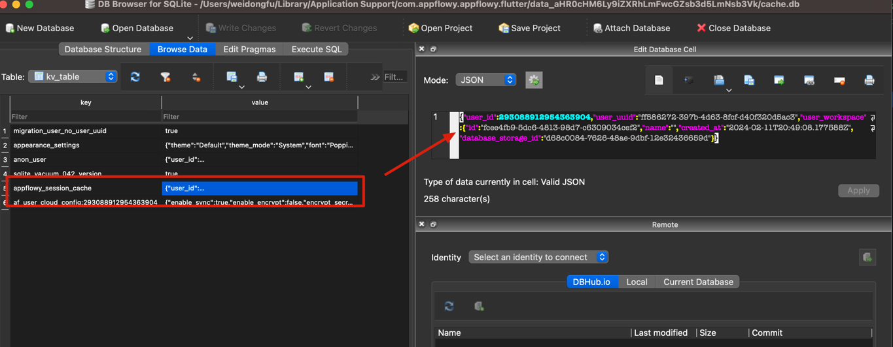
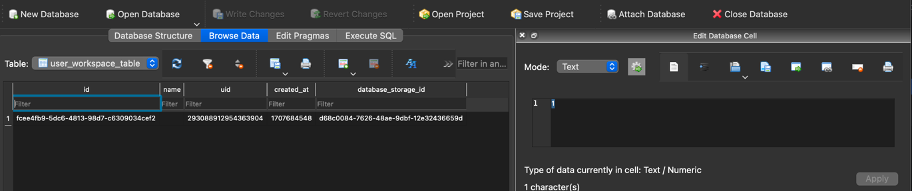

# 💽 Data Storage

## 💽 Data Storage

## Import External AppFlowy Data

AppFlowy allows you to import data from an external 'AppFlowyDataDoNotRename' folder. It will merge all data from the chosen external folder into your current AppFlowy data folder.

To import, navigate to `Settings` --> `Files` --> `Import Data from External AppFlowy Folder` and select the external AppFlowy data folder you want to import.



Once the import is complete, the data from the external folder will be visible in your current AppFlowy data folder.



## Migration from AppFlowy (Supabase) to Latest AppFlowy Version

Start by opening your AppFlowy (Supabase) application. Then, go to `Settings` --> `Files` --> `Open current data directory` to access the current data folder.



Next, compress all the AppFlowy application data into a ZIP file and save it in a new directory as illustrated here.



Unzip the folder, and then download the latest AppFlowy application. Open the application and start as anonymous user. Go to `Settings` --> `Files` --> `Import Data from External AppFlowy Folder`

Select the folder that just unzipped.

## Custom AppFlowy Data Folder

When you launch the application the first time, you will be able to set the directory where you want to store your AppFlowy data. Click on `Set` to open the file explorer and choose your preferred path. In the example below, the data will be stored under G:\My Drive\05 Notes. Then click Quick Start.

<mark style="color:red;">Do not put the folder under your Google Drive.</mark>

If you're unsure about changing the data directory now, just select 'Quick Start' without making any changes. You can always modify the data directory later within the application. For cloud data storage options, see the [Self-Hosting AppFlowy Cloud](../guides/appflowy/self-hosting-appflowy.md) guide.

<figure><figcaption></figcaption></figure>

You can always verify where your data is stored by going to Settings --> Files

<figure><figcaption></figcaption></figure>

To open another AppFlowy data folder, click on `Change` and choose your target folder.

## Restore Specific Local User Data Manually

To restore specific local user data:

1. Go to `Settings` > `Files` > `Open current data directory` to access your current data folder.
2. Based on the cloud service you're using, locate the relevant folder:
   * For Local storage, use the `data` folder.
   * For Supabase, find the folder named with the hash value of the Supabase URL, like `data_hash_value_of_supabase_url`.
   * For AppFlowyCloud, look for a folder named with a hash value that represents the AppFlowy Cloud URL, such as `data_have_appflowy_cloud_url`.

Example:

* The `data_aHR0cHM6Ly9iZXRhLmFwcGZsb3d5LmNsb3Vk` folder is associated with AppFlowy Cloud, where `aHR0cHM6Ly9iZXRhLmFwcGZsb3d5LmNsb3Vk` represents the hashed URL of AppFlowy Cloud.
* The `data` folder is designated for Local storage.



Each folder follows a consistent structure:

* `cache.db`: This is a cache database that stores key-value pairs to identify which user data should be loaded.
* User data folders: Each folder, like `293088912954363904` and `278723408814936064`, contains specific user data.



To restore specific user data, you must update the content of the `appflowy_session_cache` key in the `cache.db`.



The `appflowy_session_cache` key's content includes:

1. `user_id`
2. `user_workspace`

To find the `user_id`, check the log file for a specific date. Search for "session" within the log, and you'll find entries resembling:

```shell
{"msg":"init user session: xxxxxxx:fake_email_address@appflowy.io"}
```

This entry contains the `user_id` you need. after you get the user id. Let's say the id is `293088912954363904`, then you can open the `293088912954363904` folder and using sqlite tool to open the `flowy-database.db` file.


Go to the `user_workspace_table` to find the workspace record for the user.



Once you have both the `user_id` and `user_workspace`. Open the `cache.db` and\
update these specific values in the `appflowy_session_cache` key's content.

After all these steps, you can restart the application and the specific user data will be restored.
