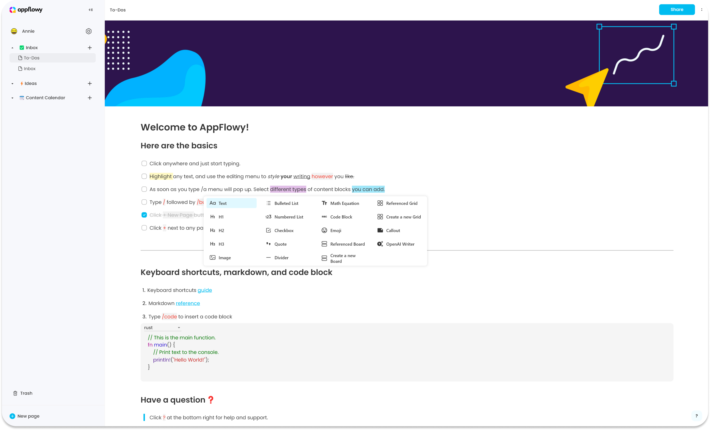
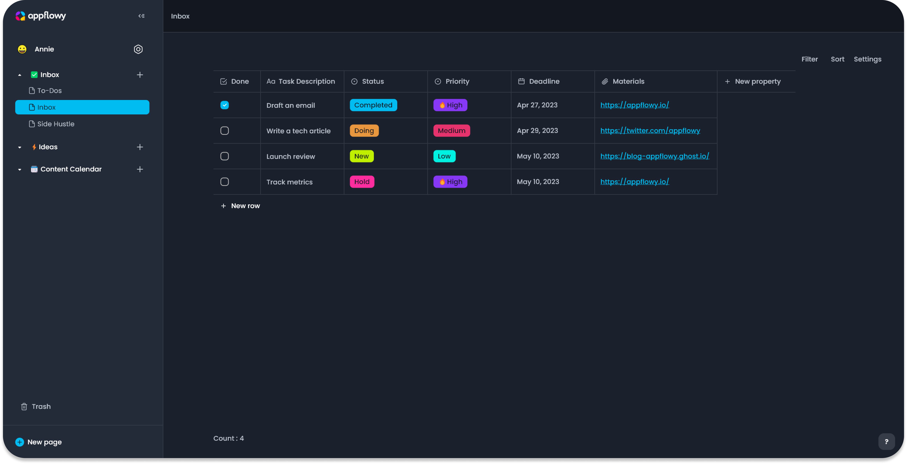
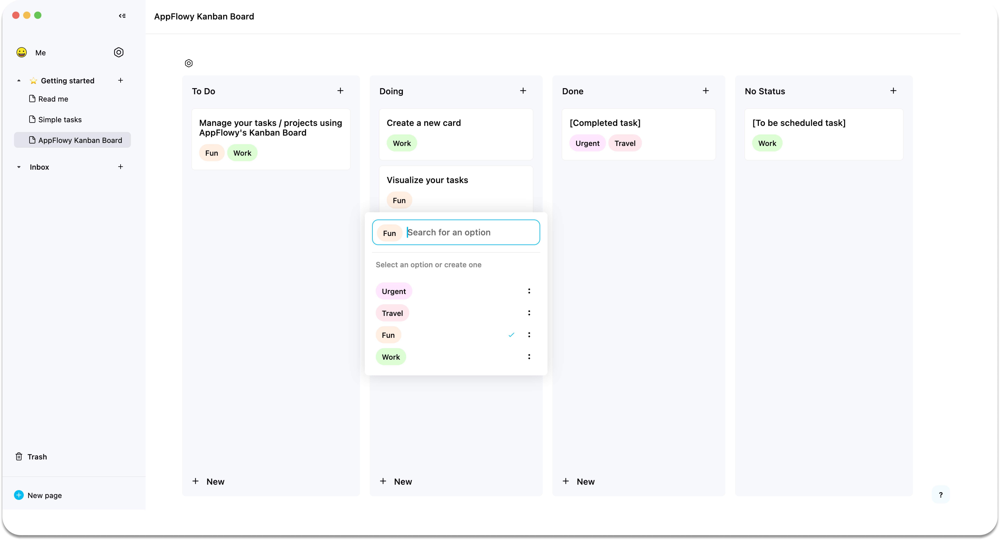
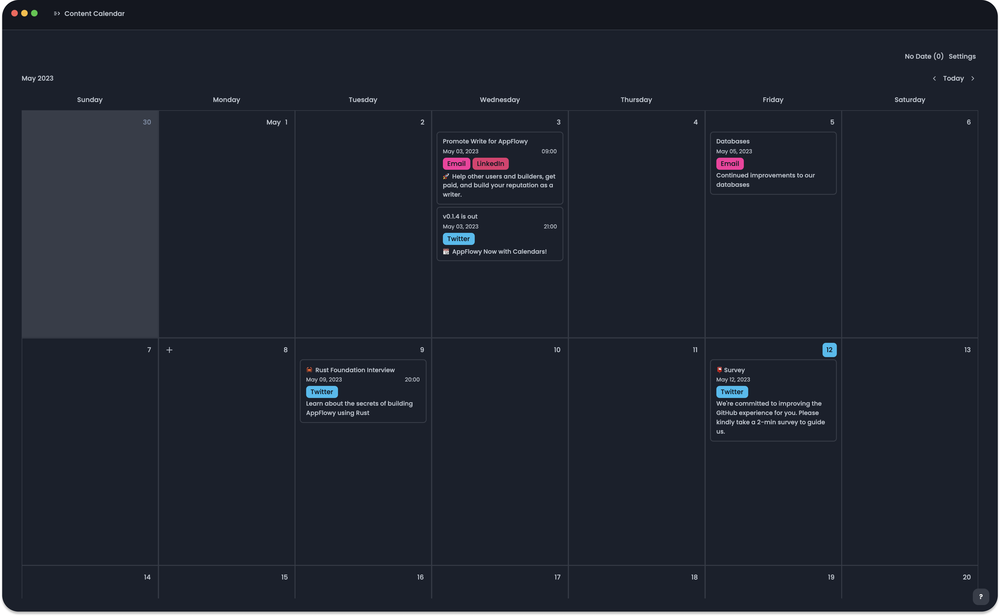

# Welcome to AppFlowy Docs

AppFlowy is the first open-source Notion alternative. You are in charge of your data and customizations. Here you can access the complete documentation for AppFlowy.

<figure><figcaption>
AppFlowy Docs &#x26; Notes &#x26; Wikis
</figcaption></figure>

<figure><figcaption>
AppFlowy Databases for Tasks &#x26; Projects
</figcaption></figure>

<figure><figcaption>
AppFlowy Kanban Board for To-Dos
</figcaption></figure>

<figure><figcaption>
AppFlowy Calendar for Content Management
</figcaption></figure>

<figure><figcaption>
AppFlowy Open AI Opt-in Smart Write and Edit
</figcaption></figure>

### Overview

| Essential Documentation                                        | Popular Topics                                                          |
| -------------------------------------------------------------- | ----------------------------------------------------------------------- |
| [install-appflowy](../../appflowy/install-appflowy/ "mention") | [architecture](../contribute-to-appflowy/architecture/ "mention")       |
| [appflowy](../../documentation/appflowy/ "mention")            | [translation.md](../../documentation/appflowy/translation.md "mention") |


**Help & Feedback**

***

**Docs**

Edit [**AppFlowy Docs**](https://github.com/AppFlowy-IO/docs) to fix an error or add an improvement in a merge request.\
[**Create an issue**](https://github.com/AppFlowy-IO/docs/issues) to suggest an improvement to our Docs.

**Product**

[AppFlowy Public Roadmap](https://github.com/AppFlowy-IO/AppFlowy/blob/main/ROADMAP.md)

[Propose functionality](https://github.com/AppFlowy-IO/appflowy/issues/new/choose) by submitting a feature request.\
[Join our Discord channel](https://discord.gg/9Q2xaN37tV) to help shape new features.

***

**Get Help**

Ask on the [forum](https://github.com/AppFlowy-IO/appflowy/discussions/new)

Join [Discord](https://discord.gg/9Q2xaN37tV) to get quick support

Email [support@appflowy.io](mailto:support@appflowy.io) for specific problems

