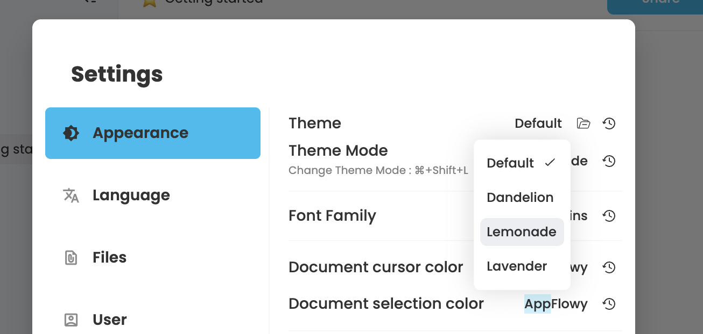
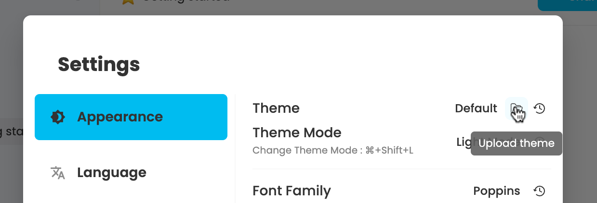
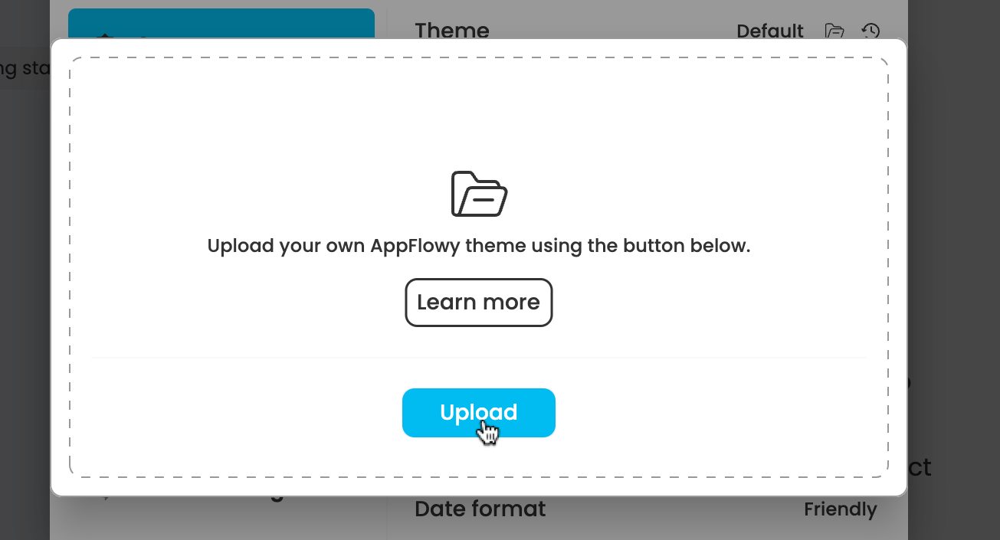
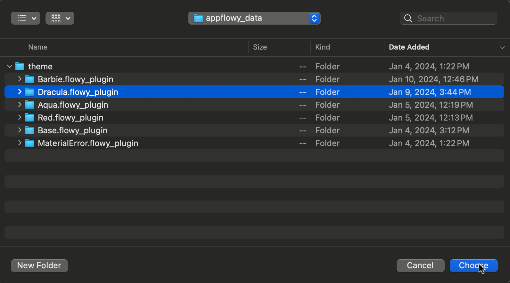
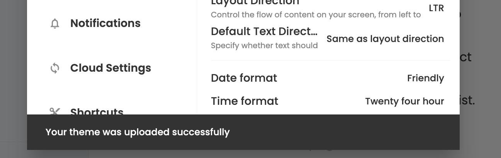
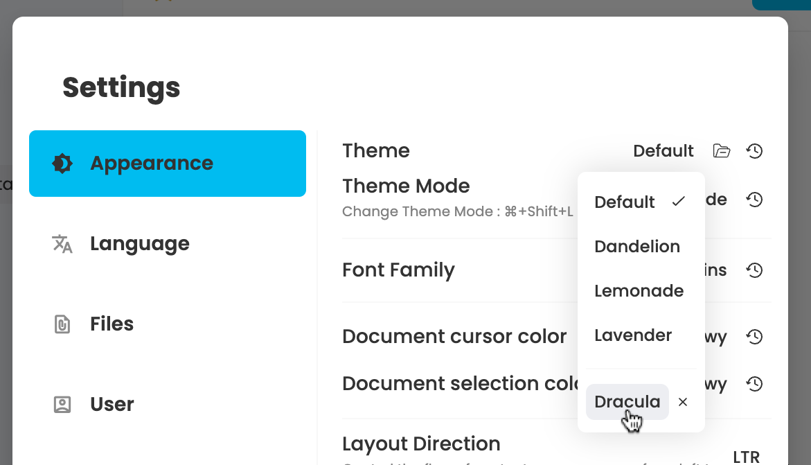
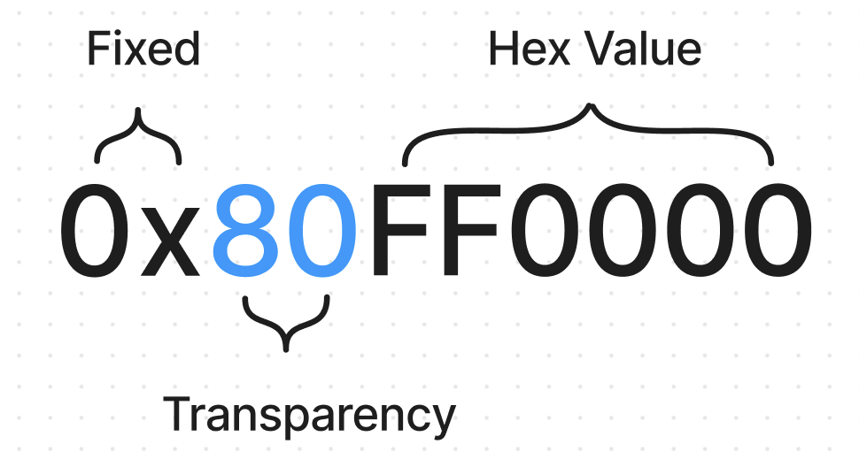

# 🎨 Themes

## Default Theme Options 

***

AppFlowy offers a variety of pre-designed themes for you to choose from. Each theme includes both light and dark mode. Explore these themes and discover the one that resonates with your style!

<figure><figcaption>
Select a built-in theme in the setting dialog
</figcaption></figure>

## Personalized Custom Theme 

***

For a more tailored experience, AppFlowy introduces the ability to upload your custom theme file. This feature empowers you to handpick and modify the color scheme of the application, crafting an environment that aligns precisely with your personal preferences.

### Upload Your Custom Theme File 

#### **Step 1: Get your theme file ready**

To get started, you will require a custom theme file for the upload process. Don't worry if you don't already have one, we provide a pre-made sample theme called **Dracula** for your convenience. First, download this theme file and unzip it. We will use this sample file in the upcoming steps to guide you through the process of uploading a custom theme file.



After you unzip it, you will find a folder called **Dracula.flowy\_plugin**. Inside this folder, there are two JSON files:

* **Dracula.light.json**: The file configures the color scheme for the light mode of the Dracula theme.
* **Dracula.dark.json**: The file, in contrast, specifies the color palette for the dark mode of the theme.

#### **Step 2: Upload your theme file**

Now it is time to upload this Dracula theme.

1. Go to the settings dialog and click the '**Upload Theme**' icon button.

<figure><figcaption></figcaption></figure>

2. Click '**Upload**' in the pop-up window.

<figure><figcaption></figcaption></figure>

3. Choose the **Dracula.flowy\_plugin** folder and click '**Choose**'

<figure><figcaption></figcaption></figure>

4. After that, you should ideally see a confirmation message appear at the bottom of the settings dialog, indicating the successful upload of your theme file. If you concur with any error message during this step, please refer to [#requirements-for-custom-theme-files](themes.md#requirements-for-custom-theme-files "mention") and check if all the requirements are met.

<figure><figcaption></figcaption></figure>

**Step 3: Implement your custom theme**

Once you have successfully uploaded the theme file, navigate to the theme options list to locate your newly added theme. Simply select your custom theme from the list to implement it. Revel in the fresh, personalized look of your newly implemented theme!

<figure><figcaption></figcaption></figure>

### Requirements for Custom Theme Files 

* Name your theme folder ending with `.flowy_plugin`.
* Include both `.light.json` and `.dark.json` files in the folder for light and dark themes.
* Keep file names consistent, like `Dracula.flowy_plugin`, `Dracula.light.json`, and `Dracula.dark.json`.
*   Make sure you have added **all** the colors from `FlowyColorScheme` in your JSON files.

    We may change the color field of `FlowyColorScheme` over time, You can find the latest color field in `FlowyColorScheme` in [`colorscheme.dart`](https://github.com/AppFlowy-IO/AppFlowy/blob/main/frontend/appflowy\_flutter/packages/flowy\_infra/lib/colorscheme/colorscheme.dart).
* Using 8-digit hexadecimal codes to format the color values in JSON Files:

For example, if you want to set a red color(hex value: FF0000) with 50% opacity. The color value should be written as `0x80FF0000` in the JSON files.

<figure><figcaption></figcaption></figure>

* `0x` is a fixed code, which is a standard prefix indicating that the following characters are in hexadecimal format.
* `80` denotes the alpha (transparency) channel of the color, representing 50% opacity. To determine the appropriate code for different opacity levels, refer to this helpful resource: [Opacity percentage in a Hex color code](https://gist.github.com/passiondroid/51fd6b3281c10d463361fa5eb5a1f22b)
* `FF0000`: The Hex value of the red color.

### Tips for Creating Custom Theme Files 

Given the extensive number of color values required in theme file creation, a practical approach is to leverage existing sample theme files as your starting point.

Here are three sample theme files for you to experiment with. By altering specific values within one of these samples, you can craft your unique custom theme with greater ease.







:fingers\_crossed:Fingers crossed.... hopefully your theme looks great! We're eager to see how your theme turned out! If not, please [Submit a Feature Request](https://github.com/AppFlowy-IO/AppFlowy/issues/new?assignees=\&labels=\&projects=\&template=feature\_request.yaml\&title=%5BFR%5D+) or [Report an issue](https://github.com/AppFlowy-IO/AppFlowy/issues/new?assignees=\&labels=\&projects=\&template=bug\_report.yaml\&title=%5BBug%5D+) so that we can improve your user experience.
