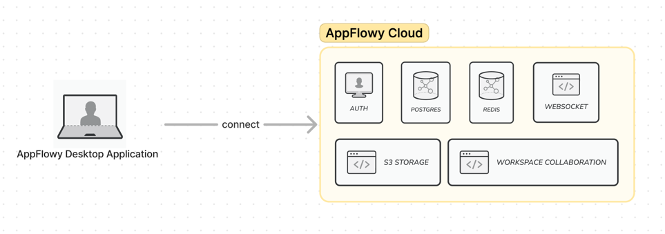
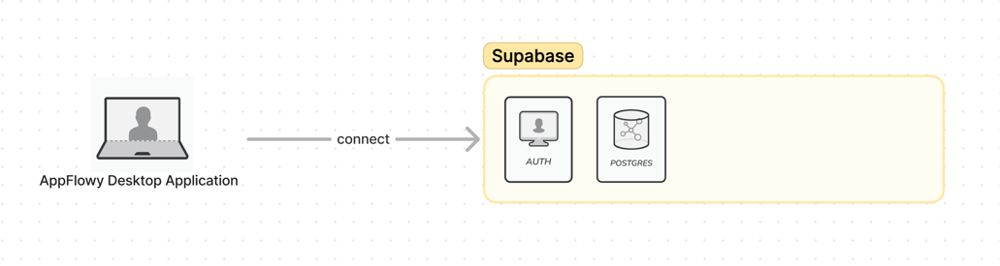

# Self-Hosting AppFlowy

AppFlowy offers versatile self-hosting options with support for various cloud implementations, ensuring flexibility and control for users. Currently, we provide support for two primary cloud:

1. [**AppFlowy Cloud**](https://docs.appflowy.io/docs/guides/appflowy/self-hosting-appflowy): This is our recommended method for self-hosting AppFlowy. AppFlowy Cloud is designed to be user-friendly, allowing for a straightforward setup process. It comes packed with a range of features, including data synchronization via websocket, collaborative editing capabilities, and more, enhancing the overall user experience.

2. [**Supabase**](https://docs.appflowy.io/docs/guides/appflowy/self-hosting-appflowy-using-supabase): As an alternative, we also support self-hosting AppFlowy using Supabase. This option is ideal for users who prefer Supabase's features or are already using Supabase for their infrastructure.

## Note

Each self-hosting option for AppFlowy, be it AppFlowy Cloud or Supabase, is designed to be secure, efficient, and tailored to fit a variety of needs. It's essential to choose the option that best meets your specific requirements to take full advantage of what AppFlowy offers. However, it's crucial to remember that these options are exclusive – data isn't synchronized between different clouds. So, if you opt for AppFlowy Cloud, your data will reside solely in its PostgreSQL database, and similarly, choosing Supabase will store your data only in the Supabase database.

The AppFlowy Cloud is currently undergoing rapid iterations, and we are planning to release our official cloud service soon. If you have any questions, don't hesitate to contact us on [Discord](https://discord.gg/7kmZgcvA).
