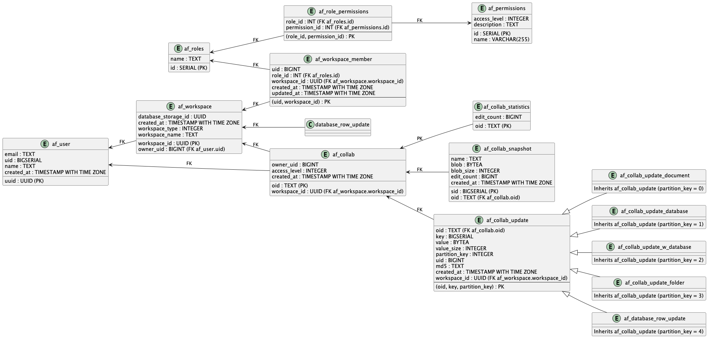

# 🆓 Self-hosting AppFlowy for free Using Supabase

### <mark style="color:red;">**We have sunset Supabase as one of the cloud options since v0.5.3. You can get more context from**</mark> [<mark style="color:red;">**this PR**</mark>](https://github.com/AppFlowy-IO/AppFlowy/pull/5069)<mark style="color:red;">**.**</mark>

<figure><figcaption><p>AppFlowy Self-hosted</p></figcaption></figure>

AppFlowy is a privacy-first, open source workspace for your notes, wikis, projects, and more. You are in charge of your data and customizations, with no vendor lock-in.

Over the past year, we've been working hard alongside thousands of community members towards our mission: to empower everyone to create workspaces that suit their needs, without limits on what's possible. We have been determined to uphold our three core values from the very beginning:

* Data privacy first
* Reliable native experience
* Community-driven extensibility

Today, we're pleased to share that AppFlowy can now be self-hosted. This article will delve into what's behind the scenes and guide you on how to self-host AppFlowy using Supabase.

**If you prefer a video tutorial click here:**&#x20;


video tutorial for hosting appflowy with supabase


## Introducing Cloud Enabled AppFlowy

In order to implement cloud features such as user sign-ins and data storage, we've partnered with [Supabase](https://supabase.com/), an open-source alternative to [Firebase](https://firebase.google.com/).

With a Supabase project, transforming AppFlowy into a self-hosted cloud app is straightforward. By the end of this article, you'll be primed to launch your very own AppFlowy cloud application with ease. Furthermore these steps are similar to other cloud services, such as `Appwrite` or `Firebase`, should you want to use those services for an AppFlowy cloud implementation.

Let's explore how AppFlowy uses Supabase to implement the cloud features.

## Table of Contents

* [Authentication](#authentication)
  * [Auth Code Walkthrough](#auth-code-walkthrough)
  * [The Authentication Flow In Action](#the-authenication-flow-in-action)
* [Data Storage](#data-storage)
  * [Architectural Design](#architectural-design)
  * [Supabase Implementation](#supabase-implementation)
    * [Database Schema](#database-schema)
    * [DB Code Walkthrough](#db-code-walkthrough)
  * [Database Monitoring With Realtime](#database-monitoring-with-realtime)
    * [Monitoring Code Walkthrough](#monitoring-code-walkthrough)
* [File Storage](#file-storage)
* [Self-Hosting](#self-hosting)

## Authentication

Initially, we considered building our own authentication service from scratch. The feature set we were looking to support included social third-party authentication and magic links as well as traditional email & password login.

However, we soon realized that there were open-source projects available that already offer these features. That led us to the discovery of the Supabase authentication service, which provides multiple methods for user authentication.

* Email & password
* Magic links
* Social providers
* Phone logins

This is exactly what we need.

We can leverage Supabase's authentication service to implement AppFlowy's authentication system. After following the instructions for the [Supabase auth documentation](https://supabase.com/docs/guides/auth), we successfully set up the authentication service.

Let's explore how we integrated Supabase authentication into AppFlowy.

### Auth Code Walkthrough

Integrating AppFlowy with Supabae requires the [supabase\_flutter](https://pub.dev/packages/supabase\_flutter) Flutter package.

#### Adding Dependencies

We utilize the `env` file to inject the supabase configuration into the app. Simply adding `supabase_flutter` and `envied` to the `pubspec.yaml` is all that's needed to kickstart the process.

```yaml
dependencies:
  supabase_flutter: ^1.10.4
  envied: ^0.3.0+3
  
dev_dependencies:
  envied_generator: ^0.3.0+3
```

#### Config Files

Follow the instructions [here](https://github.com/AppFlowy-IO/AppFlowy/blob/main/frontend/appflowy\_flutter/dev.env) to setup the `.env` file.

```dotenv
CLOUD_TYPE=1
SUPABASE_URL=your-supabase-url
SUPABASE_ANON_KEY=your-supabase-anon-key
```

Then, create the `env.dart` file, which defines the global environment variables.

The `.env.dart` file will look as follows:

```dart
@Envied(path: '.env')
abstract class Env {
  @EnviedField(
    obfuscate: true,
    varName: 'SUPABASE_URL',
    defaultValue: '',
  )
  static final String supabaseUrl = _Env.supabaseUrl;
  @EnviedField(
    obfuscate: true,
    varName: 'SUPABASE_ANON_KEY',
    defaultValue: '',
  )
  static final String supabaseAnonKey = _Env.supabaseAnonKey;
}
```

Afterwards, run the following command to generate the `env.g.dart` file. This file contains the environment variables we defined in the `.env` file. These variables are encrypted to prevent them from being exposed in the source code.

```shell
dart run build_runner build --delete-conflicting-outputs
```

#### Initializing the Supabase Instance

Before utilizing the Supabase instance, it must be initialized. This initialization takes place in the `supabase_task.dart` file. We define the `SupabaseLocalStorage` to customize the storage of the Supabase auth data.

```dart
 await Supabase.initialize(
   url: Env.supabaseUrl,
   anonKey: Env.supabaseAnonKey,
   debug: kDebugMode,
   localStorage: const SupabaseLocalStorage(),
 );
```

#### Performing Authentication

Our authentication logic is provided in an abstract class named `AuthService`.

This class's Supabase implementation can be found in `SupabaseAuthService`, specifically within the `supabase_auth_service.dart` file.

```dart
 @override
  Future<Either<FlowyError, UserProfilePB>> signUpWithOAuth({
    required String platform,
    AuthTypePB authType = AuthTypePB.Supabase,
    Map<String, String> params = const {},
  }) async {
    final provider = platform.toProvider();
    final completer = supabaseLoginCompleter(
      onSuccess: (userId, userEmail) async {
        return await _setupAuth(
          map: {
            AuthServiceMapKeys.uuid: userId,
            AuthServiceMapKeys.email: userEmail,
            AuthServiceMapKeys.deviceId: await getDeviceId()
          },
        );
      },
    );

    final response = await _auth.signInWithOAuth(
      provider,
      queryParams: queryParamsForProvider(provider),
      redirectTo: supabaseLoginCallback,
    );
    if (!response) {
      completer.complete(left(AuthError.supabaseSignInWithOauthError));
    }
    return completer.future;
  }
```

### The Authentication Flow In Action

The steps for the authentication flow are outlined below:

1. The user clicks the login button in AppFlowy.
2. AppFlowy requests Supabase to start the authentication process.
3. Supabase prompts a web browser to open for authentication.
4. The user enters their credentials in the browser.
5. Once entered, the credentials are sent to Supabase for verification.
6. Supabase verifies the credentials and sends a user token back to AppFlowy.
7. AppFlowy updates to show the user they're logged in.


By clicking a login button for Google, users are directed to a web browser to finalize the authentication process. Once authenticated, they are redirected back to AppFlowy.

We will support other social logins later, including GitHub, Discord, Slack, and more. The process for each is quite similar


## Data Storage

### Architectural Design

One of the prerequisites for AppFlowy Data Storage is support for multiple cloud services.

To achieve this, we've designed an abstraction layer that facilitates the integration of various cloud services. Each implementation provides the specific logic for the functions outlined in the AppFlowyServer interface.

The architectural design is illustrated below:


Using the `AppFlowyServer` interface we can easily transition between various cloud services. For instance, moving from [Supabase](https://supabase.com/) to [Firebase](https://firebase.google.com/) or [Appwrite](https://appwrite.io/) is merely a matter of changing the implementation of the `AppFlowyServer` interface.

The `AppFlowyServer` encompasses five services, with each service catering to a unique set of functionalities. Additionally, each service defines its own interface. Let's explore each of these components in detail.

#### UserCloudService

The UserCloudService represents a standardized set of functionalities for interacting with a cloud-based user management service.

This includes operations for:

* registering new users
* authenticating existing users
* managing user profiles
* handling user workspaces

In addition to basic user management, the interface provides methods for managing collaborative objects, subscribing to user updates, and receiving real-time events.

#### DocumentCloudService

The `DocumentCloudService` represents a set of standardized functionalities for managing and retrieving information related to documents in a cloud service.

It facilitates fetching updates to a given document, obtaining snapshots of a document up to a specified limit, and accessing the primary data of a document.

This interface is designed to offer asynchronous operations to ensure efficient and non-blocking interactions when dealing with document data in a cloud environment.

#### DatabaseCloudService

The `DatabaseCloudService` represents a set of standardized operations focused on collaborative objects within a `AppFlowy` database.

This interface allows for the retrieval of updates for a specific collaborative object, batch fetching of updates for multiple collaborative objects of a given type, and obtaining a set number of snapshots for a collaborative object.

These functionalities ensure efficient and streamlined interactions when managing and accessing collaborative data in a cloud database environment.

#### RemoteCollabStorage

The `RemoteCollabStorage` interface provides a suite of operations for managing collaborative objects in a remote storage system. This includes checking whether the remote storage is active and functions for retrieving all updates, snapshots, and the state of a collaborative object.

Furthermore, there are methods to create snapshots and dispatch updates or initial states to the remote storage.

The service is built with asynchronous operations in mind, as evident by the `async` keyword, ensuring that activities like fetching or sending data don't block other operations. It also allows subscribing to remote updates, giving users the capability to stay updated with changes in the collaborative object.

#### FolderCloudService

The `FolderCloudService` interface outlines a set of operations centered around managing workspaces and folders in a cloud environment. It offers capabilities to create a new workspace and fetch data, snapshots, and updates related to a specific folder within a workspace.

### Cloud Service Provider Implementations

Currently, we only support Supabase as a cloud service provider. However, we intend to support other cloud services in the future.

Let's explore how to implement the `AppFlowyServer` using Supabase.

#### Supabase Implementation

Upon integrating Supabase authentication, we discovered it inherently offers a PostgreSQL database. This advantage implies that individual users self-hosting AppFlowy on Supabase won't require separate data storage setups.

Each Supabase project is pre-equipped with a dedicated PostgreSQL database, which we leverage to store AppFlowy's data.

#### Database Schema

We utilize the Postgres database to store:

1. User profiles
2. User settings
3. Data related to documents and databases generated within AppFlowy
4. Relationships between users and their associated workspaces

Here's what our schema looks like:



Let's introduce some of the tables and views in the schema:

1. **`af_roles` table**: Captures roles, e.g., 'Owner', 'Member', 'Guest'.
2. **`af_permissions` table**: Chronicles permissions, each featuring a name, description, and access tier.
3. **`af_role_permissions` table**: A junction table representing permissions assigned to roles.
4. **`af_user` table**: Houses user details, including a unique identifier (uid).
5. **`af_workspace` table**: Lists workspaces, each linked to a user via the user's uid.
6. **`af_workspace_member` table**: Associates members with their workspaces and respective roles.
7. **`af_collab` & `af_collab_member` tables**: Denote collaborations and their constituent members.
8. **Update tables**: (`af_collab_update`, `af_collab_update_document`, etc.): Handle collaboration updates.
9. **Statistics & snapshot tables**: (`af_collab_statistics`, `af_collab_snapshot`, `af_collab_state`): Track collaboration metrics and snapshots.
10. **`af_user_profile_view` view**: Fetches the latest workspace\_id for every user.

We've developed a [tool](https://github.com/AppFlowy-IO/AppFlowy-Supabase) designed to set up the database tables, triggers, and functions within a Supabase PostgreSQL database. With this tool, a single command can configure your database. For a detailed guide, please consult [this documentation](https://github.com/AppFlowy-IO/AppFlowy-Supabase/tree/main/postgres).

#### DB Code Walkthrough

AppFlowy's backend is developed in Rust, which requires a Rust crate to interact seamlessly with the Postgres database.

Thankfully, the community has provided [postgrest-rs](https://github.com/supabase-community/postgrest-rs), a crate specifically designed to handle Supabase's Postgres database features. We've defined a struct named [SupabaseServer](https://github.com/AppFlowy-IO/AppFlowy/blob/main/frontend/rust-lib/flowy-server/src/supabase/server.rs) that implements the `AppFlowyServer` trait.

When interacting with the Postgres database, primarily CRUD operations are carried out. However, it's important to emphasize the value of the RPC function for customizing database actions.

We've defined a function called `flush_collab_updates_v3`. This function locks the row with a specified OID, aggregates the updates into a single update, and then deletes the consolidated updates.

Here is the definition of the `flush_collab_updates_v3` function:

```plpgsql
CREATE OR REPLACE FUNCTION public.flush_collab_updates_v3(
        oid TEXT,
        new_value BYTEA,
        encrypt INTEGER,
        md5 TEXT,
        value_size INTEGER,
        partition_key INTEGER,
        uid BIGINT,
        workspace_id UUID,
        removed_keys BIGINT [],
        did TEXT
    ) RETURNS void AS $$
DECLARE lock_key INTEGER;
BEGIN -- Hashing the oid to an integer for the advisory lock
lock_key := (hashtext(oid)::bigint)::integer;
-- Getting a session level lock
PERFORM pg_advisory_lock(lock_key);
-- Deleting rows with keys in removed_keys
DELETE FROM af_collab_update
WHERE key = ANY (removed_keys);
-- Inserting a new update with the new key and value
INSERT INTO af_collab_update(
        oid,
        value,
        encrypt,
        md5,
        value_size,
        partition_key,
        uid,
        workspace_id,
        did
    )
VALUES (
        oid,
        new_value,
        encrypt,
        md5,
        value_size,
        partition_key,
        uid,
        workspace_id,
        did
    );
-- Releasing the lock
PERFORM pg_advisory_unlock(lock_key);
RETURN;
END;
$$ LANGUAGE plpgsql;
```

Then we can call the `flush_collab_updates_v3` function in Rust.

```rust
pub(crate) async fn flush_collab_with_update(
  object: &CollabObject,
  update_items: Vec<UpdateItem>,
  postgrest: &Arc<Postgres>,
  update: Vec<u8>,
  secret: Option<String>,
) -> Result<(), Error> {
  // 2.Merge the updates into one and then delete the merged updates
  let merge_result = spawn_blocking(move || merge_updates(update_items, update)).await??;
  tracing::trace!("Merged updates count: {}", merge_result.merged_keys.len());

  let workspace_id = object
    .get_workspace_id()
    .ok_or(anyhow::anyhow!("Invalid workspace id"))?;

  let value_size = merge_result.new_update.len() as i32;
  let md5 = md5(&merge_result.new_update);

  let (new_update, encrypt) =
    SupabaseBinaryColumnEncoder::encode(merge_result.new_update, &secret)?;
  let params = InsertParamsBuilder::new()
    .insert("oid", object.object_id.clone())
    .insert("new_value", new_update)
    .insert("encrypt", encrypt)
    .insert("md5", md5)
    .insert("value_size", value_size)
    .insert("partition_key", partition_key(&object.ty))
    .insert("uid", object.uid)
    .insert("workspace_id", workspace_id)
    .insert("removed_keys", merge_result.merged_keys)
    .insert("did", object.get_device_id())
    .build();

  postgrest
    .rpc("flush_collab_updates_v3", params)
    .execute()
    .await?
    .success()
    .await?;
  Ok(())
}
```

### Database Monitoring With Realtime

With Supabase's [realtime](https://supabase.com/docs/guides/realtime) service, we can monitor changes to specific tables.

For instance, by watching the `af_user` table, we can detect the latest user activities every time they sign in across different devices. Similarly, other tables can be monitored. This diagram illustrates how user profile updates are tracked across multiple devices.


#### Monitoring Code Walkthrough

We observe update events from both the `af_collab_update` and `af_user` tables. When an update event is triggered, we propagate the event data to the Rust backend. Different components will consume various updates.

A detailed discussion on this is beyond the scope of this documentation, but we will delve into it in future discussions.

```dart
Future<void> _subscribeTablesChanges() async {
 final List<ChannelFilter> filters = [
      "document",
      "folder",
      "database",
      "database_row",
      "w_database",
    ]
        .map(
          (name) => ChannelFilter(
            event: 'INSERT',
            schema: 'public',
            table: "af_collab_update_$name",
            filter: 'uid=eq.${userProfile.id}',
          ),
        )
        .toList();

    filters.add(
      ChannelFilter(
        event: 'UPDATE',
        schema: 'public',
        table: "af_user",
        filter: 'uid=eq.${userProfile.id}',
      ),
    );

    const ops = RealtimeChannelConfig(ack: true);
    channel?.unsubscribe();
    channel = supabase.client.channel("table-db-changes", opts: ops);
    for (final filter in filters) {
      channel?.on(
        RealtimeListenTypes.postgresChanges,
        filter,
        (payload, [ref]) {
          try {
            final jsonStr = jsonEncode(payload);
            final pb = RealtimePayloadPB.create()..jsonStr = jsonStr;
            UserEventPushRealtimeEvent(pb).send();
          } catch (e) {
            Log.error(e);
          }
        },
      );
    }

    channel?.subscribe(
      (status, [err]) {
        Log.info(
          "subscribe channel statue: $status, err: $err",
        );
      },
    );
 }
```

## File Storage

File storage in AppFlowy is still under development.

Once implemented, users will be able to store images, videos, documents, and various other file types.

## How to Self-host AppFlowy with Supabase

Self-hosting AppFlowy with Supabase has been made easy and straightforward. Follow this detailed guide:

### Step 1: Set Up a Supabase Project

* **Create a Supabase Project**: Start by creating a new project in Supabase. Detailed instructions are available in the [Supabase Getting Started Guide for Flutter](https://supabase.com/docs/guides/getting-started/tutorials/with-flutter).

### Step 2: Configure Your Postgres Database

* **Database Setup**: Configure your Postgres database according to the steps provided in the [Postgres Setup Guide](https://github.com/AppFlowy-IO/AppFlowy-Supabase/tree/main/postgres).

### Step 3: Download and Install AppFlowy

* **Download AppFlowy**: Get the latest release package from the [AppFlowy Releases](https://github.com/AppFlowy-IO/AppFlowy-with-AppFlowy-Cloud-Build/releases) page.
* **Install and Launch**: Install the downloaded AppFlowy application and open it.

### Step 4: Configure the AppFlowy Application

*   **Initial Setup**: In the AppFlowy application, click on 'Quick Start'.

    
* **Cloud Settings**: Go to the `Settings` page, select `Cloud Setting` from the sidebar, and choose `Supabase` as your cloud provider.
*   **Enter Details**: Fill in your Supabase server's `url` and `anon key`, then click `Restart` to apply the new settings.

    

### Step 5: Login to Your Account

*   **User Settings**: Access the `Setting` page in the AppFlowy application and choose `User` from the sidebar.

    

By following these steps, you'll be able to successfully set up and start using AppFlowy with Supabase as your backend.

🙏If you have any questions, don't hesitate to contact us on [Discord](https://discord.gg/7kmZgcvA).

## Questionnaire

Thanks for reading this article. If you have some time, please kindly take our [1-minute survey](https://tally.so/r/w2aVej) to give us feedback and let us know what interests you the most.

If you have a suggestion or question for self-hosted solutions or any part of AppFlowy, you can [create an issue](https://github.com/AppFlowy-IO/AppFlowy/issues/new/choose) on GitHub and we’ll get back to you as soon as possible. Also, feel free to follow us @appflowy on [Twitter](https://twitter.com/appflowy) or join our [Discord server](https://discord.gg/9Q2xaN37tV) to follow our latest development!
