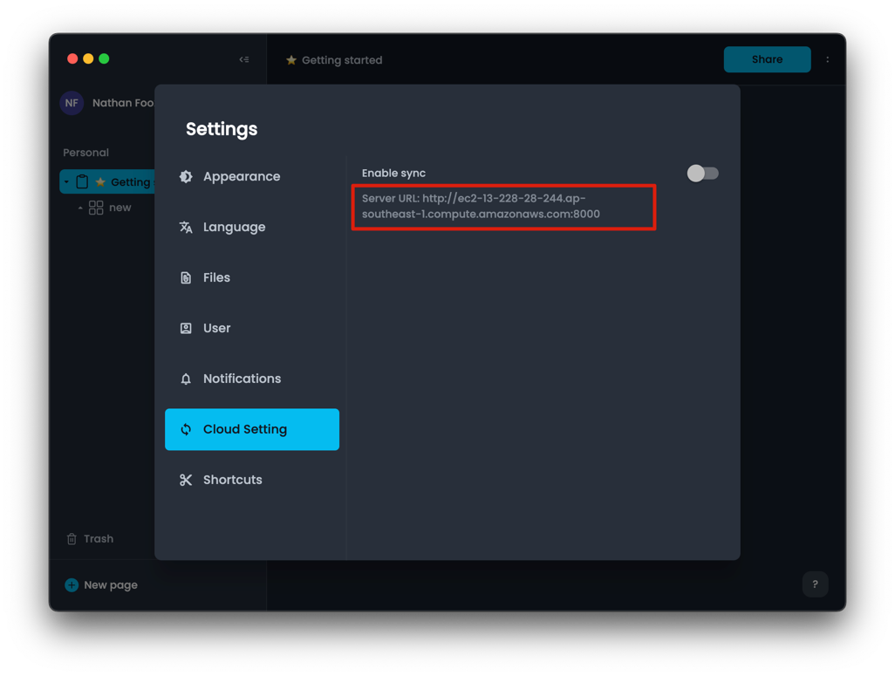

# ☁️ Self-hosting AppFlowy with AppFlowy Cloud

AppFlowy is a privacy-first, open-source workspace designed for notes, wikis, projects, and more, giving you full control over your data and customizations. Over the past year, our community-driven approach has focused on delivering a data-privacy-centric, reliable native experience, and extensible platform.

We're thrilled to introduce self-hosting capabilities for AppFlowy, further empowering users to tailor workspaces to their needs. This guide is divided into two key sections:

1. Setting up AppFlowy Cloud on your server.
2. Building AppFlowy with a self-hosted server.

🙏If you have any questions, don't hesitate to contact us on [Discord](https://discord.gg/7kmZgcvA).

## Step 1: Setting Up AppFlowy Cloud

To self-host AppFlowy Cloud, please refer to our comprehensive [deployment guide](https://github.com/AppFlowy-IO/AppFlowy-Cloud/blob/main/doc/deployment.md).

## Step 2: Building AppFlowy with a Self-hosted Server

> 💪This step will become unnecessary once the AppFlowy client application is updated to allow switching between self-hosted servers directly within the app.

### Fork the Repository

- Visit the [AppFlowy-Cloud Build repository](https://github.com/AppFlowy-IO/AppFlowy-with-AppFlowy-Cloud-Build) on GitHub.
- Click "Fork" to create your version of the repository.

### Configure Environment Secrets

- In your forked repository, go to "Settings" > "Environments".
- Create a new environment named `AppFlowyCloud`.
- Add these secrets under "Add secret":
    - `CLOUD_TYPE`: `2` (indicating AppFlowy Cloud usage)
    - `APPFLOWY_CLOUD_BASE_URL`: `http://<your-server-hostname>:8000`
    - `APPFLOWY_CLOUD_WS_BASE_URL`: `ws://<your-server-hostname>:8000/ws`
    - `APPFLOWY_CLOUD_GOTRUE_URL`: `http://<your-server-hostname>:9998`
- Replace `<your-server-hostname>` with your server's public hostname or domain name.


### Starting Deployment Process for AppFlowy

To initiate the deployment of AppFlowy, follow these steps:

1. **Enable GitHub Actions**: Before proceeding, ensure that GitHub Actions is enabled in your repository. Go to the 'Actions' tab on your GitHub repository page and activate it if it's not already active. This step is crucial because the deployment won't trigger without GitHub Actions being enabled.

2. **Create and Push a Release Tag**: Use the following Git commands to create and push a new release tag. This tag is for building version 0.3.8 of AppFlowy on the main branch.

    ```bash
    # Create and push a tag for building AppFlowy version 0.3.8 on the main branch
    git tag 0.3.8_main && git push origin 0.3.8_main
    ```

3. **Monitor the Build Process**: Once the tag is pushed, you can track the progress of the build in the 'Actions' tab of your GitHub repository. Here, you'll see the automated processes initiated by GitHub Actions in response to the new tag.

By following these steps, you'll successfully start the deployment process of AppFlowy version 0.3.8.


After the build process is completed, you can download the binaries from the "Assets" section of the build.


After logging in, you can visit the "Settings" page to confirm that the server URL is correct.




## Current Limitations

**Bundle ID Conflict**

The AppFlowy App built with AppFlowy Cloud currently shares the same bundle ID as the official AppFlowy App. Consequently,
you cannot install both versions on the same device simultaneously. We are working on a solution for this issue.

**Ongoing Development of Stable Branch**

The process of building AppFlowy with AppFlowy Cloud using the stable branch is ongoing. Rapid developments and frequent 
updates in [AppFlowy Cloud](https://github.com/AppFlowy-IO/AppFlowy-Cloud) mean that new features are constantly being added. 