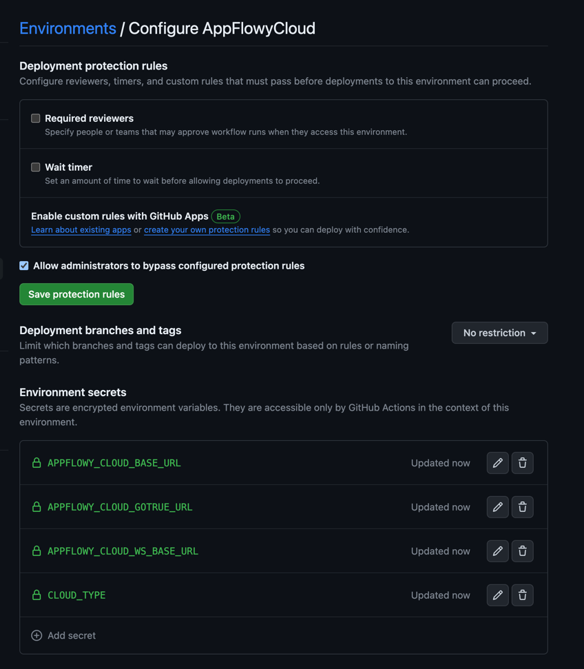
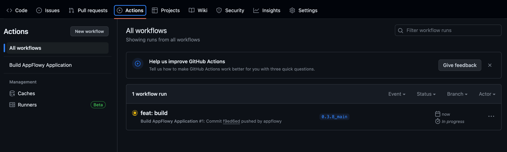

# ☁️ Self-hosting AppFlowy with AppFlowy Cloud

AppFlowy is a privacy-first, open-source workspace designed for notes, wikis, projects, and more, giving you full control over your data and customizations. Over the past year, our community-driven approach has focused on delivering a data-privacy-centric, reliable native experience, and extensible platform.

We're thrilled to introduce self-hosting capabilities for AppFlowy, further empowering users to tailor workspaces to their needs. This guide is divided into two key sections:

1. Setting up AppFlowy Cloud on your server.
2. Building AppFlowy with a self-hosted server.

## Step 1: Setting Up AppFlowy Cloud

To self-host AppFlowy Cloud on AWS EC2, follow our detailed [deployment guide](https://github.com/AppFlowy-IO/AppFlowy-Cloud/blob/main/doc/deployment.md).

## Step 2: Building AppFlowy with a Self-hosted Server

> 💪This step will become unnecessary once the AppFlowy client application is updated to allow switching between self-hosted servers directly within the app.

1. **Fork the Repository**:

- Visit the [AppFlowy-Cloud Build repository](https://github.com/AppFlowy-IO/AppFlowy-with-AppFlowy-Cloud-Build) on GitHub.
- Click "Fork" to create your version of the repository.

2. **Configure Environment Secrets**:

- In your forked repository, go to "Settings" > "Environments".
- Create a new environment named `AppFlowyCloud`.
- Add these secrets under "Add secret":
    - `CLOUD_TYPE`: `2` (indicating AppFlowy Cloud usage)
    - `APPFLOWY_CLOUD_BASE_URL`: `http://<your-server-hostname>:8000`
    - `APPFLOWY_CLOUD_WS_BASE_URL`: `ws://<your-server-hostname>:8000/ws`
    - `APPFLOWY_CLOUD_GOTRUE_URL`: `http://<your-server-hostname>:9998`
- Replace `<your-server-hostname>` with your server's public hostname or domain name.



3. **Initiate Deployment**:
   
   Issue a new release tag and push it to start the deployment process:
      ```bash
      git tag -a v0.3.8 -m "Release 0.3.8" && git push origin v0.3.8
      ```
    After pushing the tag, you can view the build process in the Actions tab of your repository.

    

